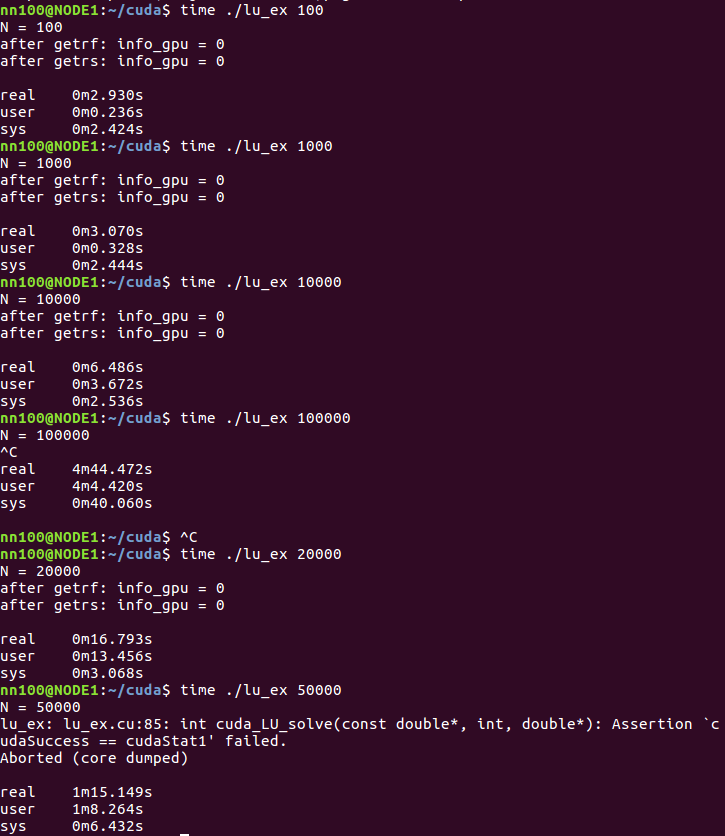

# cuSolver Tutorials

1. http://docs.nvidia.com/cuda/cusolver/index.html

## gsl vs. cusolver

Compare the LU decomposition by using gsl on CPU or using cusolver on GPU.

Considering the solve $Ax=b$ by LU decomposition, where $A$'s dimension is $N\times N$

The test results are as follows:

For gsl on CPU,

while for cusolver on GPU

In a word, when $N$ is less than 2500, the speed of gsl is more fast, but when $N$ is larger than 2500, cusolver is more fast.
