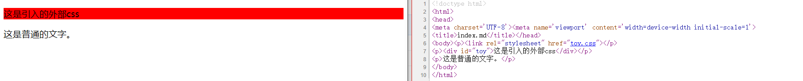

# md中引入外部css

## 说明

md文件可以直接当成html文件处理，直接用下面的代码引入`toy.css`

```html
<link rel="stylesheet" href="toy.css">
```

## 效果

<link rel="stylesheet" href="toy.css">

<div id="toy">这是引入的外部css</div>

这是普通的文字。

生成html效果如下：



查看README.html及README.md源文件比较差异。