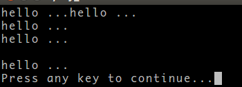
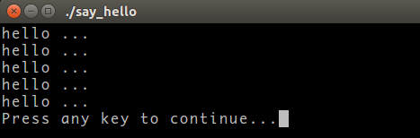
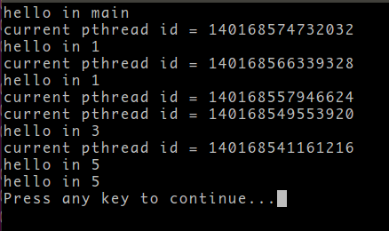
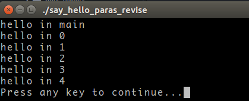

# C/C++ Notes

!!! abstract "My C/C++ Projects"
	- [C](https://github.com/szcf-weiya?tab=repositories&q=&type=source&language=c&sort=)
	- [C++](https://github.com/szcf-weiya?tab=repositories&q=&type=source&language=c%2B%2B&sort=)

## GCC: gcc/g++

[GCC](https://gcc.gnu.org/) 代表 GNU Compiler Collections, 主要用于编译 C/C++，但也支持其它语言，如 Fortran, Go.

- gcc/g++ 都可以编译任何 `.c` 或者 `.cpp` 文件，但 gcc 将其看作分别 C, C++，而 g++ 将其都看成 C++
- 在 link 时，g++ 会自动连接 C++ 标准库，而 gcc 不会

see also: 

- [Difference between GCC and G++](https://www.geeksforgeeks.org/difference-between-gcc-and-g/)
- [What is the difference between g++ and gcc?](https://stackoverflow.com/questions/172587/what-is-the-difference-between-g-and-gcc)

一步到位的编译命令为

```bash
gcc test.c -o test
```

它可以拆解为以下若干步

```bash
# 预处理, -E 使得编译器在预处理后停止，并输出预处理结果
gcc -E test.c -o test.i
// gcc -E test.c
# 编译为汇编代码, -S 程序编译期间，生成汇编代码后，停止
gcc -S test.i -o test.s
# 汇编
gcc -c test.s -o test.o
# 连接
gcc test.o -o test
```

- 多个程序文件的编译

```bash
gcc test1.c test2.c -o test 
```

- 检错

```bash
gcc -pedantic illcode.c -o illcode
gcc -Wall illcode.c -o illcode
gcc -Werror test.c -o test
```

- 编译成可执行文件

```bash
gcc -c -I /usr/dev/mysql/include test.c -o test.o
```

- 连接库文件

```bash
gcc -L /usr/dev/mysql/lib –lmysqlclient test.o -o test
```

- 强制连接时使用静态链接库: 优先使用动态链接库，只有当动态链接库不存在时才考虑使用静态链接库，`-static` 强制使用静态链接库

在 `/usr/dev/mysql/lib` 目录下有链接时所需要的库文件`libmysqlclient.so`和 `libmysqlclient.a`，为了让GCC在链接时只用到静态链接库，可以使用下面的命令

```bash
gcc -L /usr/dev/mysql/lib -static -lmysqlclient test.o -o test
```

- 静态库链接时搜索路径顺序:
	1. ld会去找GCC命令中的参数-L
	2. 再找gcc的环境变量 LIBRARY_PATH
	3. 再找内定目录 /lib /usr/lib /usr/local/lib 这是当初compile gcc时写在程序内的

- 动态链接时、执行时搜索路径顺序: [see also](../Linux/#shared-objects-so-dynamic-library)
	1. 编译目标代码时指定的动态库搜索路径
	2. 环境变量 LD_LIBRARY_PATH 指定的动态库搜索路径
	3. 配置文件 /etc/ld.so.conf 中指定的动态库搜索路径
	4. 默认的动态库搜索路径 /lib
	5. 默认的动态库搜索路径 /usr/lib

参考 [Linux GCC常用命令](http://www.cnblogs.com/ggjucheng/archive/2011/12/14/2287738.html)

!!! tip "(n+3)&~3 used for memory alignment"
	The case comes from [:link:](https://github.com/szcf-weiya/forked_BOLT-REML/blob/c48286e468c91d6f6ef0785610466f860e75b883/src/Bolt.cpp#L1190)
	For example, when `n=14`, then the answer is 16 because
	- `17` is represented in binary as `10001`
	- `3` is represented in binary as `00011`
	then `17` AND `~3` gives `10000`, which is 16 in decimal.

## Print Format


> source: <https://www.cplusplus.com/reference/cstdio/printf/>

## GSL

- My compiled `lib` and `include` for Windows and the detailed procedures: [szcf-weiya/GSLwin](https://github.com/szcf-weiya/GSLwin)

## OpenMP 

### get its version

```cpp
--8<-- "docs/Cpp/openmp/version.cpp"
```

On T460P,

```bash
$ g++ version.cpp -fopenmp
$ ./a.out 
We have OpenMP 4.5
```

### data scope attribute clause


> source: [Shared and private variables in a parallel environment](https://www.ibm.com/docs/en/zos/2.2.0?topic=programs-shared-private-variables-in-parallel-environment)

### `#pragma omp critical`

!!! info
    A practical example: [`r.push_back(j);`](https://github.com/szcf-weiya/fRLR/blob/58539d9e381de718bc4660ec6de96362da968268/src/frlr.cpp#L195-L199)

指定某个区域的代码，每次只能同时被一个线程执行。

### references

- [Official Specifications](https://www.openmp.org/specifications/)
    - [OpenMP 4.5 API C/C++ Syntax Reference Guide](https://www.openmp.org/wp-content/uploads/OpenMP-4.5-1115-CPP-web.pdf)
    - [OpenMP 4.5 Examples](https://openmp.org/wp-content/uploads/openmp-examples-4.5.0.pdf)
- [Lecture Notes: CS-E4580 Programming Parallel Computers @ Aalto University](https://ppc.cs.aalto.fi/)

[OpenMP topic: Loop parallelism](http://pages.tacc.utexas.edu/~eijkhout/pcse/html/omp-loop.html)

[OpenMP并行构造的schedule子句详解](http://blog.csdn.net/gengshenghong/article/details/7000979)

## Pointer

- 空格不重要：`int* p`, `int * p`, `int *p`, `int*p`，但是类型为 `int *` 或 `int*`: refer to [c++指针（一）——指针的定义以及写法--大风车-CSDN博客](https://blog.csdn.net/qq_32103261/article/details/80221014) and [C++中引用，指针，指针的引用，指针的指针--luoshenFU的专栏-CSDN博客](https://blog.csdn.net/luoshenfu001/article/details/8601494)

### reference vs pointer

```cpp linenums="1"
--8<-- "docs/Cpp/pointer/ref.cpp"
```

- 赋值时左右端类型需相同，与符号 `*` 和 `&` 无关
- `b` 与 `array` 的地址相同

参考 [c++指针（六）——指针与引用_大风车-CSDN博客](https://blog.csdn.net/qq_32103261/article/details/80231698)

### 输出字符型指针地址值

C 语言中通过 `printf` 便可以很方便地输出字符串指针地址值，如

```c
--8<-- "docs/Cpp/pointer/print_pointer_address.c"
```

运行结果为，

```bash
$ gcc print_pointer_address.c
$ ./a.out 
字符串: hello world
字符串起始地址值: 0x56499eb0e724
```

但在 Cpp 中没那么简单，主要原因是

> C++标准库中I/O类对 << 操作符重载，因此在遇到字符型指针时会将其当作字符串名来处理，输出指针所指的字符串

类似 C 中强制类型转换，用 `static_cast` 将字符串指针转换成无类型指针。

```cpp
--8<-- "docs/Cpp/pointer/print_pointer_address.cpp"
```

运行结果为，

```bash
$ g++ print_pointer_address.cpp 
$ ./a.out 
hello world
0x556f1462fa65
```

参考 [C++中cout输出字符型指针地址值的方法](http://www.cnblogs.com/wxxweb/archive/2011/05/20/2052256.html)

### 指针初始化

```
double x;
double *p = &x;
```

DO NOT

```
double *p = 5;
```

BUT
```
double *p = "aaa";
```
并且要初始化，不能

```
double *p;
```
然后直接传参了，这是不对的。

## 参数和返回值的三种传递方式

参考

- [Passing vector to a function in C++](https://www.geeksforgeeks.org/passing-vector-function-cpp/) and [Vector in C++ STL](https://www.geeksforgeeks.org/vector-in-cpp-stl/)
- [C++函数参数和返回值三种传递方式：值传递、指针传递和引用传递（着重理解）](http://blog.csdn.net/thisispan/article/details/7456180)

### 值传递

改变 `x` 的值不会影响 `n`

```cpp
void Func1(int x)
{
    x = x + 10;
}
int n = 0;
Func1(n);
```

### 指针传递

```cpp
void Func2(int *x)
{
    (*x) = (*x) + 10;
}
int n = 0;
Func2(&n);
```


### 引用传递

`x` 和 `n` 是一个东西


```cpp
void Func3(int &x)
{
    x = x + 10;
}
int x = 0;
Func3(n);
```

引用传递的性质像指针传递，而书写方式像值传递。

```cpp
int m;
int &n = m;
```

其中 `n` 是 `m` 的一个引用 (reference)，而 `m` 是被引用物 (referent).

引用的规则如下：

- 引用被创建时同时被初始化，而指针则可以在任何时候初始化；
- 不能有 NULL 引用，必须与合法的存储单元关联，而指针可以是 NULL;
- 一旦引用被初始化，就不能改变引用的关系，而指针则可以随时改变所指的对象。

## 多线程编程（未完）

参考 [c++多线程编程_狂奔的蜗牛-CSDN博客](http://blog.csdn.net/hitwengqi/article/details/8015646)

### say_hello

```cpp linenums="1"
--8<-- "docs/Cpp/MultiThread/say_hello.cpp"
```

两次运行的结果混乱，因为没有同步？





### say_hello_paras

```cpp linenums="1"
--8<-- "docs/Cpp/MultiThread/say_hello_paras.cpp"
```



结果混乱！！

可能原因：主进程还没开始对i赋值，线程已经开始跑了...?

### say_hello_paras_revise

```cpp linenums="1"
--8<-- "docs/Cpp/MultiThread/say_hello_paras_revise.cpp"
```





## Algorithms

- [three ways for iterating combinations](https://gist.github.com/shaunlebron/2843980)

## const 总结
[ref](http://www.2cto.com/kf/201210/160536.html)

## new

申请空间，并执行相应的构造函数

## delete

执行析构函数，并释放空间

引用的本质是指针常量

```
const int m;
//int* p = &m;//wrong
const int* p = &m;
int *const pc = &m; //必须初始化，引用的本质
```


构造函数析构函数作用区间

```
A a;
A *ap;
if (...)
{
	B b;
	...// B析构
	ap = new A;
}
......// A析构
delete ap;
```


先执行基类构造函数，再派生类构造函数；
先执行派生类析构函数，再派生基类析构函数。


## 函数模板和模板函数

[ref](http://blog.csdn.net/beyondhaven/article/details/4204345)

C++中，函数模板与同名的非模板函数重载时，应遵循下列调用原则：
1. 寻找一个参数完全匹配的函数，若找到就调用它。若参数完全匹配的函数多于一个，则这个调用是一个错误的调用。
2. 寻找一个函数模板，若找到就将其实例化生成一个匹配的模板函数并调用它。
3. 若上面两条都失败，则使用函数重载的方法，通过类型转换产生参数匹配，若找到就调用它。
4. 若上面三条都失败，还没有找都匹配的函数，则这个调用是一个错误的调用。

## 初始化列表

[ref](http://www.cnblogs.com/graphics/archive/2010/07/04/1770900.html)


## extern

[reference](http://www.cnblogs.com/yc_sunniwell/archive/2010/07/14/1777431.html)

在Rcpp中，extern "C" 告诉编译器，保持其名称，不要生成用于链接的中间函数名。

## "symbol lookup error"

```
./test: symbol lookup error: ./test: undefined symbol:
```

动态链接库的原因，因为更新完gsl之后，原先的动态链接库不管用了，可以用下面的命令追踪动态链接库
```
ldd test
ldd -d -r test
```

参考[c++ runtime "symbol lookup error" ](http://gdwarner.blogspot.com/2009/03/c-runtime-symbol-lookup-error.html)

## 字符数组与数字互换

http://blog.csdn.net/sunquana/article/details/14645079

### 字符数字转数字
1. atoi
2. atof
3. atol
4. strtod
5. strtol

### 数字转字符
sprintf

## C: Correctly freeing memory of a multi-dimensional array

https://stackoverflow.com/questions/1733881/c-correctly-freeing-memory-of-a-multi-dimensional-array

## \#pragma unroll的用法
http://blog.csdn.net/fengzizhuang/article/details/9300431

## Getting std :: ifstream to handle LF, CR, and CRLF?

1. https://stackoverflow.com/questions/6089231/getting-std-ifstream-to-handle-lf-cr-and-crlf

2. https://stackoverflow.com/questions/9188126/c-strange-behavior-with-stdistream-or-sentry-wrap-around/9189541#9189541

```
std::istream& safeGetline(std::istream& is, std::string& t)
{
    t.clear();

    // The characters in the stream are read one-by-one using a std::streambuf.
    // That is faster than reading them one-by-one using the std::istream.
    // Code that uses streambuf this way must be guarded by a sentry object.
    // The sentry object performs various tasks,
    // such as thread synchronization and updating the stream state.

    std::istream::sentry se(is, true);
    std::streambuf* sb = is.rdbuf();

    for(;;) {
        int c = sb->sbumpc();
        switch (c) {
        case '\n':
            return is;
        case '\r':
            if(sb->sgetc() == '\n')
                sb->sbumpc();
            return is;
        case EOF:
            // Also handle the case when the last line has no line ending
            if(t.empty())
                is.setstate(std::ios::eofbit);
            return is;
        default:
            t += (char)c;
        }
    }
}
```

使用这个代码注意一个问题
应该使用
```
while(!safeGetline(input, line).eof)
```

不能用
```
while(safeGetline(input, line))
```

## fPIC

参考http://blog.sina.com.cn/s/blog_54f82cc201011op1.html

## C++ public/protected/private

[深入理解C++中public、protected及private用法](http://www.jb51.net/article/54224.htm)

## C++按行读取文本文件

[C++按行读取文本文件](http://www.cnblogs.com/freeliver54/archive/2012/06/18/2554173.html)

## struct--构造函数对结构体初始化的影响

[struct--构造函数对结构体初始化的影响](http://blog.csdn.net/wwangluogongchengshi/article/details/6901540)

##

[](https://www.felix021.com/blog/read.php?1587)

## C++11 std::chrono库详解

[C++11 std::chrono库详解](http://www.cnblogs.com/jwk000/p/3560086.html)

## vector::erase()方法的详细介绍及问题解答

adapted from [vector::erase()方法的详细介绍及问题解答](http://blog.sina.com.cn/s/blog_6377b8e60100ino6.html)

> 当调用erase()后Iter迭代器就失效了，变成了一野指针。... 要解决调用erase()方法后，Iter迭代器变成野指针的问题，这个时候呢给他赋一个新的迭代器给他。

```cpp
// ref: http://blog.sina.com.cn/s/blog_6377b8e60100ino6.html

#include <vector>
#include <iostream>
using namespace std;

int main()
{
  vector <int> v1;
  vector <int>::iterator Iter;
  v1.push_back( 10 );
  v1.push_back( 20 );
  v1.push_back( 30 );
  v1.push_back( 40 );
  v1.push_back( 50 );
  cout << "v1 =" ;
  for ( Iter = v1.begin( ) ; Iter != v1.end( ) ; Iter++ ) 
    cout << " " << *Iter;
  cout << endl;
  v1.erase( v1.begin( ) );
  cout << "v1 =";
  for ( Iter = v1.begin( ) ; Iter != v1.end( ) ; Iter++ ) 
    cout << " " << *Iter;
  cout << endl;
  v1.erase( v1.begin( ) + 1, v1.begin( ) + 3 );
  cout << "v1 =";
 for ( Iter = v1.begin( ) ; Iter != v1.end( ) ; Iter++ ) 
   cout << " " << *Iter;
 cout << endl;
 //当调用erase()后Iter迭代器就失效了，变成了一野指针。
 //所以要处理这种问题，关键是要解决调用erase()方法后，Iter迭代器变成野指针的问题，
 //这个时候呢给他赋一个新的迭代器给他。
 v1.push_back( 10 );
 v1.push_back( 30 );
 v1.push_back( 10 );
 cout << "v1 =";
 for ( Iter = v1.begin( ) ; Iter != v1.end( ) ; Iter++ ) 
   cout << " " << *Iter;
 cout << endl; 
 for(Iter = v1.begin(); Iter != v1.end(); Iter++) 
   { 
     if(*Iter == 10) 
       { 
	 v1.erase(Iter);
	 Iter = v1.begin(); //当erase后，旧的容器会被重新整理成一个新的容器
	 // or
	 // Iter = v1.erase(Iter);
       }
     if (Iter == v1.end())
       break;
   }

 cout << "v1 =";
 for ( Iter = v1.begin( ) ; Iter != v1.end( ) ; Iter++ ) 
   cout << " " << *Iter;
 cout << endl; 
 // another one
 v1.erase(v1.begin()+1);
 cout << "v1 =";
 for ( Iter = v1.begin( ) ; Iter != v1.end( ) ; Iter++ ) 
   cout << " " << *Iter;
 cout << endl; 
 
 return 0;
  
}
```

## 最长递增子序列 O(NlogN)算法 

[最长递增子序列 O(NlogN)算法 ](https://www.felix021.com/blog/read.php?1587)

## c语言中realloc()函数解析

[c语言中realloc()函数解析](http://blog.csdn.net/hackerain/article/details/7954006)

## C语言结构体里的成员数组和指针(关于零数组)

[C语言结构体里的成员数组和指针(关于零数组)](http://blog.csdn.net/yang_yulei/article/details/23395315)

## C语言：数组和指针的区别

[C语言：数组和指针的区别](http://blog.csdn.net/imred/article/details/45441457)

## 1017. The Best Peak Shape (35)

[1017. The Best Peak Shape (35)](http://blog.csdn.net/jtjy568805874/article/details/60339007)

## error: 'stod' was not declared in this scope

[error: 'stod' was not declared in this scope](https://stackoverflow.com/questions/20437984/error-stod-was-not-declared-in-this-scope)


## 分词

参考[The Porter Stemming Algorithm](https://tartarus.org/martin/PorterStemmer/)


## C++中String类的字符串分割实现

参考[C++中String类的字符串分割实现](http://www.cnblogs.com/carsonzhu/p/5859552.html)


## typeinfo.h

参考[C++: typeinfo.h](http://www.cnblogs.com/visayafan/archive/2011/11/29/2268135.html)


## exit(0), exit(1)和return的区别

参考[exit（0）与exit（1）、return区别 - ITtecman - 博客园](http://www.cnblogs.com/nufangrensheng/archive/2013/03/01/2938508.html)

- exit(0): 正常运行程序并退出程序
- exit(1): 非正常运行导致退出程序
- return: 返回函数

## 命令行参数的传入

申明 `main` 函数如下

```cpp
int main( int argc, char *argv[] );
int main( int argc, char **argv );
```

其中 `argc` 参数包含参数的计数值，而 `argv` 包含指向这些参数的指针数组，且第一个参数为程序名。比如[这里](https://github.com/szcf-weiya/ESL-CN/blob/f314293634cec66606d59fdaa493155170c1d530/docs/notes/BS/bspline.cpp#L9)，

```bash
size_t order = atoi(argv[1]);
```

对于命令行的处理，可以采用 `getopt()` 或者 `getopt_long()`.

参考[使用 getopt() 进行命令行处理](https://www.ibm.com/developerworks/cn/aix/library/au-unix-getopt.html)

## variably modeified type in C language

参考[Variably modified type in C language - Stack Overflow](https://stackoverflow.com/questions/23529069/variably-modified-type-in-c-language)

## write into file immediately

```cpp
fprintf(fileptr, "writing to file\n");
fflush(fileptr);
```

[How to make fprintf() writes immediately](https://stackoverflow.com/questions/45339874/how-to-make-fprintf-writes-immediately)

or refer to

[Linux实时将所有输出重定向到文件](https://www.cnblogs.com/itZhy/p/3163230.html)

## Map

- `find` returns an iterator, so if the key does not exist it returns an end iterator. [:link:](https://stackoverflow.com/questions/23140956/what-kind-of-value-will-mapfind-return-if-key-doesnt-exist)

```cpp
std::map<int, int> some_map;
if (some_map.find(10) != some_map.end())
{
  // key exists
}
else
{
  // key does not exist
}
```