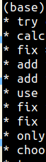
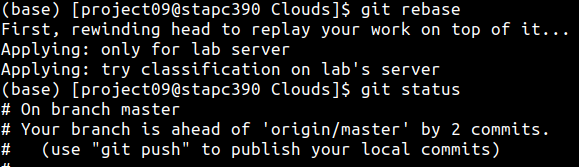

# Git Tips

## 教程

- [这才是真正的Git——Git内部原理揭秘！](https://zhuanlan.zhihu.com/p/96631135)
- [阮一峰的网络日志](http://www.ruanyifeng.com/blog/2014/06/git_remote.html)
- [这些GIT经验够你用一年了](https://zhuanlan.zhihu.com/p/22666153)
- [Cheatsheet](git-cheat-sheet-education.pdf)
- [Pro Git book (中文)](https://git-scm.com/book/zh/v2)


## GitHub

- 添加和设置项目徽章: [shields.io](http://shields.io/)
- [开通 Sponsor](https://surmon.me/article/163)
- [relase public from private repo](https://stackoverflow.com/questions/26217941/can-i-make-releases-public-from-a-private-github-repo)
	- example: <https://github.com/szcf-weiya/TriMatchMOT>

### Actions

- [use `setup-python` instead of `container: python`](https://github.community/t/why-use-setup-python-action-instead-of-a-python-container/17332): fast and flexible
	- examples: [:material-file-code:](https://github.com/szcf-weiya/Cell-Video/blob/5b6119ba5517a5e94ce0440586c62c25a3f9846d/.github/workflows/blank.yml#L24-L27)

### Searching

- the symbol `:` in date in keywords in not proper ([Query 1](https://github.com/szcf-weiya/Clouds/issues?q=15%3A59%3A33)), instead `-` is OK ([Query 2](https://github.com/szcf-weiya/Clouds/issues?q=2022-03-01T15))

## SETUP & INIT: `config`

### Installation

```bash
sudo apt-get install git
```

### Setup User Name and Email

```bash
git config --global user.name "test"
git config --global user.email "test@163.com"
```

除了设置全局的 `name` 和 `email`，也可以指定 `--local`（因为是默认行为，因此也可以省略）对不同 project 指定不同的 `name` 及 `email`, 

```bash
git config [--local] user.name "foo"
git config [--local] user.email "foo@gmail.com"
```


另外还有更高级的配置 `--system`。显然，local 覆盖 global, 而 global 覆盖 system.

如果想要知道当前 `name` 和 `email`,可以通过下面命令查看

```bash
git config user.name
git config user.email
```

参考 [Is it possible to have different Git configuration for different projects?](https://stackoverflow.com/questions/8801729/is-it-possible-to-have-different-git-configuration-for-different-projects)

### push with ssh key

```bash
ssh-keygen -t rsa -C "test@163.com"
```

复制 `~/.ssh/id_rsa.pub` 到 github 上。

### sign with GPG key

Official documentation on Github: [Managing commit signature verification](https://docs.github.com/en/github/authenticating-to-github/managing-commit-signature-verification)

Two nice Chinese tutorials on setting GPG keys

  - [震惊！竟然有人在 GitHub 上冒充我的身份！](https://blog.spencerwoo.com/2020/08/wait-this-is-not-my-commit)
  - [在 Github 上使用 GPG 的全过程](https://www.imwzk.com/posts/2019-08-04-how-to-use-gpg-on-github/)

The steps are:

```bash
# generate GPG key, 4096bits
gpg --full-generate-key
# get secret key id
gpg --list-secret-keys --keyid-format LONG
# configure git
git config --global user.signingkey <SECRET_KEY_ID>
git config --global commit.gpgsign true
# tell github public GPG key
gpg --armor --export <SECRET_KEY_ID>
```

## CLEAN: `clean`

### remove untracked files

```bash
git clean -n
git clean -f
```

refer to [How to remove local (untracked) files from the current Git working tree](https://stackoverflow.com/questions/61212/how-to-remove-local-untracked-files-from-the-current-git-working-tree)


## CLONE: `clone`

- 提高 `git clone` 速度

```bash
git config --global http.postBuffer 524288000
```

- clone 单个分支

```bash
git clone -b BRANCH_NAME ...
```

- clone 多个分支

```bash
git clone ...
# list the remote-tracking branches
git branch -r 
# OR: list both remote-tracking branches and local branches
git branch -a 
git checkout -b BRANCH_NAME REMOTE_BRANCH
# OR: the branch name is exactly in the remote branches
git checkout BRANCH_NAME
```

## BRANCH: `branch`

```bash
# list branch
$ git branch
# create a new branch
$ git branch [branch_name]
# switch branch
$ git checkout [branch_name]
```

### delete branches

```bash
## Delete a remote branch
$ git push origin --delete <branch> # Git version 1.7.0 or newer
$ git push origin :<branch> # Git versions older than 1.7.0

## Delete a local branch
$ git branch --delete <branch>
$ git branch -d <branch> # Shorter version
$ git branch -D <branch> # Force delete un-merged branches

## Delete a local remote-tracking branch
$ git branch --delete --remotes <remote>/<branch>
$ git branch -dr <remote>/<branch> # Shorter
$ git fetch <remote> --prune # Delete multiple obsolete tracking branches
$ git fetch <remote> -p # Shorter
```

adapted from [cmatskas/GitDeleteCommands.ps1](https://gist.github.com/cmatskas/454e3369e6963a1c8c89)

see also: [删除github的master分支](http://blog.csdn.net/jefbai/article/details/44234383)

## LOG: `log`

- extract the last revision time of a file, `git log --date=short --format=%ad file`, it has been used in the [mkdocs-git-revision-date-plugin](https://github.com/szcf-weiya/mkdocs-git-revision-date-plugin).

## PUSH: `push`

### default push

采用低版本的 git， 如 `v1.8.3.1` 当 push 时会报出以下提醒信息，

```bash
warning: push.default is unset; its implicit value is changing in
Git 2.0 from 'matching' to 'simple'. To squelch this message
and maintain the current behavior after the default changes, use:

  git config --global push.default matching

To squelch this message and adopt the new behavior now, use:

  git config --global push.default simple

See 'git help config' and search for 'push.default' for further information.
(the 'simple' mode was introduced in Git 1.7.11. Use the similar mode
'current' instead of 'simple' if you sometimes use older versions of Git)
```

而自己本机电脑一般采用 `v2.0+`， 比如当前 `v2.17.1` 的 git，所以直接采用 `simple` 模式便好了。

See also: [Git push与pull的默认行为](https://segmentfault.com/a/1190000002783245)

### require username and password

possible reason: use the default HTTPS instead of SSH

correct this by

```
git remote set-url origin git@github.com:username/repo.git
```

参考 [Git push requires username and password](https://stackoverflow.com/questions/6565357/git-push-requires-username-and-password)

## REMOTE: `remote`

### change remote repo name

举个例子，如将一个名为 epi 的仓库改名为 depi，再次在本地提交虽然也能成功，但是会提示你原始的仓库已经移动，请修改为新的仓库地址，于是我们可以利用下面的命令进行修改

```bash
git remote set-url origin git@github.com:szcf-weiya/depi.git
```

### modify origin

本地通过 `git clone` 得到仓库 [CellProfiler/CellProfiler](https://github.com/CellProfiler/CellProfiler)，后来需要在此基础上做些更改用到自己的项目中去，于是对原仓库进行了 fork，不过忘记了本地的仓库其实是从原仓库 clone 下来的，而非来自 fork 后的仓库，所以当在 git push 会试图像原仓库进行 push 时，当然是会被拒绝的。

简单的方法便是直接更改本地仓库的 origin，首先可以通过

```bash
git remote show origin
```

来查看当前 origin，前几行显示如下

```bash
$ git remote show origin
* remote origin
  Fetch URL: git@github.com:CellProfiler/CellProfiler.git
  Push  URL: git@github.com:CellProfiler/CellProfiler.git
```

更改可以使用

```bash
git remote rm origin
git remote add origin git@github.com:szcf-weiya/CellProfiler.git
```

或者直接一步走

```bash
git remote set-url origin git@github.com:szcf-weiya/CellProfiler.git
```

注意到这里 url 都是直接取的 `git@github.com`，倘若用了 `https://github.com`，则 push 时会要求手动输入密码。

参考 [How to change the fork that a repository is linked to](https://stackoverflow.com/questions/11619593/how-to-change-the-fork-that-a-repository-is-linked-to)

### sync forked repo

1. 添加原仓库，比如

```bash
git remote add upstream git@github.com:LCTT/TranslateProject.git
```

查看当前远程仓库

```bash
git remote -v
```

2. pull

```bash
git pull upstream master
```

参考[Quick Tip: Sync a GitHub Fork via the Command Line](https://www.sitepoint.com/quick-tip-synch-a-github-fork-via-the-command-line/)

## Rewrite History: `rebase, reset`

### rebase after merge

Suppose I have done

```bash
git add .
git commit -m "add local changes"
git pull
```

then a merge will be invoked. 

But actually these two commits do not have conflicts, so we can use

```bash
$ git rebase
First, rewinding head to replay your work on top of it...
```

to remove the merge commit.

### discard local changes

Here are instructions when running `git status`.

- not added: just `git checkout .`
- last added: `git reset HEAD`, or `git restore --staged <file>`
- last committed: 
	- 丢弃修改的内容：`git reset --hard HEAD^`
	- 保留修改的内容：`git reset --soft HEAD^`
	- 还有一种 `mixed`，也是默认不带参数的
- jump to historical commit: `git reset --hard <commit>`

如果也要更新远程仓库，如 github，则需要使用 `git push -f` 强制更新。

参考

- [git 放弃本地修改](https://www.cnblogs.com/qufanblog/p/7606105.html)
- [github,退回之前的commit](https://www.cnblogs.com/xiaomengzhang/p/3240788.html)
- [github 版本回退](https://blog.csdn.net/apple_wolf/article/details/53326187)

### discard reset

type

```bash
git reflog
```

to find the log of all ref updates, and then use

```bash
git reset 'HEAD@{1}'
```

to restore the corresponding state of `HEAD@{1}`, where `1` implies that last state, and it can be set as other refs.

refer to [How to undo 'git reset'?](https://stackoverflow.com/questions/2510276/how-to-undo-git-reset)

### case study

某次写博客时，有一篇仍处于草稿箱的文件 A.md 暂时不想上传，但是更改了已经发表的文章 B.md 中的 typo，然后提交时一不留神直接用

```bash
$ g "fix typo"
```

提交了，其中 `g` 是在 `.bashrc` 中自定义的一个函数，

```bash
# file .bashrc
# alias for git
func_g(){
    rm -f core
    git add .
    git commit -a -m "$1"
    git push
}
alias g=func_g
```

本来会直接 push 上去的，但是发现及时，Ctrl-C 取消掉了，不过 commit 需要回退。注意到这时并不想放弃修改的文档，所以 `--hard` 选项不可取，

```bash
$ git reset --soft HEAD^
```

这只是取消了 commit，但是仍然被 add 了，查看 git status，会有一行提示语，

```bash
  (use "git reset HEAD <file>..." to unstage)
```

所以下一步自然为

```bash
$ git reset HEAD A.md
```

有时可能删掉已经 add （甚至 commit，但还没 push） 的文件（比如下文中的 `Peek 2020-08-20 10-06.mp4`），首先如果 committed，则采用

```bash
$ git reset --soft HEAD^
```

取消 commit，然后 `git add` 就好了，但是继续撤销 add 的状态，并没有作用，而是提示

> Unstaged changes after reset:

```bash
$ git status
On branch master
Your branch is up to date with 'origin/master'.

Changes to be committed:
  (use "git reset HEAD <file>..." to unstage)

        new file:   docs/Linux/Peek 2020-08-20 10-06.mp4

Changes not staged for commit:
  (use "git add/rm <file>..." to update what will be committed)
  (use "git checkout -- <file>..." to discard changes in working directory)

        deleted:    docs/Linux/Peek 2020-08-20 10-06.mp4

$ git reset HEAD docs/Linux/Peek 2020-08-20 10-06.mp4
Unstaged changes after reset:
D       docs/Linux/Peek 2020-08-20 10-06.mp4
$ git add .
$ git status
On branch master
Your branch is up to date with 'origin/master'.
```

### amend commit message

If the latest commit， type

```bash
git commit --amend
```

to edit the commit message, and then

```bash
git push --force-with-lease
```

where `--force-with-lease` is a safer version than `--force`, in which the former will not overwrite any work on the remote branch while the latter would overwrites a remote branch with the local branch. More detailed comparisons refer to [git push --force-with-lease vs. --force](https://stackoverflow.com/questions/52823692/git-push-force-with-lease-vs-force)

Refer to [Changing git commit message after push (given that no one pulled from remote)](https://stackoverflow.com/questions/8981194/changing-git-commit-message-after-push-given-that-no-one-pulled-from-remote).

### discard un-pushed merges

现有本地、服务器仓库各一个，通过 GitHub 进行共享，原则上只通过本地编辑代码，然后在服务器中借助 `git pull` 进行更新代码。但是有一行代码由于文件路径原因，不得已在服务器端更改，在 `git pull` 之前进行了 `git add; git commit` 操作，所以 `pull` 的时候会产生 merge，而且这样下去每一次进行 `pull` 都会进行 merge。这样就很难看出服务器端真正更改的内容了，这时发现了 `git rebase`，这张图很好地展示了它要干的事情，


这也正是我想要的，简单说就是把基于以前的更改转换成基于最新的更改。

然而我这情况还没这么直接，因为有过很多 merges，这些 merges 都想放弃掉。

```bash
$ git log --graph --format=%s
```


后来发现了 [--rebase-merges](https://git-scm.com/docs/git-rebase/2.28.0#_rebasing_merges) 选项，似乎是在处理我的问题（~~最后还是理解反了~~），但是没高兴多久，服务器端的 git 版本只有 `1.8.3.1`，而这个选项至少要求 `2.x`。不过有注意到了 `--preserve-merges` 选项，新版本中已经 deprecated，而且文档中有这么一句，

```bash
[DEPRECATED: use --rebase-merges instead]
```

似乎也可以用，但是这个名字怎么感觉跟我的目标是相反的呢！?（此时还未意识到），后来简单试了一下

```bash
$ git rebase --preserve-merges
```

发现没啥变化。这才意识到自己理解错了这两个命令。

后来又注意到了 `--root` 选项，发现这个跟自己的目标挺像的，而且抱着搞坏了大不了重新 `git clone` 一下，所以果断去试了，history 确实都变成线性了



但是似乎还没成功，commits 都变成不一样了，


后来又瞎运行了下

```bash
$ git rebase
```

发现竟然成功了，



现在我甚至怀疑是不是一开始直接 `git rebase` 就好了，也不需要 `--root`，不过 `root` 是说可以 rebase 所有 reachable commits，没有什么 upstream 限制，不知道 merges 算不算 upstream 限制（**以后再玩玩**）. 如果需要更新的话，仍采用 `git pull`，但是 `git pull` 不是相当于 `git fetch & git merge` 么？！不过需要注意[加上 `--rebase` 选项](https://stackoverflow.com/a/36148845/8427014)


### change commit time

!!! tip "TL;DR"
    ```bash
    GIT_AUTHOR_DATE=$(date -d "-10 days - 8 hours" -Iseconds) GIT_COMMITTER_DATE=$GIT_AUTHOR_DATE git commit -m ""
    ```

因为习惯将当天的工作通过 commit 贡献图反映出来，但有时候提交时超了一点点时间就变成第二天了，有时会强迫性地想把时间改过来。此前一直在用一种比较笨但很有效的方法，即修改系统时间——往回拨几分钟，再进行 commit。但是昨晚这样操作时出现了失误，只调整了时间，日期并没有回退一天，push 之后才意识到，就这样多了一条未来的 commit。

于是就需要像修改 commit message 修改时间重新 commit。首先尝试的是，

```bash
git commit --amend --date="13/04/2021 @ 23:59"
```

这样 `git log` 确实显示时间更改了，

```bash
$ git log
commit XXXXXXXXXXXXXXXXXXXXXXXXXXXXXXXXXX
Author: XXX
Date:   Tue Apr 13 23:59:49 2021 +0800
```

但是 force push 到 github 上时仍然是当前的时间。这时才意识到有所谓的 GIT_AUTHOR_DATE 和 GIT_COMMITTER_DATE 之分，通过加上 `--pretty=fuller` 可以看到 committer 及其 date (refer to [How to configure 'git log' to show 'commit date'](https://stackoverflow.com/questions/14243380/how-to-configure-git-log-to-show-commit-date))

```bash
$ git log --pretty=fuller
commit XXXXXXXXXXXXXXXXXXXXXXXXXXXXXXXXXX
Author: XXX
AuthorDate: Tue Apr 13 23:59:49 2021 +0800
Commit: XXX
CommitDate: Tue Apr 13 23:59:08 2021 +0800
```

所以修改完 author date 之后，仍然采用笨办法回拨系统时间再提交，这样就能修改 commit date，于是便出现了上面 commit date 竟然比 author date 早的结果。当然更直接的做法是直接在命令行 commit 时同时指定这两个时间，

```bash
$ GIT_AUTHOR_DATE=$(date -d "-10 days - 8 hours") GIT_COMMITTER_DATE=$GIT_AUTHOR_DATE git commit -m "XXXX"
```

在本机上， `date` 默认输出格式为

```bash
$ date -d "-10 days - 8 hours"
Mon May 24 12:17:17 CST 2021
```

其中 `CST` 为 China Standard Time (UTC+0800)，然而，Central Standard Time (UTC-06:00) 缩写也是 `CST`，另外 Cuba Standard Time (UTC-05:00) 也为同一缩写，详见 [:link:](https://en.wikipedia.org/wiki/Time_zone#Abbreviations)。
大概基于此，上述时间被识别为了 UTC-0600,

```bash
$ git log --pretty=fuller
Author:     szcf-weiya <your@email>
AuthorDate: Mon May 24 12:18:06 2021 -0600
Commit:     szcf-weiya <your@email>
CommitDate: Mon May 24 12:18:06 2021 -0600
```

为了避免歧义，加入选项 `-Iseconds` 指定为 ISO-8601 格式，并精确至 `seconds`.

```bash
$ GIT_AUTHOR_DATE=$(date -d "- 8 hours" -Iseconds) GIT_COMMITTER_DATE=$GIT_AUTHOR_DATE git commit -m "XXX"
$ git log --pretty=fuller
Author:     szcf-weiya <your@email>
AuthorDate: Mon May 24 12:27:06 2021 +0800
Commit:     szcf-weiya <your@email>
CommitDate: Mon May 24 12:27:06 2021 +0800
```

另外，`GIT_**_DATE` 支持的日期格式详见 `man git-commit`.

- [How can one change the timestamp of an old commit in Git?](https://stackoverflow.com/questions/454734/how-can-one-change-the-timestamp-of-an-old-commit-in-git)
- [How do I make a Git commit in the past?](https://stackoverflow.com/questions/3895453/how-do-i-make-a-git-commit-in-the-past)

### change date of an older commit

!!! tip "TL; DR"
    Avoid to use, let it go.

!!! warning 
    Try to test
    ```bash
    $ git filter-branch --env-filter 'if [ $GIT_COMMIT == 4fae3c78eac6230ee53082654aaf58ab79fbddc5 ]; then echo $GIT_AUTHOR_DATE; fi'
    Rewrite 4f479f96d4672aaf11f800306b10bb95e83071fd (1/21) (0 seconds passed, remaining 0 predicted)    /usr/lib/git-core/git-filter-branch: 1: [: 4f479f96d4672aaf11f800306b10bb95e83071fd: unexpected operator
    ...
    ```
    which overwrites **all** commit hashes.

I want to update the commit date of an historical commit, where there are 3 more recent commits. Following [How can one change the timestamp of an old commit in Git?](https://stackoverflow.com/questions/454734/how-can-one-change-the-timestamp-of-an-old-commit-in-git),

```bash
$ git rebase -i e5c9f
```

the mark the commit to be edited, not that `e5c9f` is the one before the commit to be edited,

after saving, 

```bash
$ git rebase -i e5c9f
Stopped at 4fae3c7...  XXXXXXXXXXXXXXXXXXXXXXXXXXX
You can amend the commit now, with

  git commit --amend '-S'

Once you are satisfied with your changes, run

  git rebase --continue
```

then change the date via

```bash
$ GIT_AUTHOR_DATE=$(date -d "2021-07-11T23:58:48+0800" -Iseconds) GIT_COMMITTER_DATE=$GIT_AUTHOR_DATE git commit --amend --no-edit --reset-author 
[detached HEAD e1e1cec] XXXXXXXXXXXXXXXXXXXXXXXXXXX
```

note that the hash has been updated, then run

```bash
$ git rebase --continue
Successfully rebased and updated refs/heads/master.
```

Now the status is

```bash
$ git status
On branch master
Your branch and 'origin/master' have diverged,
and have 4 and 4 different commits each, respectively.
  (use "git pull" to merge the remote branch into yours)
```

Then just type `git pull`, but I immediately realized that do not use `git pull` since it will introduce 4 more commits, together with the merge one. Note that

```bash
$ git reflog 
1f4ff92 (HEAD -> master) HEAD@{0}: pull: Merge made by the 'recursive' strategy.
f8ea37c HEAD@{1}: rebase -i (finish): returning to refs/heads/master
f8ea37c HEAD@{2}: rebase -i (pick): XXXXXXXX
59b6935 HEAD@{3}: rebase -i (pick): XXXXXXXX
b849915 HEAD@{4}: rebase -i (pick): XXXXXXXX
```

then go back to 

```bash
$ git reset HEAD@{1}
$ git status
On branch master
Your branch and 'origin/master' have diverged,
and have 4 and 4 different commits each, respectively.
  (use "git pull" to merge the remote branch into yours)
```

then run

```bash
$ git push --force-with-lease
```

However, although the author date indeed has updated, the commit date points to the current date. 

## TEMPORARY COMMITS: `stash`

Temporarily store modified, tracked files in order to change branches.

```bash
git stash # Save modified and staged changes
git stash list # list stack-order of stashed file changes
git stash pop # write working from top of stash stack
git stash drop # discard the changes from top of stash stack
```

- [git pull without git add them](https://stackoverflow.com/questions/54040063/how-to-git-pull-without-git-add-them): 

```bash
git stash
git pull
git stash apply
```

- [an application](https://github.com/szcf-weiya/Cell-Video/issues/172#issuecomment-660456314)

## MERGE: `merge`

### manually resolve merge conflicts

1. open the file and edit
2. git add
3. git commit

refer to [How do I finish the merge after resolving my merge conflicts?](https://stackoverflow.com/questions/2474097/how-do-i-finish-the-merge-after-resolving-my-merge-conflicts)


## `.gitignore`

### 忽略已 track 的文件

`.gitignore` 只能忽略那些原来没有被 track 的文件，如果某些文件已经被纳入了版本管理中，则修改 `.gitignore` 是无效的。那么解决方法就是先把本地缓存删除（改变成未track状态），然后再提交：

```bash
git rm -r --cached foo.txt
git add .
git commit -m 'update .gitignore'
```

see also: [apply `.gitignore` to committed files](https://stackoverflow.com/questions/7527982/applying-gitignore-to-committed-files)

## PULL: `pull`

### in rstudio

在使用rstudio的git功能时，某次commit的时候，勾选了amend previous commit，然后push的时候就出错了


后来直接运行`git pull`后，重新push，便解决了问题。

附上git pull的某篇博客[git pull命令](http://www.yiibai.com/git/git_pull.html)

## Webhook配置

参考[Webhook 实践 —— 自动部署](http://jerryzou.com/posts/webhook-practice/)

需要在腾讯云服务器上自动更新github pages的内容，于是采用webhook来实现。

```bash
npm install -g forever
forever start server.js
```

## webhooks 响应特定分支的 push

参考[Web Hooks - execute only for specified branches #1176](https://github.com/gitlabhq/gitlabhq/issues/1176)@rtripault

提取 json 中的 `ref`，在 `do_POST()` 中进行设置响应动作。


## CHECKOUT: `checkout`

- 撤销未被 add 的文件

```bash
git checkout -- file
```

- 撤销所有更改

```bash
git checkout -- .
```

参考[git checkout all the files](https://stackoverflow.com/questions/29007821/git-checkout-all-the-files)

- 从其他分支更新文件

```bash
git checkout master -- SOMEFILE
```

参考 [Quick tip: git-checkout specific files from another branch](http://nicolasgallagher.com/git-checkout-specific-files-from-another-branch/)

## rewrite 时百分比的含义

表示相似性。

参考[What does the message “rewrite … (90%)” after a git commit mean? [duplicate]](https://stackoverflow.com/questions/1046276/what-does-the-message-rewrite-90-after-a-git-commit-mean)

## Travis CI

中文折腾为什么 Travis CI 中用 '*' 号不会上传文件，最后还是指定了文件名。

刚刚找到解决方案 [How to deploy to github with file pattern on travis?](https://stackoverflow.com/questions/25929225/how-to-deploy-to-github-with-file-pattern-on-travis)

简单说要加上

```yml
file_glob: true
```


## 列出另一分支的目录

```bash
git ls-tree master:dirname
```


## cannot lock ref

参考 [git pull时遇到error: cannot lock ref 'xxx': ref xxx is at （一个commitID） but expected的解决办法](https://blog.csdn.net/qq_15437667/article/details/52479792)


另外试试 `git gc`

参考

1. [Git and nasty “error: cannot lock existing info/refs fatal](https://stackoverflow.com/questions/6656619/git-and-nasty-error-cannot-lock-existing-info-refs-fatal)

## `CRLF` & `LF`

双系统切换时，原先在 Win 处理，后来换到 Linux 处理，报出

```
CRLF will be replaced by LF.
```

设置 `autocrlf` 配置项：

- false 表示取消自动转换功能。适合纯 Windows
- true 表示提交代码时把 CRLF 转换成 LF，签出时 LF 转换成 CRLF。适合多平台协作
- input 表示提交时把 CRLF 转换成 LF，检出时不转换。适合纯 Linux 或 Mac

参考 [Git 多平台换行符问题(LF or CRLF)](https://blog.csdn.net/ljheee/article/details/82946368)


## alias

本来想同时在一行命令中运行 `git add .` 和 `git commit -m`，但是如果采用 `;` 或者 `&&` 连接时都报错，

> error: unknown switch `m'

顺带发现了 `;` 和 `&&` 以及 `||` 的区别，详见 [Run multiple commands in one line with `;`, `&&` and `||` - Linux Tips](https://dev.to/0xbf/run-multiple-commands-in-one-line-with-and-linux-tips-5hgm)

- `;`: 无论第一个命令成功与否，都会运行第二个命令
- `&&`: 只有当第一个命令成功运行，才会运行第二个命令
- `||`: 只有当第一个命令失败后，才会运行第二个命令

后来发现这个，[Git add and commit in one command](https://stackoverflow.com/questions/4298960/git-add-and-commit-in-one-command)，可以通过 `git config` 来配置 alias，

> git config --global alias.add-commit '!git add -A && git commit'

则以后只需要调用

> git add-commit -m 'My commit message'

这跟在 `.bashrc` 中配置有异曲同工之妙！

## 标签

- 打标签

```bash
# annotated
git tag -a v1.0 -m "version 1"
# lightweight
git tag v1.0
# push to github
git push origin v1.0
# or
git push origin --tags
```

详见 [2.6 Git 基础 - 打标签](https://git-scm.com/book/zh/v2/Git-%E5%9F%BA%E7%A1%80-%E6%89%93%E6%A0%87%E7%AD%BE)

- 删除标签

```bash
# local
git tag -d v1.0
# github
git push origin :refs/tags/v1.0
```

详见 [mobilemind/git-tag-delete-local-and-remote.sh](https://gist.github.com/mobilemind/7883996)

## DIFF: `diff`

### color in git diff

在服务器上使用 `git diff`，没有像在本地 Ubuntu 那样用颜色高亮出不同的地方，这个可以通过在 `~/.gitconfig` 中进行配置，

```bash
[color]
  diff = auto
  status = auto
  branch = auto
  interactive = auto
  ui = true
  pager = true
```

参考 [How to colorize output of git?](https://unix.stackexchange.com/questions/44266/how-to-colorize-output-of-git)

顺带发现，如果在 markdown 中复制 git diff 的 output，可以使用 `diff` 的代码块，会将更改的部分高亮出来。

### color different words

by default, the differences are shown per sentences, add option `--color-words` would only highlight the modified words

### compare two files not indexed by git

use option `--no-index`

### show line ending changes

```bash
git diff --color --word-diff-regex=.
```

which highlights all whitespace changes everywhere in lines.

see also: [:link:](https://stackoverflow.com/questions/3920650/git-diff-show-me-line-ending-changes)

## 公开私有仓库的部分代码

可能的解决方案：

- 新建一个 branch，以备公开
	- public branch on private repo? [a discussion](https://github.com/dear-github/dear-github/issues/160)
	- 手动移动
	- 如果只有小部分的代码需要公开，则这样在新 branch 上面需要删掉过多无关的文件夹。
- 以 release 形式发布，并不创建新仓库
	- 通过脚本打包需要公开的代码

## Submodule

```bash
~/github/techNotes/docs$ git submodule add git@github.com:szcf-weiya/TFnotes.git
```
