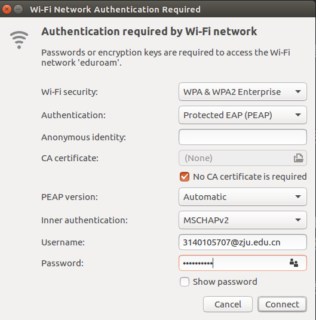

# 网络连接相关问题

## 安装XX-Net

### Environment
1. ubuntu 16.04
2. XX-net
3. privoxy

### Install

- 安装privoxy

```bash
sudo apt-get install privoxy
```

- 安装XX-net

直接访问项目主页[XX-net](https://github.com/XX-net/XX-Net)，内有安装说明

- 设置privoxy
在/etc/privoxy/config文件中加入

```bash
forward / 127.0.0.1:8087
listen-address 0.0.0.0:8118
```

### Usages

- 可以在访问时设置代理

```bash
curl ipinfo.io/ip --proxy 127.0.0.1:8087
```

- 也可以在.bashrc设置，这样所有的终端的网络访问都会走终端，在~/.bashrc文件中加入

```bash
export https_proxy=127.0.0.1:8087
export http_proxy=127.0.0.1:8087
```

然后

```bash
source ~/.bashrc
curl ipinfo.io/ip #测试是否代理成功
```

### Notes

3.10 15:36 chrome 在升级xxnet后成功翻墙了，而Firefox不行了。未升级前情况是相反的，但未升级时Firefox从不能用到能用。

## 有线连不上

手动设置ip
IPv4 settings

Address: 10.71.115.59
Netmask: 24
Gateway: 10.71.115.254
DNS server: 10.10.0.21

```bash
sudo su
ifconfig enp0s31f6 up
ifconfig enp0s31f6 10.71.115.59 netmask 255.255.255.0 up
ping 10.71.115.254
route add default gw 10.71.115.254 enp0s31f6
ping 10.71.45.100
```

## shadowssocks安装
### 二维码反解
对
```
ss://bWV0aG9kOnBhc3N3b3JkQGhvc3RuYW1lOnBvcnQ=
```

中的
```
bWV0aG9kOnBhc3N3b3JkQGhvc3RuYW1lOnBvcnQ=
```

base64解密得到

```
method:password@hostname:port
```


然后
```
sslocal -p port -k password -m method
```

[http://blog.csdn.net/qq_25978793/article/details/49870501](http://blog.csdn.net/qq_25978793/article/details/49870501)


### 系统代理与浏览器代理
无需单独设置系统代理，浏览器是可以通过插件设置代理的。

另外使用如curl需要代理时，可以采用
```
curl ip.cn --proxy socks5://127.0.0.1:1080
```


## CDN折腾记录

突然想到要怎么设置子域名，一开始还以为需要再次购买，原来并非如此，只需要添加解析即可。具体设置子域名和添加解析的方法可以参考github提供的帮助文档。

花了几个小时折腾完这个，突然又想实现https 访问，直接百度“github pages https”便有几篇文档，都谈到了cloudflare，注册之后可以享受免费版本的CDN服务。一开始我也不清楚CDN到底是什么，就直接按照网上的教程走

```
1. 注册cloudflare
2. 添加自己的网站
3. 将DNS服务器改为cloudflare上要求的，比如在阿里云的域名管理界面，将万网服务器换掉。
```

设置完这些之后，我也清楚可能不会理解生效，但也想尽快看看效果怎么样，于是搜索“更新dns缓存”的资料，尽管按照教程走了一遍，但是dns还是没有更新过来，通过
```
dig hohoweiya.xyz +noall +answer
```
返回的结果仍然为未添加cloudflare时的信息。同时访问hohoweiya.xyz并没有传说中的https出现，又郁闷了很久。

在某一刻，突然发现在firefox浏览器中访问时自动跳转到了https，然而在chrome中依然为http，然后我强制在地址栏中加入https，打开开发者模式，说有混合的错误，调用了http的资源，于是我又便去改了网站的资源地址，将http的资源改为https的。直到某一刻才清醒过来，原来我的firefox开了自动代理，之所以能够用https访问是因为我是通过代理访问的，去掉代理后，在Firefox中也是http，即使强行添加https也会报warning。

后来，觉得可能是校园网的原因，导致dns还没有更新过来，于是在服务器上ping了域名地址，已经显示为cloudflare提供的ip了。此时，也通过了www.ping.chinaz.com 进行了测试，表明cloudflare已经添加成功了，只是本地迟迟不能够访问。

并且，通过手机也是能够通过https访问的，于是我做了一个试验，开启手机的热点，让电脑通过手机上网，这时候无论是ping还是dig都返回出了cloudflare的ip，而且此时访问hohoweiya.xyz已经自动为https了。

到现在，原因已经很显然了，因为校园网是通过电信的，不同运营商更新dns的时间可能存在差异，导致一开始在校园网上访问网址不能通过https，以及ping和dig的结果没有发生变化。

折腾了一晚上，也算是了解了一点点cdn和dns的知识吧，知识有时候不要太固执，该等待的时候还是要耐心一点。

## Ubuntu连接UWS和eduroam

默认情况下一直连接不是，注意选对security，Authentication应当选择PEAP，如图。




## 阿里公共ADS差评

之前轻信了阿里公共ADS，在Ubuntu上装了，链接在[此](http://www.alidns.com/setup/#linux)，然而却无法取消设置，restore选项毫无作用。也一直不管它，在枫叶国，竟然连google都ping不通，这就很奇怪了，于是便怀疑是它搞的鬼。

为了彻底根除这个毒瘤，
```
cd /etc/resolvconf/resolv.conf.d/
sudo vim head
## 删除文件中的所有信息，其实只有阿里公共ads的配置信息
sudo vim head.save
## 删除文件中的所有信息，其实只有阿里公共ads的配置信息
```

终于好了！

## rvpn

Ubuntu下配置rvpn，需要浏览器启用JAVA插件，但新版本的chrome和firefox都不支持（firefox 52以后都不行了），解决办法是安装一个旧版本的firefox，然后按照登录rvpn时的说明进行配置就ok了。

## proxychains实现命令行代理

参考[How to use SOCKS 5 proxy in Ubuntu command line](https://bokunokeiken.wordpress.com/2015/07/22/how-to-use-socks-5-proxy-in-ubuntu-command-line/)

```
proxychains curl ip.cn
```

## hosts文件原理

有段时间是采用更改hosts文件来访问谷歌，但其背后的原理一直不甚清楚。突然想到这个问题，看了下面的两个博客，大致明白了。

简单来说，其目的跟dns解析域名一样，但是优先级更高，如果本机hosts文件中已经有了某域名的ip映射，则不需要通过dns返回域名ip。

更多细节可以参考这两个博客

1. [host文件的工作原理及应用](http://blog.csdn.net/tskyfree/article/details/41214829)
2. [简单科普下hosts文件原理与制作 | 老D博客](https://laod.cn/hosts/hosts-file-making.html)