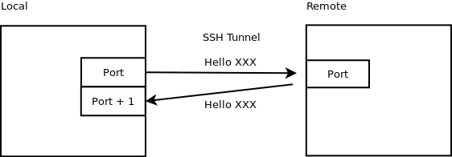
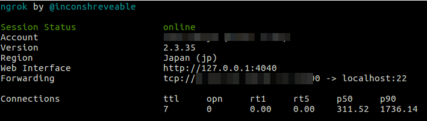

# 科学上网

这里总结了笔者从本科开始 (2014 年) 至今尝试的若干种科学上网方式，不仅仅是狭义的翻墙，还包括从内网访问学校内网服务器。简单来说，有以下几种方案：

- 学校提供的 VPN：不稳定
- SSH 隧道：需要外网服务器，目前一直使用
- ngrok：如无外网服务器，可以采用，但速度取决于服务器地点
- shootback：类似 SSH 隧道，但不够安全
- ShadowSocks: 自搭外网服务器，目前不常用，但仍保留反向爬墙。
- XX-Net: 本科时使用过

## SSH Tunnel

!!! info
    2022-08-04 从香港到珠海的隔离酒店，采取此方案，其中 `InnerServer` 为 `chpc-sandbox`，`OuterServer` 为阿里云 ECS。
    另外，为了使得手机也能享受墙外服务，同时使用酒店 wifi，首先通过 `ifconfig` 获得电脑内网 ip（`wlpXXX:inet`），然后在手机代理中输入 `192.168.1.3:8118`，详见 [:link:](#proxy-for-android-phone)

假设有一台外网服务器 OuterServer，以及内网服务器 InnerServer

- OutServer: 外网服务器，可以从本地 `Laptop` 及内网服务器 `InnerServer` 通过给定外网 IP 访问
- InnerServer: 内网服务器，无法从外网访问，但可以访问外网

=== "Laptop"
    ```bash
    ssh -L 30002:localhost:30002 OuterServer
    ```

=== "OuterServer"
    ```bash
    ssh -D 30002 -p 30001 InnerServer
    ```

=== "InnerServer"
    ```bash
    ssh -R 30001:localhost:22 Server
    ```

这样只能在 ssh 访问内网资源，可以通过 chrome 的 SwithyOmega 插件实现在浏览器中访问内网，效果和登录 VPN 一样，可以正常下文献。

在 SwitchyOmega 中添加 socks5://127.0.0.1:30002 即可访问内网资源。

另外，如果只想科学上网，直接

```bash
# Local Laptop
ssh -D 30002 Server
```

然后在 SwitchyOmega 中添加 socks5://127.0.0.1:30002。

如果将上面的 `my server` 部分改成
```bash
ssh -gD 30002 -p 30001 my@inner-server
```

其中 `-g` 表示允许远程连接，则在 SwitchyOmega 中添加 socks5://my-server:30002 亦可访问内网资源，但这样不够安全，因为似乎所有知道你 server address 都可以访问内网资源，除非特别配置 my server 的安全组，但是应该不是很好，因为你本地的 public ip 是动态分配的，安全组的作用不大。

参考 [玩转SSH端口转发](https://blog.fundebug.com/2017/04/24/ssh-port-forwarding/) 和 [使用SSH反向隧道实现内网穿透](https://zhuanlan.zhihu.com/p/34908698)

有时候可能需要重新连接一下，但是会出现端口占用的问题，

```bash
lsof -i:30002
```

找出端口占用的 pid，然后


```bash
kill -s 9 pid
```

在某些机子上发现运行 `ssh -D` 会报出，

> bind: Cannot assign requested address

但是还是可以 ssh 到目标服务器。[找到类似的问题](https://serverfault.com/questions/444295/ssh-tunnel-bind-cannot-assign-requested-address)，然后解决方案是加上 `-4` 来表示 ipv4，但是不懂原因

### autossh

为了让 ssh 程序在断开后重连，采用 [autossh](https://www.harding.motd.ca/autossh/)。在内网服务器上运行，

```bash
./autossh -M 30000 -o "StrictHostKeyChecking=false" -o "ServerAliveInterval 10" -o "ServerAliveCountMax 3" -NR 30003:localhost:22 xxx@xx.xx.xx.xx
```

通过 `ps -aef` 发现其调用了，

```bash
/usr/bin/ssh -L 30000:127.0.0.1:30000 -R 30000:127.0.0.1:30001 -o StrictHostKeyChecking=false -o ServerAliveInterval 10 -o ServerAliveCountMax 3 -NR 30003:localhost:22 xxx@xx.xx.xx.xx
```

而且如果 kill 掉这个进程，则会立即重新运行一个完全一样的。对于多出来的 `30001` 端口很是奇怪，因为我没有指定。直到学习了下 [autossh 的原理](https://blog.csdn.net/wesleyflagon/article/details/85304336)之后才恍然大悟. 

监视端口 `-M port[:echo_port]` 算是最重要的参数了，这里只指定了 `port` 为 30000，则

- `-L 30000:127.0.0.1:30000` 将发送到**本地端口 30000** (第一个 30000)的请求转发到**目标地址的目标端口**（`127.0.0.1:30000`， 即 `xx.xx.xx.xx:30000`）
- `-R 30000:127.0.0.1:30001` 将发送到**远程端口 30000** (第一个 30000，对应 `xx.xx.xx.xx:30000`）的请求转发到**目标地址的目标端口**（`127.0.0.1:30001`，即本地的 30001 端口）
- 上面一来一会就形成一个闭环。内网服务器定期往 30000 端口发送检测消息，如果链路正常，则 30000 端口的消息先转发到 `xx.xx.xx.xx` 的 30000 端口，然后立即转送到内网服务器的 30001 端口。



### Proxy for Gmail in Thunderbird

因为在 Thunderbird 中不只有 Gmail 账户，所以想只对 Gmail 账户进行代理。于是通过 SwitchyOmega 单独创建一个 profile，然后导出 `.pac` 文件。


### Jupyter Notebook

当**搭建好隧道**后，可以借用该隧道使用内网服务器上的 Jupyter Notebook，

```bash
# open jupyter notebook as usual on innerserver
jupyter notebook
# return url like, 127.0.0.1:8888/?token=xxxxxxxxxxx

# on public server
ssh -L localhost:18888:localhost:8888 -p 30001 [Inner-Server's Username]@localhost

# on my local laptop
ssh -L 18888:localhost:18888 [Server's Username]@[Server's Public IP]
```

于是在本地可以通过 

```bash
127.0.0.1:18888/?token=xxxxxxxxxxx
```

访问内网的 Jupyter Notebook。

## Proxy for Android Phone

!!! info
	2022-08-04 在珠海的隔离酒店，采用此方案使得手机翻墙。另见 [:link:](#ssh-tunnel)

安卓手机自带的只默认 http 和 https 代理，但像 ssh 隧道或者 shadowsocks 得到的都是 socks5 代理，也尝试过[别人推荐的 ProxyDroid](https://blog.csdn.net/qq_40374604/article/details/88989651)，但是似乎还要对手机进行 root。遂放弃。

既然 socks5 有了，直接转换成 http 不就行了么，然后看到了 [Privoxy](https://g2ex.top/2016/05/20/Tips-on-Chinternet/)，这勾起了我的回忆，记得曾经[跟 shadowsocks 搭配](https://blog.csdn.net/m0_38110132/article/details/79796171)使用过，但不知道为啥要用它。而这次我的目标及动机很明确了，将 socks5 转换成 http，供手机端访问，因为我的电脑和手机在同一个局域网内，那这样手机端的 http 代理服务器即为我电脑的局域网 ip，通过 ifconfig 可以得到。

```bash
# 把 HTTP 流量转发到本机 127.0.0.1:1080 的 Shadowsocks (or SSH tunnel)
forward-socks5 / 127.0.0.1:1080 .

# 可选，默认只监听本地连接 127.0.0.1:8118
# 可以允许局域网中的连接
listen-address 0.0.0.0:8118
```

注意这里要用 `0.0.0.0`，这样才能允许[局域网内的连接](https://blog.csdn.net/lamp_yang_3533/article/details/52154695)。但这样还不够，防火墙还没打开，[查看防火墙](https://blog.csdn.net/jiaochiwuzui/article/details/80907521)当前打开的 port

```bash
sudo ufw status
```

果然没有 8118 端口，于是打开

```bash
sudo ufw allow 8118
```

大功告成，手机端能够通过 http 代理科学上网啦！

## [ngrok](https://ngrok.com/)

在内网服务器 Server (such as Fan's lab server, ln001 server, chpc's server)进行如下操作：

1. 下载 ngrok 并解压
2. 注册 ngrok 获得 authtoken，然后运行 `./ngrok authtoken YOUR-AUTHTOKEN` 激活账户
3. 运行 `./ngrok tcp 22 --region=jp ` 来开启 ssh 的 22 端口，其中 `-region jp` 指定服务器为日本的，默认为 `us`，亲测速度很慢。然后得到下面的运行结果



注意 Forwarding 一行的记录，`tcp://SOME-IP-ADDRESS:PORT`

在本地 Local Laptop 上，终端中运行

```shell
ssh -X usename-for-Server@SOME-IP-ADDRESS -p PORT
```

即可登录内网服务器。

## shootback

顾名思义，这就是内网穿透。

同 SSH 反向隧道，需要自己准备一台服务器，[项目主页](https://github.com/aploium/shootback)有详细配置过程。

```bash
# ---- master ----
python3 master.py -m 0.0.0.0:10000 -c 0.0.0.0:10022 --ssl

# ---- slaver ----
# ps: the `--ssl` option is for slaver-master encryption, not for SSH
python(or python3) slaver.py -m 22.33.44.55:10000 -t 127.0.0.1:22 --ssl

# ---- YOU ----
ssh [username@]22.33.44.55 -p 10022
```

注意，`YOU` 的 username 是 slaver 的 username!!

另外一种更复杂的工具是 [frp](https://github.com/fatedier/frp)

但是这似乎跟不加 `-g` 版本的 ssh 反向隧道一样，会存在安全性问题，相当于暴露了公网 ip. 


## ShadowSocks

!!! info
    需要境外服务器，可以在各大云服务商上购买，上一次折腾至少追溯到 2020 年。目前（2022-08-05 20:43:08）仍保留从墙外返回墙内的功能，即在阿里云内地服务商上运行该服务。

Follow the [instruction](https://github.com/shadowsocks/shadowsocks/blob/master/README.md) in the official repo, 

- start on the server: `sudo ssserver -c ss.json -d start`
- check the log file: `tail /var/log/shadowsocks.log -f`
- stop on the server: `sudo ssserver -d stop`

### 二维码反解

对

```bash
ss://bWV0aG9kOnBhc3N3b3JkQGhvc3RuYW1lOnBvcnQ=
```

中的

```bash
bWV0aG9kOnBhc3N3b3JkQGhvc3RuYW1lOnBvcnQ=
```

base64 解密得到

```bash
method:password@hostname:port
```

然后

```bash
sslocal -p port -k password -m method
```


### 系统代理与浏览器代理

- 只作用在浏览器上：shadowsocks + switchOmega
- 全局代理：shadowsocks + privoxy

参考 [Ubuntu配置Shadowsocks全局代理](https://xingjian.space/Computer-Network/global-proxy-of-Shadowsocks-in-Ubuntu/)

无需单独设置系统代理，浏览器是可以通过插件设置代理的。

另外使用如curl需要代理时，可以采用

```bash
$ curl ip.cn --proxy socks5://127.0.0.1:1080
```

## XX-Net

!!! warning
    很久未曾使用，上一次至少是 2018 年以前。

### Environment

1. ubuntu 16.04
2. XX-net
3. privoxy

### Install

- 安装privoxy

```bash
sudo apt-get install privoxy
```

- 安装XX-net

直接访问项目主页[XX-net](https://github.com/XX-net/XX-Net)，内有安装说明

- 设置privoxy
在/etc/privoxy/config文件中加入

```bash
forward / 127.0.0.1:8087
listen-address 0.0.0.0:8118
```

### Usages

- 可以在访问时设置代理

```bash
curl ipinfo.io/ip --proxy 127.0.0.1:8087
```

- 也可以在.bashrc设置，这样所有的终端的网络访问都会走终端，在~/.bashrc文件中加入

```bash
export https_proxy=127.0.0.1:8087
export http_proxy=127.0.0.1:8087
```

然后

```bash
source ~/.bashrc
curl ipinfo.io/ip #测试是否代理成功
```

!!! tip
    <https://ipinfo.io/> can show more details about the ip, such as the ips for an organization, say, <https://ipinfo.io/AS3661>. 

## CUHK VPN

!!! info
    不稳定，而且目前 (2022-08-05 20:58:04) 已无帐号，上一次使用为 2020 上半年。

### Ubuntu 16.04 

在安装 `network-manager-l2tp-gnome` 好后（如 [Ubuntu 16.04 Connecting to L2TP over IPSEC via Network Manager](https://medium.com/@hkdb/ubuntu-16-04-connecting-to-l2tp-over-ipsec-via-network-manager-204b5d475721)），能够连接，但是并不能访问 google，甚至 baidu 也不行，而手机端 vpn 可以正常使用。并且尝试访问 google 失败后，便弹出 vpn stop 的消息。

### Ubuntu 18.04

In mainland China, still failed. Firstly, I need to install `l2tp` following the instruction of [Setup L2TP over IPsec VPN client on Ubuntu 18.04 using GNOME](https://20notes.net/linux/setup-l2tp-over-ipsec-client-on-ubuntu-18-04-using-gnome/).
Sometimes it can be connected, but quickly disconnected. Then I tried to figure out the reason, such as specifying the phase algorithm, and I known a little about the difference of `strongswan` between `libreswan` from [L2TP VPN on Ubuntu 18.04 client](https://community.ui.com/questions/L2TP-VPN-on-Ubuntu-18-04-client/e8317a0c-ba97-4673-b2c2-1c0be0906228)

```bash
3DES, modp1024, modp1536 and SHA1 are considered weak by strongswan and newer versions of libreswan, so aren't in their default proposals (although some late versions of libreswan still allow modp1536 and SHA1 with IPsec IKEv1). You can explicitly specify the proposals for phase 1 and 2 in the IPsec config dialog box.


You could try the following with strongswan :

Phase1: aes256-sha1-modp1024,aes128-sha1-modp2048,aes128-sha1-modp1536!
Phase 2 : aes256-sha1,aes128-sha1!
Or for libreswan try:

Phase1: aes256-sha1-modp1024,aes128-sha1-modp2048,aes128-sha1-modp1536
Phase 2 : aes256-sha1,aes128-sha1
Note the exclamation mark (!) with strongswan that isn't used with libreswan. 

If you are not sure if you are using libreswan or strongswan, run :

ipsec --version 
```


And when I click the option of 

> Use this connection only for resources on its network

seems can visit the websites of school. But neither with nor without this option, I cannot visit Google.

And I found [a question](https://serverfault.com/questions/978914/no-internet-access-through-l2tp-ipsec-using-ubuntu-18-04-routing-table) has quite similar problem with me, then I tried to learn and edit the routing table. [第八章、路由觀念與路由器設定](http://linux.vbird.org/linux_server/0230router.php) helps me a lot on the understanding of routing. But it seems that I don't miss the rule pointed out by the question. And so it might be due to the routing table.

As a result, I give up and continue to use the reverse SSH to visit google.

### VPN Jump

猜测可能由于墙的原因使得 VPN 不稳定，于是尝试在境外服务器连接 VPN

首先安装 

```bash
sudo add-apt-repository ppa:nm-l2tp/network-manager-l2tp
sudo apt-get install network-manager-l2tp
```

#### 尝试一：通过 `-X` 在 GUI 中配置

参考 [setup L2TP IPsec VPN in archlinux using NetworkManager](https://gist.github.com/pastleo/aa3a9524664864c505d637b771d079c9)

打开配置窗口的命令为 [`nm-connection-editor`](https://askubuntu.com/questions/174381/openning-networkmanagers-edit-connections-window-from-terminal)，但竟然没有，原来没有装 

```bash
sudo apt-get install network-manager-gnome
```

#### 尝试二：命令行添加

在尝试寻找 network manager 的 command line 命令时，发现好几个 `nmcli` 相关的命令，于是猜想应该是可以直接在 command line 中配置的，比如 [L2TP Connection Client on ubuntu 18.04 Server](https://askubuntu.com/questions/1167283/l2tp-connection-client-on-ubuntu-18-04-server) 和 [How to configure and Manage Network Connections using nmcli](https://www.thegeekdiary.com/how-to-configure-and-manage-network-connections-using-nmcli/)，但我先在本地测试有几个问题

- 似乎不需要 `connection.id`
- 需要指定 `ifname`

修改好之后，可以成功添加，但是准备连接时，报错

> NetworkManager fails with “Could not find source connection”

参考 [NetworkManager fails with “Could not find source connection”](https://unix.stackexchange.com/questions/438224/networkmanager-fails-with-could-not-find-source-connection) 无果。后来在 [nmcli 的官方文档](https://developer.gnome.org/NetworkManager/stable/nmcli.html)中看到，似乎连接时需要指定 `ifname`，可用的 device 为

```bash
sudo nmcli device status 
```

但是再次连接依旧报错，不过错误跟我在墙内试图连接 VPN 时报错似乎一致。

> Error: Connection activation failed: the VPN service stopped unexpectedly.

#### 尝试三：Windows

试用 Azure，申请了个 Windows 10，按照 ITSC 的指示连接 VPN，确实能够成功，但是连接成功后，我跟该电脑的连接也就断开了，再次尝试也连不上，只好重启。

## ZJU VPN

黄熊的[浙大玉泉ubuntu有线上网](http://wwtalwtaw.studio/2018/04/26/net_surfing/)讲得很详细。不过我却碰到个很奇怪的问题，申请完静态 IP，能够 ping 通内网，但当我安装完 [`xl2tpd_zju`](xl2tpd_1.2.5+zju-1_amd64.deb) 后，却总是一直连不上网，更奇怪的是，还不能访问内网（没有运行 `vpn-connect` 前至少可以访问内网）。然后我尝试了各种办法，包括但不限于：

1. 重装 `xl2tpd_zju`；
2. 换个 `xl2tpd_zju` 的版本，在 cc98 上有两个版本，下载链接 [xl2tpd_zju](https://pan.baidu.com/s/1eRNQwng#list/path=%2F)；
3. 修改 `/etc/network/interfaces`
4. 各种组合式操作

但都迷之不能联网。

遂准备换种方式，参考[Ubuntu16.04配置L2TP-VPN](http://keyun.ml/2016/07/17/Tools/ubuntu16-l2tp-vpn.html)

但这种安装最新版本，`libnma`的版本跟不上，然后参考[L2tp IPSEC PSK VPN client on (x)ubuntu 16.04](https://askubuntu.com/questions/789421/l2tp-ipsec-psk-vpn-client-on-xubuntu-16-04/797764)

直接用

```shell
sudo add-apt-repository ppa:nm-l2tp/network-manager-l2tp  
sudo apt-get update  
sudo apt-get install network-manager-l2tp
sudo apt-get install network-manager-l2tp-gnome
```

安装。

这种方式相当于增加了 `L2TP` VPN 的设置界面，到这里我也渐渐明白 `xl2tpd_zju` 和这种方式本质上应该是一样的。于是我按照之前的配置方式新建了一个 VPN 的连接，但还是没用。

最后我换了 VPN 的 ip（有两个 ip，10.5.1.5 和 10.5.1.9），之前 `xl2tpd_zju` 默认是 10.5.1.5，误打误撞，改成 10.5.1.9 后，竟然成功了！！
