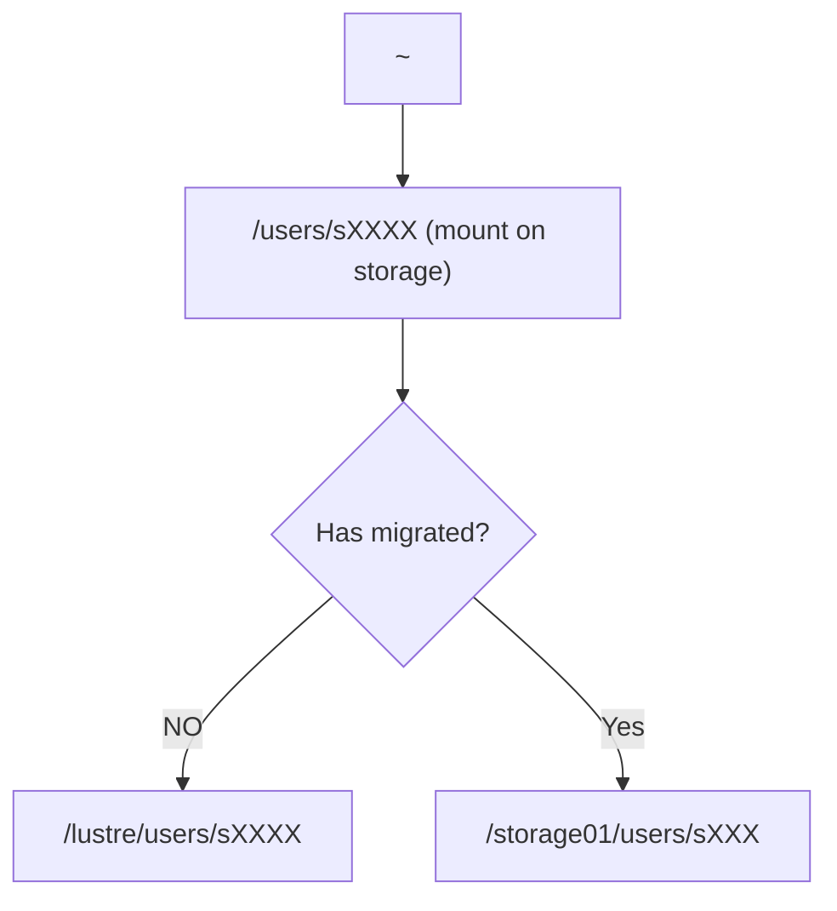
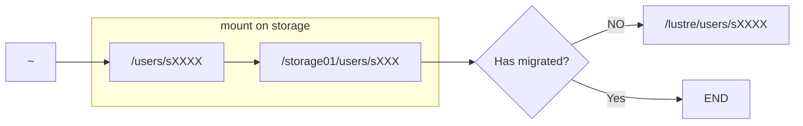
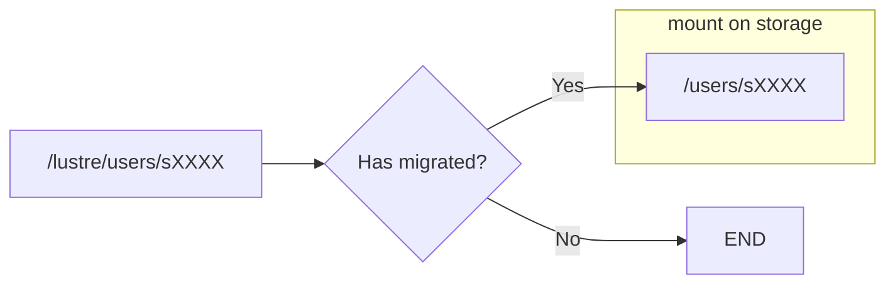

```mermaid
graph TD;
	A0["~"]-->A1["/users/sXXXX (mount on storage)"];
    A1-->A{Has migrated?};
    A-->|NO|D["/lustre/users/sXXXX"];
	A-->|Yes|C["/storage01/users/sXXX"];
```

```mermaid
graph LR;
	A0["~"]-->A1["/users/sXXXX"];
	subgraph mount on storage
	A1-->A2["/storage01/users/sXXX"];
	end
    A2-->A{Has migrated?};
    A-->|NO|D["/lustre/users/sXXXX"];
	A-->|Yes|END;
```

```mermaid
graph LR;
    A["/lustre/users/sXXXX"]-->B{Has migrated?};
	B-->|Yes|C["/users/sXXXX"];
	subgraph mount on storage
	C
	end
	B-->|No|END;
```

