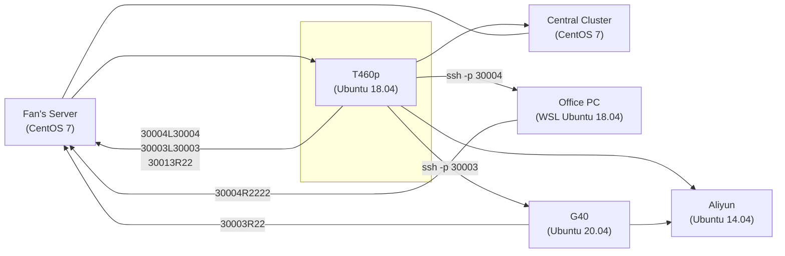

```mermaid
graph LR
    A["Fan's Server<br/> (CentOS 7)"]; 
    B["Central Cluster<br/> (CentOS 7)"];
    subgraph   
    C["T460p <br/> (Ubuntu 18.04)"];
    end
    D["Office PC<br/> (WSL Ubuntu 18.04)"];
    E["G40<br/> (Ubuntu 20.04)"];
    F["Aliyun<br/> (Ubuntu 14.04)"];
    C --"ssh -p 30004"--> D
    C--"30004L30004<br/>30003L30003<br/>30013R22"-->A---->C;    
    D--"30004R2222"-->A;
	E--"30003R22"-->A;
	C--"ssh -p 30003"-->E;
	C-->F;
	C-->B;
    E-->F;
    A---B;
```

