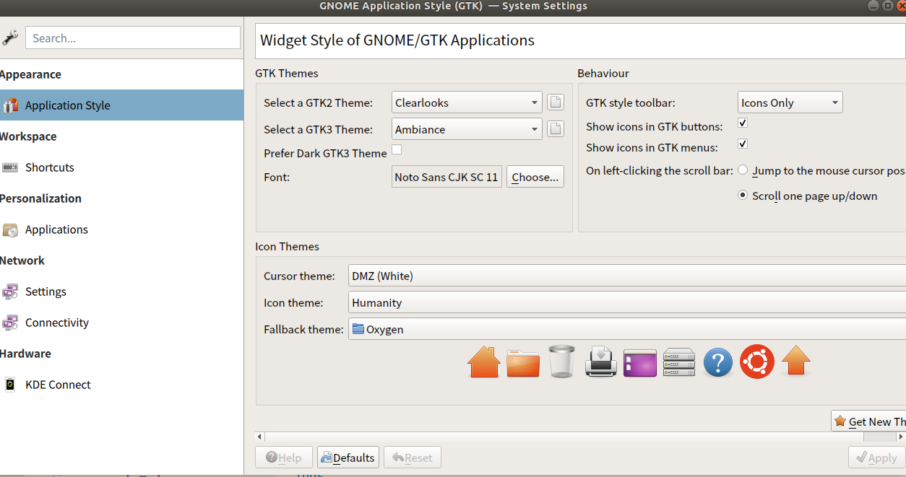

# Softwares on Linux

## 搜狗输入法

需要 fcitx，若没有装，

```bash
sudo apt-get install fcitx-bin
sudo apt-get install fcitx-table
```

然后将输入法切换成 fcitx，在设置中语言那里，


最后下载按照搜狗输入法，安装时我出现这样的问题导致安装失败，

> No such key 'Gtk/IMModule' in schema 'org.gnome.settings-daemon.plugins.xsettings' as specified in override file '/usr/share/glib-2.0/schemas/50_sogoupinyin.gschema.override'; ignoring override for this key.

参考 [Install sogoupinyin on ubuntu 16.04LTS, with error 'Gtk/IMModule'](https://askubuntu.com/questions/883506/install-sogoupinyin-on-ubuntu-16-04lts-with-error-gtk-immodule)，将 `/usr/share/glib-2.0/schemas/50_sogoupinyin.gschema.override` 中的 `IMModule` 一行改成

```bash
overrides={'Gtk/IMModule':<'fcitx'>}
```

然后再运行

```bash
sudo glib-compile-schemas /usr/share/glib-2.0/schemas/
```

再次安装便成功了。

最后在语言栏中添加搜狗拼音的输入法即可。

参考 [解决Ubuntu 18.04中文输入法的问题，安装搜狗拼音](https://blog.csdn.net/fx_yzjy101/article/details/80243710)

## Install TeXLive 2020

The texlive2017 for Ubuntu cannot work for me, it reports

> fatal: Could not undump 6994 4-byte item(s) ...

and try 

> fmtutil-sys --all

but does not work, refer to [Error Message: “tex: fatal: Could not undump 1 4-byte item(s) from”](https://tex.stackexchange.com/questions/141838/error-message-tex-fatal-could-not-undump-1-4-byte-items-from), but does not work. 

And I also try uninstall and reinstall texlive, but it still does not work.

Then finally I decided to install the latest TeXLive 2020, [TeX Live - Quick install](https://tug.org/texlive/quickinstall.html), follow the instructions, but note that the mirror url should append `path/systems/texlive/tlnet`.

```bash
install-tl --location http://mirror.example.org/ctan/path/systems/texlive/tlnet
```

And note that the [steps for compeletely removing the installed TeXLive](https://tex.stackexchange.com/questions/95483/how-to-remove-everything-related-to-tex-live-for-fresh-install-on-ubuntu).

## Okular

当初使用 Ubuntu 16.04 时，Okular 是通过 snap 安装的，可能参考了[这个](https://askubuntu.com/questions/976248/how-to-install-latest-version-of-okular-on-ubuntu-16-04)?

```bash
sudo snap install okular
```

但是更新到 Ubuntu 18.04 后，发现在移动硬盘的文档打不开，而之前没碰到过这样的问题，一开始还以为是移动硬盘命名问题，之前曾经碰到过某个程序（忘记了）不允许路径存在空格，而移动硬盘默认名字有空格，于是曾经更改过名字（忘记了怎么更改）。原本以为可能更新系统使得这个更改失效了，还想着再找找怎么更改，但是找到一堆怎么更改卷标名的，最后才发现路径中名字确实应该更改成功了。

所以问题还是回到 okular 本身，通过 snap 和 apt 安装是两个不同的版本，图标也有点差异，然后发现也有人跟我有[同样的问题](https://askubuntu.com/questions/1137830/cannot-open-pdf-files-in-mounted-usb-drive-using-okular)，有人回复说

> Okular does not support removable media while installed as Snap. 

于是卸掉 snap 版的 okular，转而安装 apt 版本的，

```bash
sudo apt-get install okular
```

发现有些图标不能正常显示，网上也找到了类似的问题，

- [KDE application icon not displayed in Ubuntu](https://askubuntu.com/questions/1007563/kde-application-icon-not-displayed-in-ubuntu)
- [State of Okular in Ubuntu 17.10?](https://askubuntu.com/questions/999551/state-of-okular-in-ubuntu-17-10)

尝试了其中的解决方案，但均未成功，最后的解决方案是 [navigation panel icons missing on standard install of 17.04](https://bugs.launchpad.net/ubuntu/+source/okular/+bug/1698656)

```bash
As a workaround, what worked for me was:

$ sudo apt install systemsettings kde-config-gtk-style kde-config-gtk-style-preview oxygen-icon-theme

* systemsettings for the app systemsettings5;

* kde-config-gtk-style enables the Appearance module in systemsettings5;

* kde-config-gtk-style-preview allows previewing the themes without restarting the GTK applications;

* oxygen-icon-theme is an alternative theme to use in KDE applications.

Then, run systemsettings5, click on Application Style, select Oxygen as a Fallback theme, click on Apply.
```

最后我的配置是



可以尝试不同配置，因为刚开始打开的，似乎并不是之前系统的配置。

### latex in annotation

okular 的 note 功能支持 LaTeX，当输入 `$$...$$` 时会提示要不要转换为 latex，点击后但是报错，

```bash
latex is not executable
```

注意到 `latex` 的 PATH 是定义在 `.bashrc` 中，而通过 zotero 调用 okular 时并不会 source `.bashrc`，只有通过 bash shell 调用的程序采用 source 到 .bashrc，也就是在终端中调用 okular 时，latex 显示正常。

研究图形界面程序调用 path 的机制似乎是一种解决方案，但觉得可能过于复杂，其实之前在 atom 中也出现过类似的问题。可能的方案是在 `.profile` 中添加 PATH，可能有用的[参考博客](https://medium.com/@abhinavkorpal/bash-profile-vs-bashrc-c52534a787d3)。

于是我采用更简单的方案，在 `/usr/bin` 中添加 `latex` 的 soft link，添加后报了新错，

```bash
dvipng is not executable
```

但至少证明这条思路是可行的，于是继续添加 `dvipng` 的 soft link，最后解决了问题！

## WeChat in Linux

起因是今天网页端竟然登不上去，本来觉得用不了就算了吧，正好降低聊天时间，但是想到很多时候传传文件大家还是习惯用微信，所以还是准备捣鼓下 linux 版。我记得之前试过一种，但是那似乎也是基于网页版的，只是封装了一下。而今天看到了基于 wine 以及将其打包成 docker 的解决方案！

docker 了解一点，知道如果成功，以后安装卸载会很简单，于是使用 https://github.com/huan/docker-wechat 提供的 docker image，但是后来输入时文本不可见的问题很恼人 https://github.com/huan/docker-wechat/issues/40，也不知道怎么解决。

想到作者的 docker 是在 19.10 上构建的，在想会不会与我的 18.04 不够兼容，所以想着自己修改 docker，其实都已经 fork 好了，但是由于 wine 对 18.04 的支持有个问题，https://forum.winehq.org/viewtopic.php?f=8&t=32192，虽说可能跟输入法也不太有关，但是还是试着装这个，后面改写 docker file 时重新 build 总是出问题，一直没解决，所以决定放弃。

于是差不多想放弃 docker 了，想直接安装 wine，弊端似乎也就是卸载会有点繁，但是如果安装成功，那就用着呗，也不用卸载了。

于是参考 [WeChat Desktop on Linux](https://ferrolho.github.io/blog/2018-12-22/wechat-desktop-on-linux)

1. install WineHQ: https://wiki.winehq.org/Ubuntu_zhcn

```bash
The following packages have unmet dependencies:
 gstreamer1.0-plugins-good : Breaks: gstreamer1.0-plugins-ugly (< 1.13.1) but 1.8.3-1ubuntu0.1 is to be installed
 winehq-stable : Depends: wine-stable (= 5.0.0~bionic)
E: Error, pkgProblemResolver::Resolve generated breaks, this may be caused by held packages.
```

solution

```bash
# (re)install gstreamer1.0-plugins-good and gstreamer1.0-plugins-ugly
sudo apt-get install gstreamer1.0-plugins-good
sudo apt-get install gstreamer1.0-plugins-ugly
```

```bash
Error: winehq-stable : Depends: wine-stable (= 5.0.0~bionic)
```

It is due to [FAudio for Debian 10 and Ubuntu 18.04](https://forum.winehq.org/viewtopic.php?f=8&t=32192), and 

> The quickest and easiest way to satisfy the new dependency is to download and install both the i386 and amd64 libfaudio0 packages before attempting to upgrade or install a WineHQ package.

seems does not work. I need to add the repository as suggested in [Error: winehq-stable : Depends: wine-stable (= 5.0.0~bionic)](https://nixytrix.com/error-winehq-stable-depends-wine-stable-5-0-0-bionic/)

```bash
curl -sL https://download.opensuse.org/repositories/Emulators:/Wine:/Debian/xUbuntu_18.04/Release.key | sudo apt-key add -
sudo apt-add-repository 'deb https://download.opensuse.org/repositories/Emulators:/Wine:/Debian/xUbuntu_18.04/ ./'
```

but seems not due to this, and follow the instruction in [docs/WineDependencies.md](https://github.com/lutris/docs/blob/master/WineDependencies.md)

```bash
sudo apt-get install libgnutls30:i386 libldap-2.4-2:i386 libgpg-error0:i386 libxml2:i386 libasound2-plugins:i386 libsdl2-2.0-0:i386 libfreetype6:i386 libdbus-1-3:i386 libsqlite3-0:i386
```

then the problem is solved. And continue to follow the steps in [WeChat Desktop on Linux](https://ferrolho.github.io/blog/2018-12-22/wechat-desktop-on-linux)

### 窗口轮廓阴影

当从微信切换到其他软件时，会留下一个窗口轮廓阴影。再一次感叹 google 的强大，本来这个问题我都不知道怎么搜索，但只给了 “wine wechat” 和 “窗口轮廓” 这两个关键词后，就找到了两种解决方案：

- [解决Linux下微信透明窗口的问题](https://manateelazycat.github.io/linux/2019/09/29/wechat-transparent-window.html)：切换微信后，直接关掉窗口，侧边栏也不在有微信的窗口，再次启动需要点击顶部栏的图标
- [wine-wechat 窗口阴影置顶解决方案](https://www.wootec.top/2020/02/16/wine-wechat%E9%98%B4%E5%BD%B1%E8%A7%A3%E5%86%B3%E6%96%B9%E6%A1%88/)：通过 `xdotool` 去除窗口阴影。之前折腾 docker-wechat 就看到[有人提到 `xdotool`](https://www.kpromise.top/run-wechat-in-linux/)

更偏向第二种策略，后来尝试了一下也确实觉得第二种好用，当然我都有折腾过。

其实策略本身很简单，而且都可以即时运行一下脚本，就能感受效果，但是在脚本自动化那里花了挺长时间。

策略二本来推荐的是通过修改 wechat 的启动程序，但是因为我的启动程序是通过 wine 实现的，这一点似乎跟博客中不一样，我只找到一个 `WeChat.desktop` 文件，也没把握直接修改。所以我先去尝试了开机自启动

#### 开机自启动

实现方案有很多，但总想找种最简单的，有考虑 systemd service， [How do I run a script as sudo at boot time on Ubuntu 18.04 Server?](https://askubuntu.com/questions/1151080/how-do-i-run-a-script-as-sudo-at-boot-time-on-ubuntu-18-04-server)

中间也有试过 `/etc/init.d`，[Ubuntu下添加开机启动脚本](https://blog.csdn.net/hcx25909/article/details/9068497)，但是报出 warning 

> warning: /etc/init.d/test missing LSB information

有点不放心。

另外还想到直接在 `.profile` 中添加运行程序，这应该算是最简单的方式，这在 [Ubuntu添加和设置开机自动启动程序的方法](https://blog.csdn.net/qq_14989227/article/details/79227283) 中有更系统的总结。

但是后来才发现，开机自启动并不适用于策略二提供的脚本，因为在判断没有微信时，程序会自动退出去。本来也想着简单改下使其能够始终运行，但是觉得这种不如原作者的更优，白白占用内存。

### 修改 desktop 文件

这个关键点在于，使其能够同时运行 wine 和 `disable-wechat-shadow.py` 脚本文件，原 `WeChat.desktop` 文件为

```bash
Exec=env WINEPREFIX="/home/weiya/.wine32" wine C:\\\\windows\\\\command\\\\start.exe /Unix /home/weiya/.wine32/dosdevices/c:/ProgramData/Microsoft/Windows/Start\\ Menu/Programs/WeChat/WeChat.lnk
```

第一种尝试便是直接加上 `& python3 /home/weiya/disable-wechat-shadow.py`，但是似乎当做了 wine 的 argument，这一点[@mango](https://askubuntu.com/a/461495)也指出

> The `Exec` key must contain a command line. A command line consists of an executable program optionally followed by one or more arguments.

第二种便是通过 `sh -c`，即

```bash
Exec=env WINEPREFIX="/home/weiya/.wine32" sh -c "wine C:\\\\windows\\\\command\\\\start.exe /Unix /home/weiya/.wine32/dosdevices/c:/ProgramData/Microsoft/Windows/Start\\ Menu/Programs/WeChat/WeChat.lnk; python3 /home/weiya/disable-wechat-shadow.py"
```

但是这个经常报出错误

> key "Exec" in group "Desktop Entry" contains a quote which is not closed

很纳闷，觉得这不应该啊，而且也[有人 wine 的解决方案](https://askubuntu.com/questions/1200116/desktop-error-there-was-an-error-launching-the-application)也是通过 `sh -c`，但是后来发现了个区别，别人引号中空格只需要一次转义，即 `\ `，比如 "Program\ Files\ (x86)"，但是我这里原先没加引号时，用两个反斜杠进行转义 `\\ `，而且 `\\` 需要用 `\\\\` 来转义，所以隐隐觉得可能是加了引号转义会有问题。所以尝试改成 `\ ` 和 `\\`，但是都没有成功。

后来跑去研究下 `wine` 的命令，想弄清楚那一长串 argument 是什么意思，才明白这应该是句 `wine start`，而 `/Unix` 是为了用 linux 格式的路径，详见 [3.1.1 How to run Windows programs from the command line](https://wiki.winehq.org/Wine_User%27s_Guide)，所以为了避免可能的转义问题，首先可以把 `wine C:\\\\windows\\\\command\\\\start.exe` 替换成 `wine start`，而空格转义还是用 `\ `，即最终 `WeChat.desktop` 文件为

```bash
Exec=env WINEPREFIX="/home/weiya/.wine32" sh -c "wine start /Unix /home/weiya/.wine32/dosdevices/c:/ProgramData/Microsoft/Windows/Start\ Menu/Programs/WeChat/WeChat.lnk; python3 /home/weiya/disable-wechat-shadow.py"
```

这个版本终于成功了！

注意到 `env` 不要删掉，虽然在 `.bashrc` 中有设置，但是通过 desktop 启动时，并不会 source `.bashrc`，所以仍需保留这句设置，不然 `wine` 会找不到。

### window id

策略二基于的假设是，

> 微信窗口后四位所对应的不同窗口层次是固定的. 主窗口是0xXXXX000a, 那么阴影所对应的窗口就是0xXXXX0014.

而且确实好几次我阴影对应的窗口就是 `0xXXXX0014`，所以直接用了代码。但是后来方向，有时代码不起作用，这时才意识到可能 id 没对上。果然，这时候变成了 `0xXXXX0015`。不过，“不同窗口层次是固定的” 这个规律仍适用，而且我发现刚好差 8 （虽然这一点对原作者好像不适用），所以把第 25 行改成

```python
shadow = hex(int(id, 16) + 8)
```

顺带学一下 python 怎么处理十六进制，`hex()` 会把十进制数转化为十六进制，并以 `0x` 开头的字符串表示。

到这里，这个问题差不多是解决了。

### cannot send images

Try to use the approach 

```bash
sudo apt install libjpeg62:i386
```

suggested in [微信无法发送图片可以尝试一下这个方法 #32](https://github.com/wszqkzqk/deepin-wine-ubuntu/issues/32), but it does not work after `wineboot -u` and `winboot -r` and system reboot. And I even install `libjpeg8:i386` and `libjpeg9:i386`, still does not work, and then I doubt if I miss other dependencies, such as [debian-special-pkgs/deepin-wine_2.18-12_i386/DEBIAN/control](https://github.com/wszqkzqk/deepin-wine-ubuntu/commit/5300834405de1388893f2cedeb5c74f6b307a4f8#diff-4398b218af11cf74c553720d61cdff90), but I the `libjpeg-turbo8` and `libjpeg-turbo8:i386` had been installed, then I had no idea.

## Chrome 

### 黑屏

参考 https://blog.csdn.net/jjddrushi/article/details/79155421

进入休眠状态后，睡了一晚上，第二天早上打开 chrome 便黑屏了，然后采用

```bash
chrome -disable-gpu
```

再设定

```
Use hardware acceleration when available
```
false，再点击 relaunch，则黑屏的页面都回来了，不需要重启整个 chrome。

## Atom

### atom 自动更新

[atom](https://launchpad.net/~webupd8team/+archive/ubuntu/atom/)

```
sudo add-apt-repository ppa:webupd8team/atom
sudo apt-get update
```

### proxy 设置

Atom 的包管理器是 [apm](https://github.com/atom/apm#behind-a-firewall)，其中有介绍怎么设置 proxy，即

```bash
apm config set strict-ssl false
apm config set http-proxy http://127.0.0.1:8118
```


## 百度网盘

发现百度网盘出了 Linux 版，但是在 Ubuntu 16.04 似乎运行不了——能下载安装但是无法打开运行。

目前版本为 Linux版 V2.0.2（更新时间：2019-07-25）

[官网](https://pan.baidu.com/download)显示目前只支持

> 适应系统：中标麒麟桌面操作系统软件（兆芯版） V7.0、Ubuntu V18.04

于是寻找替代方案。

### bcloud

项目地址：[https://github.com/XuShaohua/bcloud](https://github.com/XuShaohua/bcloud)

但是四五年没有更新了。安装试了一下，登录不了，遂放弃。

### PanDownload

[https://www.baiduwp.com](https://www.baiduwp.com)

不需要安装客户端，只需要输入网盘分享链接和提取码，便可以下载文件（而百度网盘本身下载文件需要打开客户端）。不过速度似乎不咋地

### bypy

逛到了另外一个客户端，项目地址：[https://github.com/houtianze/bypy](https://github.com/houtianze/bypy)

还挺活跃，五个月前有更新。

测试了一下，相当于在网盘内新建了 `/apps/bypy` 文件夹，然后可以同步该文件夹内的内容，似乎不能直接对文件夹外的文件进行操作。尽管这样，也是很好的了，以后文件可以存放在这个文件夹下。

当然，还是期待官网本身支持。

常用命令：

```bash
bypy syncup
bypy syncdown
```

## Kazam

Ubuntu 下 kazam 录屏 没声音解决方案

[http://www.cnblogs.com/xn--gzr/p/6195317.html](http://www.cnblogs.com/xn--gzr/p/6195317.html)

### Kazam video format

cannot open in window

solution

```
ffmpeg -i in.mp4 -pix_fmt yuv420p -c:a copy -movflags +faststart out.mp4
```

refer to [convert KAZAM video file to a file, playable in windows media player](https://video.stackexchange.com/questions/20162/convert-kazam-video-file-to-a-file-playable-in-windows-media-player)


## Peek

[homepage](https://github.com/phw/peek), easy to use, can convert to gif.

## Rstudio

### Rstudio 不能切换中文输入（fctix）

参考[Rstudio 不能切换中文输入（fctix）](http://blog.csdn.net/qq_27755195/article/details/51002620)

- [Ubuntu 16.04 + Fcitx + RStudio 1.0で日本語を入力する方法](http://blog.goo.ne.jp/ikunya/e/8508d21055503d0560efc245aa787831)
- [Using RStudio 0.99 with Fctix on Linux](https://support.rstudio.com/hc/en-us/articles/205605748-Using-RStudio-0-99-with-Fctix-on-Linux)

曾经按照上述的指导能够解决这个问题，即将系统的 qt5 的 `libfcitxplatforminputcontextplugin.so` 手动添加到 rstudio 安装目录下的 plugins 中，即

```bash
sudo ln -s /usr/lib/$(dpkg-architecture -qDEB_BUILD_MULTIARCH)/qt5/plugins/platforminputcontexts/libfcitxplatforminputcontextplugin.so /usr/lib/rstudio/bin/plugins/platforminputcontexts/
```

但是后来又失败了，猜测原因可能是 qt5 的版本不再兼容了。在 Rstudio 顶部的菜单栏中，点击 Help > About Rstudio 可以找到具体的 qt 版本信息，比如 RStudio (Version 1.2.5001) 依赖 QtWebEngine/5.12.1，而系统的 Qt 插件版本没那么高，所以也能理解 `libfcitxplatforminputcontextplugin.so` 为什么不再有用了。一种解决方案便是手动重新编译与 Rstudio 中匹配的 Qt 插件的版本，但是似乎比较繁琐，而且也不能一劳永逸，如果 rstudio 更新，还是会失效。

索性不折腾了。如果真的需要中文，就用其他编辑器吧。期待 rstudio 官方早日解决这个问题……

### 更新rstudio 后闪退

安装 rstudio 应该采用

```
sudo apt-get install gdebi-core
wget https://download1.rstudio.org/rstudio-1.0.44-amd64.deb
sudo gdebi rstudio-1.0.44-amd64.deb
```

而非
```
sudo dpkg -i
```

另外，如果不行，删除后再装
```
sudo apt-get remove rstudio
```

## Octave安装指南

参考[Octave for Debian systems](http://wiki.octave.org/Octave_for_Debian_systems)

另外帮助文档见[GNU Octave](https://www.gnu.org/software/octave/doc/interpreter/)
