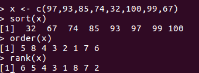

# R相关笔记

## 序列减去常数

```R
for (i in c(1:n-1))
  print(i)
##0
##1
##2
for (i in c(1:(n-1)))
  print(i)
##1
##2
```

## Error in plot.new() : figure margins too large in R

[reference](http://stackoverflow.com/questions/12766166/error-in-plot-new-figure-margins-too-large-in-r)


## linux更新的问题

查看https://mirrors.tuna.tsinghua.edu.cn/CRAN/ 中的README.md文件

### 更新记录
1. 找到源码文件夹
```{r}
sudo make uninstall
```
2. 配置source.list，安装。

## 终端执行R code

[reference](https://stackoverflow.com/questions/18306362/run-r-script-from-command-line)

```
touch main.R
vi main.R
### in main.R
##!/usr/bin/env Rscript
... ## R command
### save main.R
### run this file
./main.R
```

## shiny

[init](https://github.com/rstudio/shiny-server/issues/153)

## 删除
```
rm(list = ls(all = TRUE))
```

## interval

[http://blog.sciencenet.cn/blog-54276-288414.html](http://blog.sciencenet.cn/blog-54276-288414.html)

## window 安装包
切换到R的安装路径下，在etc文件夹中编辑文件Rprofile.site文件

```
## set a CRAN mirror
    local({r <- getOption("repos")
		r["CRAN"] <- "http://mirrors.ustc.edu.cn/CRAN/"
          options(repos=r)})
```

## sort(), rank(), order()

[http://blog.sina.com.cn/s/blog_6caea8bf0100spe9.html](http://blog.sina.com.cn/s/blog_6caea8bf0100spe9.html)

sort(x)是对向量x进行排序，返回值排序后的数值向量。rank()是求秩的函数，它的返回值是这个向量中对应元素的“排名”。而order()的返回值是对应“排名”的元素所在向量中的位置。



## Interpreting Residual and Null Deviance in GLM R


Refer to [https://stats.stackexchange.com/questions/108995/interpreting-residual-and-null-deviance-in-glm-r](https://stats.stackexchange.com/questions/108995/interpreting-residual-and-null-deviance-in-glm-r)

## 缺少libRblas.so和libRlapack.so的解决办法


虽然缺少libRblas.so和libRlapack.so，但却有libblas.so和liblapack.so，而它们应该是一样的，只是文件名不同而已，为此添加链接即可。

```
cd /usr/lib
ln -s libblas.so libRblas.so
ln -s /usr/lib/R/module/lapack.so libRlapack.so
```

参考：
1. [https://bugs.launchpad.net/ubuntu/+source/rkward/+bug/264436](https://bugs.launchpad.net/ubuntu/+source/rkward/+bug/264436)
2. [http://promberger.info/linux/2009/03/20/r-lme4-matrix-not-finding-librlapackso/](http://promberger.info/linux/2009/03/20/r-lme4-matrix-not-finding-librlapackso/)

## RSQLite

参考博文[https://statr.me/2011/10/large-regression/](https://statr.me/2011/10/large-regression/)

代码见[sqlite_ex.R](sqlite_ex.R)

## Rcpp


手动设置

```
cd /usr/local lib
##cd /usr/lib
ln -s /home/weiya/R/x86_64-pc-linux-gnu-library/library/Rcpp/libs/Rcpp.so libRcpp.so
```

## function 'dataptr' not provided by package 'Rcpp'

原因是因为没有在
```
dyn.load()
```
前面添加
```
library(Rcpp)
## 或require(Rcpp)
```

## R check package about description

check locale

## par cheatsheet

[r-graphical-parameters-cheatsheet](r-graphical-parameters-cheatsheet.pdf)

## Mathematical Annotation in R plot

```
plot(..., main = expression(paste("...", mu[1])))
```

参考
1. [Mathematical Annotation in R
](http://vis.supstat.com/2013/04/mathematical-annotation-in-r/)

## Problems installing the devtools package

[关于curl](https://stackoverflow.com/questions/20923209/problems-installing-the-devtools-package)


## function 'dataptr' not provided by package 'Rcpp'

参考[function 'dataptr' not provided by package 'Rcpp'](https://stackoverflow.com/questions/21657575/what-does-this-mean-in-lme4-function-dataptr-not-provided-by-package-rcpp)


## Rcpp reference

[Rcpp-quickref](Rcpp-quickref.pdf)
