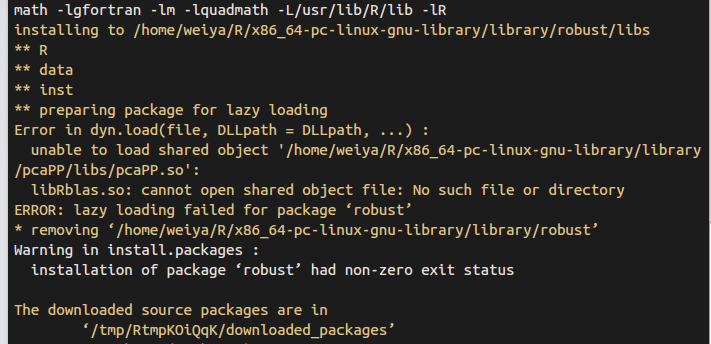

# R Notes

## Installation of Latest R3.6

Accidentally, I uninstall my R3.6 when installing `libcurl4`, the apt-log shows that

```bash
Start-Date: 2021-05-01  10:40:15
Commandline: apt install libcurl4
Requested-By: weiya (1000)
Install: libcurl4:amd64 (7.58.0-2ubuntu3.13)
Remove: r-cran-foreign:amd64 (0.8.75-1xenial0), r-cran-mgcv:amd64 (1.8-31-1cran1xenial0), libcurl3:amd64 (7.58.0-2ubuntu2), r-base-html:amd64 (3.6.3-1xenial), r-cran-class:amd64 (7.3-16-1xenial0), r-cran-boot:amd64 (1.3-23-2xenial0), r-cran-cluster:amd64 (2.1.0-2xenial0), r-cran-rpart:amd64 (4.1-15-2xenial0), r-cran-kernsmooth:amd64 (2.23-16-1+1xenial0), r-cran-matrix:amd64 (1.2-18-1xenial0), r-cran-spatial:amd64 (7.3-11-2xenial0), r-base-core:amd64 (3.6.3-1xenial), r-cran-codetools:amd64 (0.2-16-1xenial0), r-base:amd64 (3.6.3-1xenial), r-recommended:amd64 (3.6.3-1xenial), r-cran-nlme:amd64 (3.1.144-1xenial0), r-cran-lattice:amd64 (0.20-41-1cran1xenial0), r-cran-nnet:amd64 (7.3-13-1xenial0), r-cran-mass:amd64 (7.3-51.5-1xenial0), r-cran-survival:amd64 (3.1-11-1cran1xenial0)
End-Date: 2021-05-01  10:40:29
```

So I need to reinstall it. Following the [instruction on CRAN](https://cloud.r-project.org/)

1. add `deb https://cloud.r-project.org/bin/linux/ubuntu bionic-cran35/` to `/etc/apt/sources.list`, actually I found a xenial version, which means that I had followed the procedure on Ubuntu 16.04. Currently I am on Ubuntu 18.04, so I use a bionic version.
2. run `sudo apt-get update`, but it throws an error, 

> W: GPG error: https://cloud.r-project.org/bin/linux/ubuntu bionic-cran35/ InRelease: The following signatures were invalid: EXPKEYSIG 51716619E084DAB9 Michael Rutter <marutter@gmail.com>
E: The repository 'https://cloud.r-project.org/bin/linux/ubuntu bionic-cran35/ InRelease' is not signed.
N: Updating from such a repository can't be done securely, and is therefore disabled by default.
N: See apt-secure(8) manpage for repository creation and user configuration details.

The error has been reported in [Linux#GPG error](../../Linux/gpg-error), and the solution is 

```bash
sudo apt-key adv --keyserver keyserver.ubuntu.com --recv-keys 51716619E084DAB9
```

3. run `sudo apt-get install r-base`.

## Common Tips

- 删除当前工作区所有变量: `rm(list = ls(all = TRUE))`
- RStudio shows all shortcuts: `Alt-Shift-K`.

## `sort(), rank(), order()`

- `sort(x)`: sort `x` increasingly (by default)
- `rank(x)`: the ranks of each element
- `order(x)`: the permutation for `sort(x)`

```R
> x = c(97, 93, 85, 74, 32, 100, 99, 67)
> sort(x)
[1]  32  67  74  85  93  97  99 100
> order(x)
[1] 5 8 4 3 2 1 7 6
> rank(x)
[1] 6 5 4 3 1 8 7 2
```

and they satisfy (assuming no ties and in increasing order)

$$
\begin{align*}
\mathrm{x[order(x)]} & = \mathrm{sort(x)}\\
\mathrm{rank(x)} &= \mathrm{order(order(x))}\\
\mathrm{sort(x)[rank(x)]} &= \mathrm{x}
\end{align*}
$$

```R
> x[order(x)]
[1]  32  67  74  85  93  97  99 100
> order(order(x))
[1] 6 5 4 3 1 8 7 2
```

In particular, if `x = 1:n`, then `x = order(x) = sort(x)`, and hence

$$
\mathrm{x[x] = x}
$$

## Run from Command Line

- run `R -q -e "1+1"` in the command line
- run `Rscript test.R` in the command line
- put `#!/usr/bin/env Rscript` on the first line of `test.R` and allow it executable via `chmod +x test.R`

To pass arguments, we can use

```r
args = commandArgs(trailingOnly=TRUE)
```

to extract the arguments.

Test with the following scripts

=== "test1.R"

    ```r
    --8<-- "docs/R/test1.R"
    ```

=== "test2.R"

    ```r
    --8<-- "docs/R/test2.R"
    ```

the results are

```bash
$ Rscript test1.R xxx yyy
[1] 2
xxx yyy
$ Rscript test2.R xxx yyy
[1] 7
/usr/lib/R/bin/exec/R --slave --no-restore --file=test2.R --args xxx yyy
```

which shows that `trailingOnly=TRUE` is necessary and it only takes the arguments after `--args`.

Refer to [Passing arguments to an R script from command lines | R-bloggers](https://www.r-bloggers.com/2015/09/passing-arguments-to-an-r-script-from-command-lines/)

## Round numbers

I want to approximate a numerical value with 3 significant digits, but the trailing zeros are always be dropped, then I tried several methods.

First of all, define

```R
p <- function(x) { cat(deparse(substitute(x)), "=", x, "\n") }
```

for convenient and clear comparisons, which takes the advantage of [R's Lazy Evaluation](https://colinfay.me/lazyeval/).

```R
x = 0.04898246 # want 0.0490
p(signif(x, digits=3))
p(prettyNum(x))
p(prettyNum(x, digits=3))
p(formatC(x, drop0trailing = F))
p(formatC(x, drop0trailing = T))
p(format(signif(x, digits=3), nsmall = 3))
p(format(signif(x, digits=3), nsmall = 4))
p(format(signif(x, digits=3), nsmall = 3 + floor(-log10(x))))
# signif(x, digits = 3) = 0.049
# prettyNum(x) = 0.04898246
# prettyNum(x, digits = 3) = 0.049
# formatC(x, drop0trailing = F) = 0.04898
# formatC(x, drop0trailing = T) = 0.04898
# format(signif(x, digits = 3), nsmall = 3) = 0.049
# format(signif(x, digits = 3), nsmall = 4) = 0.0490
# format(signif(x, digits = 3), nsmall = 3 + floor(-log10(x))) = 0.0490
```

where `floor(-log10(x))` returns the number of zeros between the decimal symbol `.` and the first nonzero value (assume `x < 1`).

With `scientific = TRUE` option, `nsmall` would fail,

```R
p(format(signif(x, digits=3), scientific = T, nsmall = 3 + floor(-log10(x))))
# format(signif(x, digits = 3), scientific = T, nsmall = 3 + floor(-log10(x))) = 4.9e-02
```

as the manual `?format` said,

> the minimum number of digits to the right of the decimal point in formatting real/complex numbers in **non-scientific formats**. Allowed values are 0 <= nsmall <= 20.

For a larger value, such as `37289.75`, the scientific form might be necessary,

```R
y = 37289.75
p(format(signif(y, digits=3), nsmall= max(0, 3 + floor(-log10(y))) ) )
p(format(signif(y, digits=3), scientific = T))
# format(signif(y, digits = 3), nsmall = max(0, 3 + floor(-log10(y)))) = 37300
# format(signif(y, digits = 3), scientific = T) = 3.73e+04
```

Finally, I found that `sprintf("%.2e", x)` would be helpful, and actually the approximation has been consider, instead of just truncating.

```R
p(sprintf("%.2e, %.1e", x, y))
#sprintf("%.2e, %.1e", x, y) = 4.90e-02, 3.7e+04
```

## 序列减去常数

```R
for (i in c(1:n-1))
  print(i)
##0
##1
##2
for (i in c(1:(n-1)))
  print(i)
##1
##2
```

## Rstudio 清空历史图象

[Error in plot.new() : figure margins too large in R](http://stackoverflow.com/questions/12766166/error-in-plot-new-figure-margins-too-large-in-r)


## linux 下更新 R

参考[https://mirrors.tuna.tsinghua.edu.cn/CRAN/](https://mirrors.tuna.tsinghua.edu.cn/CRAN/) 中的README.md文件

若已经通过源码安装，则可以通过找到源码文件夹，使用`sudo make uninstall`进行卸载。

然后通过配置source.list，进行安装。

## window 安装包
切换到R的安装路径下，在etc文件夹中编辑文件Rprofile.site文件

```
## set a CRAN mirror
    local({r <- getOption("repos")
		r["CRAN"] <- "http://mirrors.ustc.edu.cn/CRAN/"
          options(repos=r)})
```


## Interpreting Residual and Null Deviance in GLM R


Refer to [https://stats.stackexchange.com/questions/108995/interpreting-residual-and-null-deviance-in-glm-r](https://stats.stackexchange.com/questions/108995/interpreting-residual-and-null-deviance-in-glm-r)

## 缺少libRblas.so和libRlapack.so的解决办法



虽然缺少libRblas.so和libRlapack.so，但却有libblas.so和liblapack.so，而它们应该是一样的，只是文件名不同而已，为此添加链接即可。

```bash
cd /usr/lib
ln -s libblas.so libRblas.so
ln -s /usr/lib/R/module/lapack.so libRlapack.so
```

参考：
1. [https://bugs.launchpad.net/ubuntu/+source/rkward/+bug/264436](https://bugs.launchpad.net/ubuntu/+source/rkward/+bug/264436)
2. [http://promberger.info/linux/2009/03/20/r-lme4-matrix-not-finding-librlapackso/](http://promberger.info/linux/2009/03/20/r-lme4-matrix-not-finding-librlapackso/)

## RSQLite

参考博文[https://statr.me/2011/10/large-regression/](https://statr.me/2011/10/large-regression/)

代码见[sqlite_ex.R](sqlite_ex.R)

## Rcpp

!!! info
	Another repo for learning Rcpp: [RcppNotes](https://github.com/szcf-weiya/RcppNotes)
    
### cannot found -lRcpp


手动设置

```bash
cd /usr/local/lib
##cd /usr/lib
ln -s /home/weiya/R/x86_64-pc-linux-gnu-library/library/Rcpp/libs/Rcpp.so libRcpp.so
```

### function 'dataptr' not provided by package 'Rcpp'

原因是因为没有在

```r
dyn.load()
```
前面添加

```r
library(Rcpp)
## 或require(Rcpp)
```

## R check package about description

check locale

## par cheatsheet

[r-graphical-parameters-cheatsheet](r-graphical-parameters-cheatsheet.pdf)

## Mathematical Annotation in R plot

```r
plot(..., main = expression(paste("...", mu[1])))
```

参考
1. [Mathematical Annotation in R
](http://vis.supstat.com/2013/04/mathematical-annotation-in-r/)

## function 'dataptr' not provided by package 'Rcpp'

参考[function 'dataptr' not provided by package 'Rcpp'](https://stackoverflow.com/questions/21657575/what-does-this-mean-in-lme4-function-dataptr-not-provided-by-package-rcpp)

## Rcpp reference

[Rcpp-quickref](Rcpp-quickref.pdf)

## remove outliers from the boxplot

[How to remove outliers from a dataset
](https://stackoverflow.com/questions/4787332/how-to-remove-outliers-from-a-dataset)

## rmarkdown转化中文字符为PDF的设置

```r
---
title: "test"
author: "weiya"
output:
    pdf_document:
        latex_engine: xelatex
        includes:
            in_header: header.tex
---
```

## rmarkown compiler does not show captions for two consecutive figures

add at least two spacing newline.

[*Some* figure captions from RMarkdown not showing](https://stackoverflow.com/questions/27444804/some-figure-captions-from-rmarkdown-not-showing)


## 在grid排列图

[Arranging plots in a grid](https://cran.r-project.org/web/packages/cowplot/vignettes/plot_grid.html)

## x11 font cannot be loaded

参考[X11 font -adobe-helvetica-%s-%s-*-*-%d-*-*-*-*-*-*-*, face 2 at size 11 could not be loaded](https://askubuntu.com/questions/449578/x11-font-adobe-helvetica-s-s-d-face-2-at-size-11-could-no)

## 安装多版本R
[Installing multiple versions of R](https://support.rstudio.com/hc/en-us/articles/215488098-Installing-multiple-versions-of-R)

## semi-transparency is not supported on this device

[semi-transparency is not supported on this device](http://tinyheero.github.io/2015/09/15/semi-transparency-r.html)

## MC, MCMC, Gibbs采样 原理

[MC, MCMC, Gibbs采样 原理&实现（in R）](http://blog.csdn.net/abcjennifer/article/details/25908495)

[](http://blog.csdn.net/abcjennifer/article/details/25908495)

[贝叶斯集锦（3）：从MC、MC到MCMC](https://site.douban.com/182577/widget/notes/10567181/note/292072927/)

[随机采样方法整理与讲解（MCMC、Gibbs Sampling等）](http://www.cnblogs.com/xbinworld/p/4266146.html)

[简单易学的机器学习算法——马尔可夫链蒙特卡罗方法MCMC](http://blog.csdn.net/google19890102/article/details/51755242)

[DP: Collapsed Gibbs Sampling](https://cs.stanford.edu/~ppasupat/a9online/1084.html)

[Metropolis Hasting算法](http://blog.csdn.net/flyingworm_eley/article/details/6517851)


## Running R in batch mode on Linux

[Running R in batch mode on Linux](http://www.cureffi.org/2014/01/15/running-r-batch-mode-linux/)


## “Kernel density estimation” is a convolution of what?

[“Kernel density estimation” is a convolution of what?](https://stats.stackexchange.com/questions/73623/kernel-density-estimation-is-a-convolution-of-what)

## unable to start rstudio in centos getting error “unable to connect to service”

[unable to start rstudio in centos getting error “unable to connect to service”
](https://stackoverflow.com/questions/24665599/unable-to-start-rstudio-in-centos-getting-error-unable-to-connect-to-service)

## 发布R包

[Releasing a package](http://r-pkgs.had.co.nz/release.html)

## Presentations with Slidy

[Presentations with Slidy
](http://rmarkdown.rstudio.com/slidy_presentation_format.html)

## Estimation of the expected prediction error

[Estimation of the expected prediction error](http://www.math.ku.dk/~richard/courses/regression2014/DataSplit.html)


## 协方差矩阵的几何解释

参考[协方差矩阵的几何解释](http://www.cnblogs.com/nsnow/p/4758202.html)

## ROCR包中prediction函数

`prediction`定义如下

```r
prediction(predictions, labels, label.ordering = NULL)
```

在绘制ROC曲线时，必要时需要指定`label.ordering`中negative和positive，否则结果会完全相反。举个例子

```r
## generate some data with a non-linar class boundary
set.seed(123)
x = matrix(rnorm(200*2), ncol = 2)
x[1:100, ] = x[1:100, ] + 2
x[101:150, ] = x[101:150, ] - 2
y = c(rep(1, 150), rep(2, 50))
dat = data.frame(x = x, y = as.factor(y))
plot(x, col = y)

## randomly split into training and testing groups
train = sample(200, 100)

## training data using radial kernel
svmfit = svm(y~., data = dat[train, ], kernel = "radial", cost = 1)
plot(svmfit, dat[train, ])

## cross-validation
set.seed(123)
tune.out = tune(svm, y~., data = dat[train, ], kernel = "radial",
                ranges = list(cost = c(0.1, 1, 10, 100, 1000),
                              gamma = c(0.5, 1, 2, 3, 4)))
summary(tune.out)

## prediction
table(true = dat[-train, "y"], pred = predict(tune.out$best.model, newdata = dat[-train, ]))

## ROC curves
library(ROCR)
rocplot = function ( pred , truth , ...) {
  predob = prediction ( pred, truth , label.ordering = c("2", "1"))
  perf = performance ( predob , "tpr" , "fpr")
  plot ( perf,...)
}
svmfit.opt = svm(y~., data = dat[train, ], kernel = "radial",
                 gamma = 3, cost = 10, decision.values = T)
fitted = attributes(predict(svmfit.opt, dat[train, ], decision.values = T))$decision.values

rocplot ( fitted , dat [ train ,"y"] , main ="Training Data")
```

对于上述代码，如果不指定`label.ordering = c("2", "1")`，则得到的ROC曲线如下图


原因是因为`fitted`与`y`大小关系相反，即前者大时后者小，而前者小时后者大。


## 神奇的`[`

来自[R语言中以矩阵引用多维数组的元素](https://d.cosx.org/d/419525-r)

比如
```r
A = array(sample(0:255, 100*100*3, replace = T), dim = c(100,100,3))
B = array(sample(1:100, 2*5), dim = c(2,5))
apply(A, 3, `[`, t(B))
```

## proxy 代理

参考

1. [Proxy setting for R](https://stackoverflow.com/questions/6467277/proxy-setting-for-r)
2. [How to use Tor socks5 in R getURL](https://stackoverflow.com/questions/17925234/how-to-use-tor-socks5-in-r-geturl)

## `lm()` 中有无 `I()` 的差异

注意

```r
lm(Y ~ X + X^2)
```

和

```r
lm(Y ~ X + I(X^2))
```

是不一样的。若要表示多项式回归，则应该用 `I(X^2)`，而前者等价于 `lm(Y ~ X)`。详见 `?formula`, 其中举了一个例子，`(a+b+c)^2 - a:b` 等价于 `a + b + c + a:c + b:c`，注意二阶项只存在于交叉项中。

## 多项式作图

参考[Plot polynomial regression curve in R](https://stackoverflow.com/questions/23334360/plot-polynomial-regression-curve-in-r)

## custom print

```r
class(obj) = "example"
print.example <- function(x)
{

}
```

refer to [Example Needed: Change the default print method of an object](https://stackoverflow.com/questions/10938427/example-needed-change-the-default-print-method-of-an-object)

## write lines to file

```r
fileConn<-file("output.txt")
writeLines(c("Hello","World"), fileConn)
close(fileConn)
```

refer to [Write lines of text to a file in R](https://stackoverflow.com/questions/2470248/write-lines-of-text-to-a-file-in-r)

## combine base and ggplot graphics in R figure

refer to [Combine base and ggplot graphics in R figure window](https://stackoverflow.com/questions/14124373/combine-base-and-ggplot-graphics-in-r-figure-window)

## specify CRAN mirror in `install.package`

```r
r <- getOption("repos")
r["CRAN"] <- "https://cran.r-project.org"
# r["CRAN"] <- "r["CRAN"] <- "https://mirrors.ustc.edu.cn/CRAN/"" ## for mainland China
options(repos=r)
```

we also can wrap it with `local({...})` and save in `~/.Rprofile`.

Refer to [How to select a CRAN mirror in R](https://stackoverflow.com/questions/11488174/how-to-select-a-cran-mirror-in-r)

For temporary use, use `repos` argument in `install.packages`, such as

```r
install.packages('RMySQL', repos='http://cran.us.r-project.org')
```

refer to [How to select a CRAN mirror in R](https://stackoverflow.com/questions/11488174/how-to-select-a-cran-mirror-in-r)

## R 符号运算

参考 [R 语言做符号计算](https://cosx.org/2016/07/r-symbol-calculate/)。

```r
NormDensity <- expression(1 / sqrt(2 * pi) * exp(-x^2 / 2))
D(NormDensity, "x")
DD <- function(expr, name, order = 1) {
 if (order < 1)
     stop("'order' must be >= 1")
 if (order == 1)
     D(expr, name) else DD(D(expr, name), name, order - 1)
 }
DD(NormDensity, "x", 3)

DFun <- deriv(NormDensity, "x", function.arg = TRUE)
DFun(1)
```

## Mistake with colon operator

```r
vec <- c()
for (i in 1:length(vec)) print(vec[i])
```

would print two `NULL` because `1:length(vec)` would be `c(1,0)`. A method to avoid this

```r
for (i in seq_along(vec)) print(vec[i])
```

refer to [Two common mistakes with the colon operator in R](https://statisticaloddsandends.wordpress.com/2018/08/03/two-common-mistakes-with-the-colon-operator-in-r/)

## Conda 管理版本

1. [Using R language with Anaconda](https://docs.anaconda.com/anaconda/user-guide/tasks/using-r-language/)
2. 单独安装 rstudio `conda install -c r rstudio`

## error in install `gRbase`

environment: Ubuntu 16.04 (gcc 5.4.0)

```
g++: error: unrecognized comma line option ‘-fno-plt’
```

the reason should be that the current gcc is too old.

In conda env `R`:

1. install latest gcc v7.3.0, but it still does not work
2. `Sys.getenv()` indeed switch to the latest gcc
3. remove `~/.R/Makevars`, which would force the gcc to be the gcc declared in that file.
4. then it works well.

refer to

[R Packages Fail to Compile with gcc](https://stackoverflow.com/questions/14865976/r-packages-fail-to-compile-with-gcc)

Note that some packages cannot be installed via CRAN, and you can check bioconductor.

```
if (!requireNamespace("BiocManager", quietly = TRUE))
    install.packages("BiocManager")

BiocManager::install("graph")
```

## `protection stack overflow`

use

```bash
R --max-ppsize 500000
```

or for rstudio

```bash
rstudio --max-ppsize 500000
```

refer to [How to solve 'protection stack overflow' issue in R Studio](https://stackoverflow.com/questions/32826906/how-to-solve-protection-stack-overflow-issue-in-r-studio)

## `not found libhdf5.a`

check if compiling under anaconda environment, if so, exit and retry.

## install.packages returns `failed to create lock directory`

in bash

```bash
R CMD INSTALL --no-lock <pkg>
```

or in R session

```r
install.packages("Rcpp", dependencies=TRUE, INSTALL_opts = c('--no-lock'))
```

refer to [R install.packages returns “failed to create lock directory”](https://stackoverflow.com/questions/14382209/r-install-packages-returns-failed-to-create-lock-directory)

## nonzero in `dgCMatrix`

refer to [R package Matrix: get number of non-zero entries per rows / columns of a sparse matrix](https://stackoverflow.com/questions/51560456/r-package-matrix-get-number-of-non-zero-entries-per-rows-columns-of-a-sparse)

## `plot.new() : figure margins too large`

Rstudio 中对于太大的图片有可能报错，比如当我试图以 `par(mfrow=c(4,1))` 画四个 `matplot`，于是报错。这时候，可以直接在 R session 里面绘制。

## S3 method

初体验，[ESL-CN/code/boosting/s3ex.R](https://github.com/szcf-weiya/ESL-CN/blob/96f2f91deabfa6eee57bd1823a4d8405b5f061f0/code/boosting/s3ex.R)

```r
j = list(name = "Joe", salary = 5500, union = T)
class(j) = "employee"

print.employee <- function(wrkr){
  cat(wrkr$name, "\n")
  cat("salary", wrkr$salary, "\n")
  cat("union member", wrkr$union, "\n")
}
summary.employee <- function(wrkr){
  cat(wrkr$name, "\n")
  cat("salary", wrkr$salary, "\n")
  cat("union member", wrkr$union, "\n")
}
```

以及一个相关的问题 [How to override default S3 function in R?](https://stackoverflow.com/questions/9275387/how-to-override-default-s3-function-in-r)


## Parallel Computing

### related packages

- `parallel`: `makeCluster` and `stopCluster`
- `doParallel`: `registerDoParallel`
- `foreach`: `%dopar%`

### example

adapt from [my project](https://github.com/szcf-weiya/sodaParallel/blob/master/R/pure_soda_par.R#L365-L375)

```R
cl <- makeCluster(ncl)
registerDoParallel(cl)


res = foreach(j=1:Nnset, .combine = 'c', .export = c('calc_lda_BIC'), .packages = 'nnet') %dopar%
{
  jj = not_set[j];
  new_set   = sort(c(jj, cur_set));
  new_score = calc_lda_BIC(xx, yy, new_set, D, K, debug, gam=gam);
  new_score
}
stopCluster(cl)
```

### references

- [Using the `foreach` package](https://cran.r-project.org/web/packages/foreach/vignettes/foreach.html)

## using R in JupyterLab

```r
install.packages('IRkernel')
#IRkernel::installspec()
IRkernel::installspec(name="3.6.0", displayname = "R 3.6.0")
```

refer to [IRkernel](https://irkernel.github.io/installation/)

and try to use [jupyterlab](https://jupyterlab.readthedocs.io/en/stable/index.html), which seems much powerful than jupyter.

But note that `-X` option is needed before creating a tmux session for running jupyter, otherwise the kernel keeps dead in the browser and check the monitor message from jupyter, which throws,

```bash
Error in .External2(C_X11, paste0("png::", filename), g$width, g$height,  :
  unable to start device PNG
Calls: <Anonymous> ... evaluate -> dev.new -> do.call -> <Anonymous> -> ok_device
In addition: Warning message:
In ok_device(filename, ...) : unable to open connection to X11 display ''
Execution halted
```

although I am just trying to calculate 1+1, nothing related to X11.

The error would appear again if the `-X` ssh session has been stopped. Then I found such issue has been reported in https://github.com/IRkernel/IRkernel/issues/388, and there might be solution by https://github.com/IRkernel/IRkernel/issues/388#issuecomment-237080809, but the working R version is built from source by myself, and `Cairo` is not supported. When I am trying to install the package, it throws that

```bash
configure: error: Cannot find cairo.h! Please install cairo (http://www.cairographics.org/) and/or set CAIRO_CFLAGS/LIBS correspondingly.
ERROR: configuration failed for package ‘Cairo’
```

Even I retried after specifying

```bash
export CAIRO_LIBS=/home/project09/miniconda3/envs/r3.6.3/lib
export CAIRO_CFLAGS=/home/project09/miniconda3/envs/r3.6.3/include
```

by linking it to other R version with Cairo support, similar as in https://stat.ethz.ch/pipermail/r-help/2014-April/374096.html, but it does not work.

Then I change to a different R version with cairo support, and it can work without `-X` option. And the setting in `.Rprofile` can also been removed (or actually the default is exactly the same).

Try to install the shortcuts as recommended, but it throws,

```bash
$ jupyter labextension install @techrah/text-shortcuts
An error occured.
ValueError: Please install Node.js and npm before continuing installation. You may be able to install Node.js from your package manager, from conda, or directly from the Node.js website (https://nodejs.org).
See the log file for details:  /tmp/jupyterlab-debug-7mmu8jy1.log
```

then

```bash
conda install -c conda-forge nodejs
```

as suggested in [Extensions](https://jupyterlab.readthedocs.io/en/stable/user/extensions.html)

However the default version is outdated.

```bash
libgcc-7.2.0         | 304 KB    | ############################################################################################################################################# | 100%
nodejs-6.13.1        | 11.9 MB   | ############################################################################################################################################# | 100%
Preparing transaction: done
Verifying transaction: done
Executing transaction: done
(base) [project09@stapc390 ~]$ jupyter labextension install @techrah/text-shortcuts
An error occured.
ValueError: Please install nodejs >=10.0.0 before continuing. nodejs may be installed using conda or directly from the nodejs website.
See the log file for details:  /tmp/jupyterlab-debug-lhf6bjwm.log
```

The solution is quite easy, just use the default conda channel,

```bash
conda install nodejs
```

which will install `nodejs-10.13.0`.

## reload data

```r
> mtcars$transmission = factor(mtcars$am, levels = c(0, 1), labels = c("Automatic", "Manual"))
> str(mtcars)
'data.frame':	32 obs. of  12 variables:
...
 $ am          : num  1 1 1 0 0 0 0 0 0 0 ...
 $ gear        : num  4 4 4 3 3 3 3 4 4 4 ...
 $ carb        : num  4 4 1 1 2 1 4 2 2 4 ...
 $ transmission: Factor w/ 2 levels "Automatic","Manual": 2 2 2 1 1 1 1 1 1 1 ...
> data("mtcars")
> str(mtcars)
'data.frame':	32 obs. of  11 variables:
...
 $ am  : num  1 1 1 0 0 0 0 0 0 0 ...
 $ gear: num  4 4 4 3 3 3 3 4 4 4 ...
 $ carb: num  4 4 1 1 2 1 4 2 2 4 ...
```