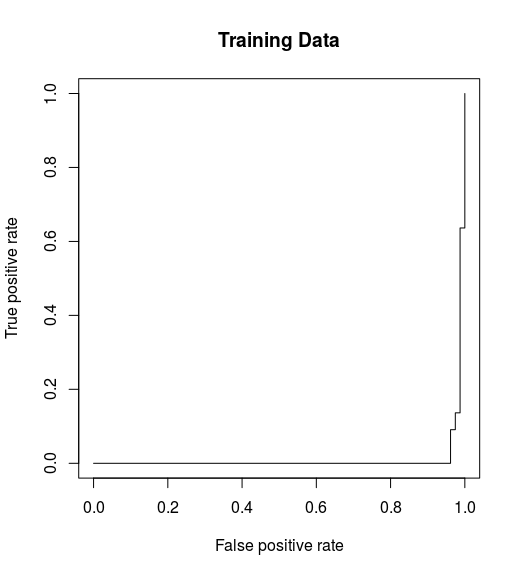

# R Notes

!!! tip "Frequent Tips"
	- 删除当前工作区所有变量: `rm(list = ls(all = TRUE))`
	- RStudio shows all shortcuts: `Alt-Shift-K`.
	- usage of `<<-`, "it will keep going through the environments in order until it finds a variable with that name, and it will assign it to that." see also [:link:](https://stackoverflow.com/questions/2628621/how-do-you-use-scoping-assignment-in-r)
	- 序列中 `0.1+1:10-1` 中 `:` 优先级低于加减运算符，所以返回 `0.1, 1.1, ..., 9.1`.
	- repeat string: `strrep('str', 2)`, `paste(rep('str', 2), collapse='')`

## Installation

### Install from source on Rocky

Following the instruction in [RStudio Documentation: Install R from Source](https://docs.rstudio.com/resources/install-r-source/)

```bash
export R_VERSION=X.X.X
curl -O https://cran.rstudio.com/src/base/R-4/R-${R_VERSION}.tar.gz
tar -xzvf R-${R_VERSION}.tar.gz
cd R-${R_VERSION}
```

Build with

```bash
./configure \
    --prefix=/opt/R/${R_VERSION} \
    --enable-memory-profiling \
    --enable-R-shlib \
    --with-blas \
    --with-lapack

make
sudo make install
```

then manage the version with `module`.

!!! note "2022-08-24 10:32:20"
	On T460P, change the prefix as follows
	```r
	./configure \
		--prefix=/home/weiya/Programs/R/${R_VERSION} \
		--enable-memory-profiling \
		--enable-R-shlib \
		--with-blas \
		--with-lapack
	```

??? tip "specify CRAN mirror in `install.package`"

	```r
	r <- getOption("repos")
	r["CRAN"] <- "https://cran.r-project.org"
	# r["CRAN"] <- "r["CRAN"] <- "https://mirrors.ustc.edu.cn/CRAN/"" ## for mainland China
	options(repos=r)
	```

	we also can wrap it with `local({...})` and save in `~/.Rprofile`. The benefit of `local` is to let the evaluation only valid in the current session. Note that RStudio would set `r["CARN"]` as `https://cran.rstudio.com`.

	Refer to [How to select a CRAN mirror in R](https://stackoverflow.com/questions/11488174/how-to-select-a-cran-mirror-in-r)

	For temporary use, use `repos` argument in `install.packages`, such as

	```r
	install.packages('RMySQL', repos='http://cran.us.r-project.org')
	```

	refer to [How to select a CRAN mirror in R](https://stackoverflow.com/questions/11488174/how-to-select-a-cran-mirror-in-r)


#### installation of `module`

Follow the official instruction [:link:](https://modules.readthedocs.io/en/latest/INSTALL.html)

```bash
curl -LJO https://github.com/cea-hpc/modules/releases/download/v5.1.1/modules-5.1.1.tar.gz
tar xvf modules-5.1.1.tar.gz
cd modules-5.1.1/
sudo apt-get install tcl-dev
make
# sudo make install
make install
```

Different from other software, `module load` command cannot be found, we need to configure as follows,

```bash
$ sudo ln -s $PWD/init/profile.sh /etc/profile.d/modules.sh
$ sudo ln -s $PWD/init/profile.csh /etc/profile.d/modules.csh
```

So the above `make install` indeed does not need `sudo`. Strangely, it still cannot find `module`, (require reboot?), so simply put `source /etc/profile.d/modules.sh` into `~/.bashrc`

### Install 4.1.0 from source

it throws when `./configure`,

```bash
configure: error: libcurl >= 7.28.0 library and headers are required with support for https
```

try to install `libcurl4-openssl-dev`, suggested in [Installing R on Linux: configure: error: libcurl >= 7.28.0 library and headers are required with support for https](https://stackoverflow.com/questions/38690232/installing-r-on-linux-configure-error-libcurl-7-28-0-library-and-headers-a).

Be careful when installing the package, and to avoid the uninstallation in the next section.

!!! info "2022-08-24 10:35:01"
	Run `sudo apt-get install libcurl4-openssl-dev`, and monitor the message, no packages are needed to be removed.

??? note "Installation of RCurl (2023-01-08 18:20:05)"
	First of all, it runs
	```bash
	curl-config --libs
	curl-config --cflags
	```
	to get `CURL_LIBS` and `CURL_CFLAGS`. Check the [`configure.in`](https://github.com/omegahat/RCurl/blob/e07c076963fc6436e0b05db04bb0b3a20ba378e9/configure.in#L179-L180) file in the source of RCurl for more details.

	- With system's `libcurl.so.4`, shipped with system or installed via `libcurl4-openssl-dev`, it outputs
	```bash
	$ curl-config --cflags

	$ curl-config --libs
	-lcurl
	```
	where it does not specify the path to the dynamic files `.so` with `-L` and to the header file with `-I`.

	- On the other hand, for R env installed via `Conda`, it returns,
	```bash
	(R4.1.0) $ curl-config --cflags
	-I/media/weiya/PSSD/Programs/anaconda3/envs/R4.1.0/include
	(R4.1.0) $ curl-config --libs
	-L/media/weiya/PSSD/Programs/anaconda3/envs/R4.1.0/lib -lcurl
	```
	where the path are specified. And those path would become `rpath` if we installed packages, such as `RCurl` that relied on the dynamic files.
	```bash
	$ readelf -d /media/weiya/PSSD/Programs/anaconda3/envs/R4.1.0/lib/R/library/RCurl/libs/RCurl.so 

	Dynamic section at offset 0xb9a0 contains 23 entries:
	Tag        Type                         Name/Value
	0x0000000000000001 (NEEDED)             Shared library: [libcurl.so.4]
	0x0000000000000001 (NEEDED)             Shared library: [libR.so]
	0x0000000000000001 (NEEDED)             Shared library: [libc.so.6]
	0x000000000000000f (RPATH)              Library rpath: [/media/weiya/PSSD/Programs/anaconda3/envs/R4.1.0/lib]
	(R4.1.0) $ ldd /media/weiya/PSSD/Programs/anaconda3/envs/R4.1.0/lib/R/library/RCurl/libs/RCurl.so 
        linux-vdso.so.1 (0x00007ffca69ce000)
        libcurl.so.4 => /media/weiya/PSSD/Programs/anaconda3/envs/R4.1.0/lib/libcurl.so.4 (0x00007f9e67d77000)
		...
	$ ldd /media/weiya/PSSD/Programs/anaconda3/envs/R4.1.0/lib/R/library/RCurl/libs/RCurl.so 
	linux-vdso.so.1 (0x00007ffd18922000)
	libcurl.so.4 => /media/weiya/PSSD/Programs/anaconda3/envs/R4.1.0/lib/libcurl.so.4 (0x00007f6ac6fe4000)
	```
	where regardless of env `R4.1.0`, `libcurl.so.4` would always point to the one used in the compilation step.
	In contrast, the system would depends on the environment since `conda` would change `LD_LIBRARY_PATH`, while `rpath` has a higher priority than `LD_LIBRARY_PATH`

??? note "set rpath via MAKEFLAGS (2023-01-08 20:44:08)"
	We can pass `MAKEFLAGS`, particularly `LDFLAGS` to set the `rpath`.
	```bash
	$ MAKEFLAGS='LDFLAGS=-Wl,-rpath=/lib/x86_64-linux-gnu/' R CMD INSTALL RCurl_1.98-1.9.tar.gz 
	$ readelf -d /opt/R/4.2.1/lib/R/library/RCurl/libs/RCurl.so 

	Dynamic section at offset 0xcd40 contains 27 entries:
	Tag        Type                         Name/Value
	0x0000000000000001 (NEEDED)             Shared library: [libcurl.so.4]
	0x0000000000000001 (NEEDED)             Shared library: [libR.so]
	0x0000000000000001 (NEEDED)             Shared library: [libc.so.6]
	0x000000000000001d (RUNPATH)            Library runpath: [/lib/x86_64-linux-gnu/]
	```
	where `rpath` is automatically changed to `runpath`. To force `rpath`, we can pass `--disable-new-dtags` option,
	```bash
	$ MAKEFLAGS='LDFLAGS=-Wl,--disable-new-dtags,-rpath=/lib/x86_64-linux-gnu/' R CMD INSTALL RCurl_1.98-1.9.tar.gz
	$ readelf -d /opt/R/4.2.1/lib/R/library/RCurl/libs/RCurl.so 

	Dynamic section at offset 0xcd40 contains 27 entries:
	Tag        Type                         Name/Value
	0x0000000000000001 (NEEDED)             Shared library: [libcurl.so.4]
	0x0000000000000001 (NEEDED)             Shared library: [libR.so]
	0x0000000000000001 (NEEDED)             Shared library: [libc.so.6]
	0x000000000000000f (RPATH)              Library rpath: [/lib/x86_64-linux-gnu/]
	```

	On the other hand, `rpath` can be further changed after compilation via [`patchelf`](https://manpages.ubuntu.com/manpages/bionic/man1/patchelf.1.html),

	```bash
	/opt/R/4.2.1/lib/R/library/RCurl/libs$ readelf -d RCurl.so 

	Dynamic section at offset 0xcd60 contains 26 entries:
	Tag        Type                         Name/Value
	0x0000000000000001 (NEEDED)             Shared library: [libcurl.so.4]
	0x0000000000000001 (NEEDED)             Shared library: [libR.so]
	0x0000000000000001 (NEEDED)             Shared library: [libc.so.6]

	/opt/R/4.2.1/lib/R/library/RCurl/libs$ patchelf --force-rpath --set-rpath "/lib/x86_64-linux-gnu/libcurl.so.4" RCurl.so
	/opt/R/4.2.1/lib/R/library/RCurl/libs# readelf -d RCurl.so 

	Dynamic section at offset 0x3b000 contains 27 entries:
	Tag        Type                         Name/Value
	0x000000000000000f (RPATH)              Library rpath: [/lib/x86_64-linux-gnu/libcurl.so.4]
	0x0000000000000001 (NEEDED)             Shared library: [libcurl.so.4]
	0x0000000000000001 (NEEDED)             Shared library: [libR.so]
	0x0000000000000001 (NEEDED)             Shared library: [libc.so.6]
	```

	See the private [:link:](https://github.com/szcf-weiya/Clouds/issues/124#issuecomment-1374707761) for more details.

??? note "--no-test-load (2023-01-08 22:10:59)"
	After replacing the default `curl-config` with `mycurl-config`, which specifies another path (such as Julia 1.8's lib path) to `libcurl.so.4`, we can avoid the conflicts of `libcurl.so`
	```bash
	CURL_CONFIG=mycurl-config R CMD INSTALL RCurl_1.98-1.9.tar.gz 
	```
	the building step seems OK, but it failed on the "testing if installed package can be loaded from temporary location" step
	```bash
	gcc -shared -L/opt/R/4.2.1/lib/R/lib -L/usr/local/lib -o RCurl.so base64.o curl.o curlInit.o curl_base64.o enums.o json.o memoryManagement.o myUTF8.o -L/opt/hostedtoolcache/julia/1.8.4/x64/bin/../lib/julia/ -lcurl -lxml2 -L/opt/R/4.2.1/lib/R/lib -lR
	installing to /opt/R/4.2.1/lib/R/library/00LOCK-RCurl/00new/RCurl/libs
	** R
	** data
	** inst
	** byte-compile and prepare package for lazy loading
	** help
	*** installing help indices
	** building package indices
	** testing if installed package can be loaded from temporary location
	Error: package or namespace load failed for ‘RCurl’ in dyn.load(file, DLLpath = DLLpath, ...):
	unable to load shared object '/opt/R/4.2.1/lib/R/library/00LOCK-RCurl/00new/RCurl/libs/RCurl.so':
	/usr/lib/x86_64-linux-gnu/libcurl.so.4: version `CURL_4' not found (required by /opt/R/4.2.1/lib/R/library/00LOCK-RCurl/00new/RCurl/libs/RCurl.so)
	Error: loading failed
	Execution halted
	ERROR: loading failed
	```
	Have tried to set `LD_LIBRARY_PATH` and `.Renviron`, both of which attempt to use Julia's `libcurl.so.4`, but failed.
	Recall that the build step should have succeed, so we just need to skip the test step. It can be done via the option `--no-test-load`,
	```bash
	CURL_CONFIG=mycurl-config R CMD INSTALL --no-test-load RCurl_1.98-1.9.tar.gz
	```
	Alternatively, we can pass them in the R session,
	```r
	install.packages("RCurl", configure.args = c(RCurl = c("CURL_CONFIG=/usr/bin/mycurl-config", "--no-test-load")))
	```
	However, here is a trick. `--no-test-load` actually does not belongs to `configure.args`. If we just mv `CURL_CONFIG` to the env field (a recommended way in GitHub Actions), 
	```r
	# NOT WORK
	> install.packages("RCurl", configure.args = c(RCurl = "--no-test-load"))
	configure: error: unrecognized option: `--no-test-load'
	Try `./configure --help' for more information
	ERROR: configuration failed for package ‘RCurl’
	```
	which will stop at the configure step. In contrast, it is an option for the argument `INSTALL_opts`, so the following will work.
	```r
	install.packages("RCurl", INSTALL_opts = "--no-test-load")
	```
	See the private [:link:](https://github.com/szcf-weiya/Clouds/issues/124#issuecomment-1374917268) for more detailed and historical exploration on this feature.

??? note "MAKEFLAGS"
	Flags that are already set (for example in file etcR_ARCH/Makeconf) can be overridden by the environment variable MAKEFLAGS ([:link:](https://cran.r-project.org/doc/manuals/r-devel/R-exts.html))
	Although `CURL_LIBS` cannot be directly overridden, it can pass via `MAKEFLAGS`
	
	But a trick is that space needs to be escape. See also [:link:](https://github.com/szcf-weiya/Clouds/issues/124#issuecomment-1375820423), [:link:](https://stackoverflow.com/questions/64541769/overriding-make-variables-containing-spaces-with-makeflags)

### Install Latest R3.6

Accidentally, I uninstall my R3.6 when installing `libcurl4`, the apt-log shows that

```bash
Start-Date: 2021-05-01  10:40:15
Commandline: apt install libcurl4
Requested-By: weiya (1000)
Install: libcurl4:amd64 (7.58.0-2ubuntu3.13)
Remove: r-cran-foreign:amd64 (0.8.75-1xenial0), r-cran-mgcv:amd64 (1.8-31-1cran1xenial0), libcurl3:amd64 (7.58.0-2ubuntu2), r-base-html:amd64 (3.6.3-1xenial), r-cran-class:amd64 (7.3-16-1xenial0), r-cran-boot:amd64 (1.3-23-2xenial0), r-cran-cluster:amd64 (2.1.0-2xenial0), r-cran-rpart:amd64 (4.1-15-2xenial0), r-cran-kernsmooth:amd64 (2.23-16-1+1xenial0), r-cran-matrix:amd64 (1.2-18-1xenial0), r-cran-spatial:amd64 (7.3-11-2xenial0), r-base-core:amd64 (3.6.3-1xenial), r-cran-codetools:amd64 (0.2-16-1xenial0), r-base:amd64 (3.6.3-1xenial), r-recommended:amd64 (3.6.3-1xenial), r-cran-nlme:amd64 (3.1.144-1xenial0), r-cran-lattice:amd64 (0.20-41-1cran1xenial0), r-cran-nnet:amd64 (7.3-13-1xenial0), r-cran-mass:amd64 (7.3-51.5-1xenial0), r-cran-survival:amd64 (3.1-11-1cran1xenial0)
End-Date: 2021-05-01  10:40:29
```

So I need to reinstall it. Following the [instruction on CRAN](https://cloud.r-project.org/)

1. add `deb https://cloud.r-project.org/bin/linux/ubuntu bionic-cran35/` to `/etc/apt/sources.list`, actually I found a xenial version, which means that I had followed the procedure on Ubuntu 16.04. Currently I am on Ubuntu 18.04, so I use a bionic version.
2. run `sudo apt-get update`, but it throws an error, 

> W: GPG error: https://cloud.r-project.org/bin/linux/ubuntu bionic-cran35/ InRelease: The following signatures were invalid: EXPKEYSIG 51716619E084DAB9 Michael Rutter <marutter@gmail.com>
E: The repository 'https://cloud.r-project.org/bin/linux/ubuntu bionic-cran35/ InRelease' is not signed.
N: Updating from such a repository can't be done securely, and is therefore disabled by default.
N: See apt-secure(8) manpage for repository creation and user configuration details.

The error has been reported in [Linux#GPG error](../../Linux/gpg-error), and the solution is 

```bash
sudo apt-key adv --keyserver keyserver.ubuntu.com --recv-keys 51716619E084DAB9
```

3. run `sudo apt-get install r-base`.

## Multiple Versions

### `prefix` + `module` (optionally)

specify `--prefix` when `./configure`, e.g. [Installing multiple versions of R on Linux -- RStudio Support](https://support.rstudio.com/hc/en-us/articles/215488098-Installing-multiple-versions-of-R)

### Conda

[Using R language with Anaconda](https://docs.anaconda.com/anaconda/user-guide/tasks/using-r-language/)

- ~~单独安装 rstudio `conda install -c r rstudio`~~ (waste memory!!)
- 共用 Rstudio，但是切换环境时找不到 shared library，而原生 R session 完全没问题。目前解决方案，命令行调用 rstudio 之前添加环境变量

```bash
conda activate R4.1.0
export LD_LIBRARY_PATH=/media/weiya/PSSD/Programs/anaconda3/envs/R4.1.0/lib:$LD_LIBRARY_PATH
rstudio
```

详见 [Issue #32 use rstudio in env R4.1.0](https://github.com/szcf-weiya/techNotes/issues/32#issuecomment-881508987)

## Rstudio

#### Failed to create OpenGL context

!!! info
	- 2022-11-17 23:33:18 -0500: again, just reboot the PC.

    Refer to [rstudio #27](https://github.com/szcf-weiya/techNotes/issues/27) for the raw records.

It throws 

```bash
WebEngineContext used before QtWebEngine::initialize() or OpenGL context creation failed.
Failed to create OpenGL context for format QSurfaceFormat(version 2.0, options QFlags<QSurfaceFormat::FormatOption>(), depthBufferSize 24, redBufferSize -1, greenBufferSize -1, blueBufferSize -1, alphaBufferSize -1, stencilBufferSize 8, samples 0, swapBehavior QSurfaceFormat::DefaultSwapBehavior, swapInterval 1, colorSpace QSurfaceFormat::DefaultColorSpace, profile  QSurfaceFormat::NoProfile) 
Aborted (core dumped)
```

when launching without any special actions. Same error after replacing with an older version.

Laterly, note that nvidia card does not work, and change to another driver. Then it resumes after rebooting.

??? bug "fcitx 时不能切换中文输入"

	参考[Rstudio 不能切换中文输入（fctix）](http://blog.csdn.net/qq_27755195/article/details/51002620)

	- [Ubuntu 16.04 + Fcitx + RStudio 1.0で日本語を入力する方法](http://blog.goo.ne.jp/ikunya/e/8508d21055503d0560efc245aa787831)
	- [Using RStudio 0.99 with Fctix on Linux](https://support.rstudio.com/hc/en-us/articles/205605748-Using-RStudio-0-99-with-Fctix-on-Linux)

	曾经按照上述的指导能够解决这个问题，即将系统的 qt5 的 `libfcitxplatforminputcontextplugin.so` 手动添加到 rstudio 安装目录下的 plugins 中，即

	```bash
	sudo ln -s /usr/lib/$(dpkg-architecture -qDEB_BUILD_MULTIARCH)/qt5/plugins/platforminputcontexts/libfcitxplatforminputcontextplugin.so /usr/lib/rstudio/bin/plugins/platforminputcontexts/
	```

	但是后来又失败了，猜测原因可能是 qt5 的版本不再兼容了。在 Rstudio 顶部的菜单栏中，点击 Help > About Rstudio 可以找到具体的 qt 版本信息，比如 RStudio (Version 1.2.5001) 依赖 QtWebEngine/5.12.1，而系统的 Qt 插件版本没那么高，所以也能理解 `libfcitxplatforminputcontextplugin.so` 为什么不再有用了。一种解决方案便是手动重新编译与 Rstudio 中匹配的 Qt 插件的版本，但是似乎比较繁琐，而且也不能一劳永逸，如果 rstudio 更新，还是会失效。

	索性不折腾了。如果真的需要中文，就用其他编辑器吧。期待 rstudio 官方早日解决这个问题……

!!! info
	使用 ibus + rime 输入法后，就没再回去用 fcitx

??? bug "更新 rstudio-1.0.44 后闪退 (outdated)"

	- `gdebi` 不再必须，(2022-11-17)更新至 rstudio-2022.07.2 直接采用 `dpkg -i` 即可。

	安装 rstudio 应该采用

	```bash
	sudo apt-get install gdebi-core
	wget https://download1.rstudio.org/rstudio-1.0.44-amd64.deb
	sudo gdebi rstudio-1.0.44-amd64.deb
	```

	而非

	```bash
	sudo dpkg -i
	```

	另外，如果不行，删除后再装
	
	```bash
	sudo apt-get remove rstudio
	```

??? bug "plot.new() : figure margins too large"

	Rstudio 中对于太大的图片有可能报错，比如当我试图以 `par(mfrow=c(4,1))` 画四个 `matplot`，于是报错。这时候，可以直接在 R session 里面绘制。或者，尝试清空历史图象。

??? tip "清空历史图象"

	[Error in plot.new() : figure margins too large in R](http://stackoverflow.com/questions/12766166/error-in-plot-new-figure-margins-too-large-in-r)

	


## `sys.nframe()`

Here is an equivalent way for pythonic `if __name__ == "__main__"`

```r
# runs only when script is run by itself
if (sys.nframe() == 0){
# ... do main stuff
}
```

refer to [:link:](https://stackoverflow.com/questions/2968220/is-there-an-r-equivalent-of-the-pythonic-if-name-main-main)

!!! example
	[My Repos](https://github.com/search?q=user%3Aszcf-weiya+nframe&type=code)


## `sort(), rank(), order()`

- `sort(x)`: sort `x` increasingly (by default)
- `rank(x)`: the ranks of each element
- `order(x)`: the permutation for `sort(x)`

```R
> x = c(97, 93, 85, 74, 32, 100, 99, 67)
> sort(x)
[1]  32  67  74  85  93  97  99 100
> order(x)
[1] 5 8 4 3 2 1 7 6
> rank(x)
[1] 6 5 4 3 1 8 7 2
```

and they satisfy (assuming no ties and in increasing order)

$$
\begin{align*}
\mathrm{x[order(x)]} & = \mathrm{sort(x)}\\
\mathrm{rank(x)} &= \mathrm{order(order(x))}\\
\mathrm{sort(x)[rank(x)]} &= \mathrm{x}
\end{align*}
$$

```R
> x[order(x)]
[1]  32  67  74  85  93  97  99 100
> order(order(x))
[1] 6 5 4 3 1 8 7 2
```

In particular, if `x = 1:n`, then `x = order(x) = sort(x)`, and hence

$$
\mathrm{x[x] = x}
$$

Python uses `np.argsort` to return the index of the sorted array, such as

```python
>>> a = np.array([97, 93, 85, 74, 32, 100, 99, 67])
>>> sorted(a)
[32, 67, 74, 85, 93, 97, 99, 100]
>>> idx = np.argsort(a)
[32, 67, 74, 85, 93, 97, 99, 100]
>>> a[idx]
array([ 32,  67,  74,  85,  93,  97,  99, 100])
```

but keep in mind that the index starts from 0 instead of 1. Here is another way in [Python | Returning index of a sorted list](https://www.geeksforgeeks.org/python-returning-index-of-a-sorted-list/) (TODO).

In julia, we use `sort` and `sortperm`.

## Row/Column of String Array cannot be changed to numeric

suppose I have a string array,

```r
> a = array(dim=c(2,2))
> a
     [,1] [,2]
[1,]   NA   NA
[2,]   NA   NA
> a[1,1]="w"
> a[1, 2]= "1"
> a[2,1]="x"
> a[2,2]="2"
> a
     [,1] [,2]
[1,] "w"  "1" 
[2,] "x"  "2" 
> a[,2] = as.numeric(a[,2])
> a
     [,1] [,2]
[1,] "w"  "1" 
[2,] "x"  "2" 
> as.numeric(a[,2])
[1] 1 2
```

on the other hand, suppose we have a numeric array, set one row to be string, then all elements would become string automatically.

```r
> b = array(dim=c(2,2))
> b
     [,1] [,2]
[1,]   NA   NA
[2,]   NA   NA
> b[1,]=1
> b[2,]=1
> b
     [,1] [,2]
[1,]    1    1
[2,]    1    1
> b[1,] = "1"
> b
     [,1] [,2]
[1,] "1"  "1" 
[2,] "1"  "1" 
```

## Run from Command Line

- run `R -q -e "1+1"` in the command line
- run `Rscript test.R` in the command line
- put `#!/usr/bin/env Rscript` on the first line of `test.R` and allow it executable via `chmod +x test.R`

To pass arguments, we can use

```r
args = commandArgs(trailingOnly=TRUE)
```

to extract the arguments.

Test with the following scripts

=== "test1.R"

    ```r
    --8<-- "docs/R/test1.R"
    ```

=== "test2.R"

    ```r
    --8<-- "docs/R/test2.R"
    ```

the results are

```bash
$ Rscript test1.R xxx yyy
[1] 2
xxx yyy
$ Rscript test2.R xxx yyy
[1] 7
/usr/lib/R/bin/exec/R --slave --no-restore --file=test2.R --args xxx yyy
```

which shows that `trailingOnly=TRUE` is necessary and it only takes the arguments after `--args`.

Refer to [Passing arguments to an R script from command lines | R-bloggers](https://www.r-bloggers.com/2015/09/passing-arguments-to-an-r-script-from-command-lines/)

See also: [Running R in batch mode on Linux](http://www.cureffi.org/2014/01/15/running-r-batch-mode-linux/)

## Round numbers

I want to approximate a numerical value with 3 significant digits, but the trailing zeros are always be dropped, then I tried several methods.

First of all, define

```R
p <- function(x) { cat(deparse(substitute(x)), "=", x, "\n") }
```

for convenient and clear comparisons, which takes the advantage of [R's Lazy Evaluation](https://colinfay.me/lazyeval/).

```R
x = 0.04898246 # want 0.0490
p(signif(x, digits=3))
p(prettyNum(x))
p(prettyNum(x, digits=3))
p(formatC(x, drop0trailing = F))
p(formatC(x, drop0trailing = T))
p(format(signif(x, digits=3), nsmall = 3))
p(format(signif(x, digits=3), nsmall = 4))
p(format(signif(x, digits=3), nsmall = 3 + floor(-log10(x))))
# signif(x, digits = 3) = 0.049
# prettyNum(x) = 0.04898246
# prettyNum(x, digits = 3) = 0.049
# formatC(x, drop0trailing = F) = 0.04898
# formatC(x, drop0trailing = T) = 0.04898
# format(signif(x, digits = 3), nsmall = 3) = 0.049
# format(signif(x, digits = 3), nsmall = 4) = 0.0490
# format(signif(x, digits = 3), nsmall = 3 + floor(-log10(x))) = 0.0490
```

where `floor(-log10(x))` returns the number of zeros between the decimal symbol `.` and the first nonzero value (assume `x < 1`).

With `scientific = TRUE` option, `nsmall` would fail,

```R
p(format(signif(x, digits=3), scientific = T, nsmall = 3 + floor(-log10(x))))
# format(signif(x, digits = 3), scientific = T, nsmall = 3 + floor(-log10(x))) = 4.9e-02
```

as the manual `?format` said,

> the minimum number of digits to the right of the decimal point in formatting real/complex numbers in **non-scientific formats**. Allowed values are 0 <= nsmall <= 20.

For a larger value, such as `37289.75`, the scientific form might be necessary,

```R
y = 37289.75
p(format(signif(y, digits=3), nsmall= max(0, 3 + floor(-log10(y))) ) )
p(format(signif(y, digits=3), scientific = T))
# format(signif(y, digits = 3), nsmall = max(0, 3 + floor(-log10(y)))) = 37300
# format(signif(y, digits = 3), scientific = T) = 3.73e+04
```

Finally, I found that `sprintf("%.2e", x)` would be helpful, and actually the approximation has been consider, instead of just truncating.

```R
p(sprintf("%.2e, %.1e", x, y))
#sprintf("%.2e, %.1e", x, y) = 4.90e-02, 3.7e+04
```

## Interpreting Residual and Null Deviance in GLM R


Refer to [https://stats.stackexchange.com/questions/108995/interpreting-residual-and-null-deviance-in-glm-r](https://stats.stackexchange.com/questions/108995/interpreting-residual-and-null-deviance-in-glm-r)

## RSQLite

参考博文[https://statr.me/2011/10/large-regression/](https://statr.me/2011/10/large-regression/)

代码见[sqlite_ex.R](sqlite_ex.R)

## Rcpp

- [Rcpp-quickref](Rcpp-quickref.pdf)

!!! info
	Another repo for learning Rcpp: [RcppNotes](https://github.com/szcf-weiya/RcppNotes)
	
	See also:
	- [Reproducing R rep with the times argument in C++ and Rcpp](https://stackoverflow.com/questions/28442582/reproducing-r-rep-with-the-times-argument-in-c-and-rcpp)
 
??? bug "(Probably Outdated) cannot found -lRcpp"

	

	手动设置

	```bash
	cd /usr/local/lib
	##cd /usr/lib
	ln -s /home/weiya/R/x86_64-pc-linux-gnu-library/library/Rcpp/libs/Rcpp.so libRcpp.so
	```

	See also [:link:](https://stackoverflow.com/questions/40555328/ubuntu-ld-can-not-find-lrcpp)

??? bug "function 'dataptr' not provided by package 'Rcpp'"
	原因是因为没有在

	```r
	dyn.load()
	```
	前面添加

	```r
	library(Rcpp)
	## 或require(Rcpp)
	```

## Rmarkdown

### `knit::kable`

pretty table, which can auto newline long description in a cell. See also [:link:](#events_init_vs_extend)

### Chinese Fonts in PDF

```r
---
title: "test"
author: "weiya"
output:
    pdf_document:
        latex_engine: xelatex
        includes:
            in_header: header_zh.tex
---
```

where `header_zh.tex` is

```tex
\usepackage{xeCJK}
\setCJKmainfont{华文中宋}
\setmainfont{Times New Roman}
\usepackage{setspace}
\doublespacing
\setlength{\parindent}{2em}
\usepackage{bm}
\usepackage{float}
```

### not show captions for two consecutive figures

add at least two spacing newline.

[*Some* figure captions from RMarkdown not showing](https://stackoverflow.com/questions/27444804/some-figure-captions-from-rmarkdown-not-showing)


## ROCR包中prediction函数

`prediction`定义如下

```r
prediction(predictions, labels, label.ordering = NULL)
```

在绘制ROC曲线时，必要时需要指定`label.ordering`中negative和positive，否则结果会完全相反。举个例子

```r
## generate some data with a non-linar class boundary
set.seed(123)
x = matrix(rnorm(200*2), ncol = 2)
x[1:100, ] = x[1:100, ] + 2
x[101:150, ] = x[101:150, ] - 2
y = c(rep(1, 150), rep(2, 50))
dat = data.frame(x = x, y = as.factor(y))
plot(x, col = y)

## randomly split into training and testing groups
train = sample(200, 100)

## training data using radial kernel
svmfit = svm(y~., data = dat[train, ], kernel = "radial", cost = 1)
plot(svmfit, dat[train, ])

## cross-validation
set.seed(123)
tune.out = tune(svm, y~., data = dat[train, ], kernel = "radial",
                ranges = list(cost = c(0.1, 1, 10, 100, 1000),
                              gamma = c(0.5, 1, 2, 3, 4)))
summary(tune.out)

## prediction
table(true = dat[-train, "y"], pred = predict(tune.out$best.model, newdata = dat[-train, ]))

## ROC curves
library(ROCR)
rocplot = function ( pred , truth , ...) {
  predob = prediction ( pred, truth , label.ordering = c("2", "1"))
  perf = performance ( predob , "tpr" , "fpr")
  plot ( perf,...)
}
svmfit.opt = svm(y~., data = dat[train, ], kernel = "radial",
                 gamma = 3, cost = 10, decision.values = T)
fitted = attributes(predict(svmfit.opt, dat[train, ], decision.values = T))$decision.values

rocplot ( fitted , dat [ train ,"y"] , main ="Training Data")
```

对于上述代码，如果不指定`label.ordering = c("2", "1")`，则得到的ROC曲线如下图



原因是因为`fitted`与`y`大小关系相反，即前者大时后者小，而前者小时后者大。


## 神奇的`[`

来自[R语言中以矩阵引用多维数组的元素](https://d.cosx.org/d/419525-r)

比如
```r
A = array(sample(0:255, 100*100*3, replace = T), dim = c(100,100,3))
B = array(sample(1:100, 2*5), dim = c(2,5))
apply(A, 3, `[`, t(B))
```

## proxy 代理

参考

1. [Proxy setting for R](https://stackoverflow.com/questions/6467277/proxy-setting-for-r)
2. [How to use Tor socks5 in R getURL](https://stackoverflow.com/questions/17925234/how-to-use-tor-socks5-in-r-geturl)

## `lm()` 中有无 `I()` 的差异

注意

```r
lm(Y ~ X + X^2)
```

和

```r
lm(Y ~ X + I(X^2))
```

是不一样的。若要表示多项式回归，则应该用 `I(X^2)`，而前者等价于 `lm(Y ~ X)`。详见 `?formula`, 其中举了一个例子，`(a+b+c)^2 - a:b` 等价于 `a + b + c + a:c + b:c`，注意二阶项只存在于交叉项中。

## custom print

```r
class(obj) = "example"
print.example <- function(x)
{

}
```

refer to [Example Needed: Change the default print method of an object](https://stackoverflow.com/questions/10938427/example-needed-change-the-default-print-method-of-an-object)

## write lines to file

```r
fileConn<-file("output.txt")
writeLines(c("Hello","World"), fileConn)
close(fileConn)
```

refer to [Write lines of text to a file in R](https://stackoverflow.com/questions/2470248/write-lines-of-text-to-a-file-in-r)

## R 符号运算

参考 [R 语言做符号计算](https://cosx.org/2016/07/r-symbol-calculate/)。

```r
NormDensity <- expression(1 / sqrt(2 * pi) * exp(-x^2 / 2))
D(NormDensity, "x")
DD <- function(expr, name, order = 1) {
 if (order < 1)
     stop("'order' must be >= 1")
 if (order == 1)
     D(expr, name) else DD(D(expr, name), name, order - 1)
 }
DD(NormDensity, "x", 3)

DFun <- deriv(NormDensity, "x", function.arg = TRUE)
DFun(1)
```

## Mistake with colon operator

```r
vec <- c()
for (i in 1:length(vec)) print(vec[i])
```

would print two `NULL` because `1:length(vec)` would be `c(1,0)`. A method to avoid this

```r
for (i in seq_along(vec)) print(vec[i])
```

refer to [Two common mistakes with the colon operator in R](https://statisticaloddsandends.wordpress.com/2018/08/03/two-common-mistakes-with-the-colon-operator-in-r/)

## error in install `gRbase`

environment: Ubuntu 16.04 (gcc 5.4.0)

```
g++: error: unrecognized comma line option ‘-fno-plt’
```

the reason should be that the current gcc is too old.

In conda env `R`:

1. install latest gcc v7.3.0, but it still does not work
2. `Sys.getenv()` indeed switch to the latest gcc
3. remove `~/.R/Makevars`, which would force the gcc to be the gcc declared in that file.
4. then it works well.

refer to

[R Packages Fail to Compile with gcc](https://stackoverflow.com/questions/14865976/r-packages-fail-to-compile-with-gcc)

Note that some packages cannot be installed via CRAN, and you can check bioconductor.

```
if (!requireNamespace("BiocManager", quietly = TRUE))
    install.packages("BiocManager")

BiocManager::install("graph")
```

## `protection stack overflow`

use

```bash
R --max-ppsize 500000
```

or for rstudio

```bash
rstudio --max-ppsize 500000
```

refer to [How to solve 'protection stack overflow' issue in R Studio](https://stackoverflow.com/questions/32826906/how-to-solve-protection-stack-overflow-issue-in-r-studio)

## `not found libhdf5.a`

check if compiling under anaconda environment, if so, exit and retry.

## install.packages returns `failed to create lock directory`

in bash

```bash
R CMD INSTALL --no-lock <pkg>
```

or in R session

```r
install.packages("Rcpp", dependencies=TRUE, INSTALL_opts = c('--no-lock'))
```

refer to [R install.packages returns “failed to create lock directory”](https://stackoverflow.com/questions/14382209/r-install-packages-returns-failed-to-create-lock-directory)

## nonzero in `dgCMatrix`

refer to [R package Matrix: get number of non-zero entries per rows / columns of a sparse matrix](https://stackoverflow.com/questions/51560456/r-package-matrix-get-number-of-non-zero-entries-per-rows-columns-of-a-sparse)

## S3 method

初体验，[ESL-CN/code/boosting/s3ex.R](https://github.com/szcf-weiya/ESL-CN/blob/96f2f91deabfa6eee57bd1823a4d8405b5f061f0/code/boosting/s3ex.R)

```r
j = list(name = "Joe", salary = 5500, union = T)
class(j) = "employee"

print.employee <- function(wrkr){
  cat(wrkr$name, "\n")
  cat("salary", wrkr$salary, "\n")
  cat("union member", wrkr$union, "\n")
}
summary.employee <- function(wrkr){
  cat(wrkr$name, "\n")
  cat("salary", wrkr$salary, "\n")
  cat("union member", wrkr$union, "\n")
}
```

以及一个相关的问题 [How to override default S3 function in R?](https://stackoverflow.com/questions/9275387/how-to-override-default-s3-function-in-r)


## Parallel Computing

### related packages

- `parallel`: `makeCluster` and `stopCluster`
- `doParallel`: `registerDoParallel`
- `foreach`: `%dopar%`

### example

adapt from [my project](https://github.com/szcf-weiya/sodaParallel/blob/master/R/pure_soda_par.R#L365-L375)

```R
cl <- makeCluster(ncl)
registerDoParallel(cl)


res = foreach(j=1:Nnset, .combine = 'c', .export = c('calc_lda_BIC'), .packages = 'nnet') %dopar%
{
  jj = not_set[j];
  new_set   = sort(c(jj, cur_set));
  new_score = calc_lda_BIC(xx, yy, new_set, D, K, debug, gam=gam);
  new_score
}
stopCluster(cl)
```

### references

- [Using the `foreach` package](https://cran.r-project.org/web/packages/foreach/vignettes/foreach.html)

## using R in JupyterLab

```r
install.packages('IRkernel')
#IRkernel::installspec()
IRkernel::installspec(name="3.6.0", displayname = "R 3.6.0")
```

refer to [IRkernel](https://irkernel.github.io/installation/)

and try to use [jupyterlab](https://jupyterlab.readthedocs.io/en/stable/index.html), which seems much powerful than jupyter.

But note that `-X` option is needed before creating a tmux session for running jupyter, otherwise the kernel keeps dead in the browser and check the monitor message from jupyter, which throws,

```bash
Error in .External2(C_X11, paste0("png::", filename), g$width, g$height,  :
  unable to start device PNG
Calls: <Anonymous> ... evaluate -> dev.new -> do.call -> <Anonymous> -> ok_device
In addition: Warning message:
In ok_device(filename, ...) : unable to open connection to X11 display ''
Execution halted
```

although I am just trying to calculate 1+1, nothing related to X11.

The error would appear again if the `-X` ssh session has been stopped. Then I found such issue has been reported in https://github.com/IRkernel/IRkernel/issues/388, and there might be solution by https://github.com/IRkernel/IRkernel/issues/388#issuecomment-237080809, but the working R version is built from source by myself, and `Cairo` is not supported. When I am trying to install the package, it throws that

```bash
configure: error: Cannot find cairo.h! Please install cairo (http://www.cairographics.org/) and/or set CAIRO_CFLAGS/LIBS correspondingly.
ERROR: configuration failed for package ‘Cairo’
```

Even I retried after specifying

```bash
export CAIRO_LIBS=/home/project09/miniconda3/envs/r3.6.3/lib
export CAIRO_CFLAGS=/home/project09/miniconda3/envs/r3.6.3/include
```

by linking it to other R version with Cairo support, similar as in https://stat.ethz.ch/pipermail/r-help/2014-April/374096.html, but it does not work.

Then I change to a different R version with cairo support, and it can work without `-X` option. And the setting in `.Rprofile` can also been removed (or actually the default is exactly the same).

Try to install the shortcuts as recommended, but it throws,

```bash
$ jupyter labextension install @techrah/text-shortcuts
An error occured.
ValueError: Please install Node.js and npm before continuing installation. You may be able to install Node.js from your package manager, from conda, or directly from the Node.js website (https://nodejs.org).
See the log file for details:  /tmp/jupyterlab-debug-7mmu8jy1.log
```

then

```bash
conda install -c conda-forge nodejs
```

as suggested in [Extensions](https://jupyterlab.readthedocs.io/en/stable/user/extensions.html)

However the default version is outdated.

```bash
libgcc-7.2.0         | 304 KB    | ############################################################################################################################################# | 100%
nodejs-6.13.1        | 11.9 MB   | ############################################################################################################################################# | 100%
Preparing transaction: done
Verifying transaction: done
Executing transaction: done
(base) [project09@stapc390 ~]$ jupyter labextension install @techrah/text-shortcuts
An error occured.
ValueError: Please install nodejs >=10.0.0 before continuing. nodejs may be installed using conda or directly from the nodejs website.
See the log file for details:  /tmp/jupyterlab-debug-lhf6bjwm.log
```

The solution is quite easy, just use the default conda channel,

```bash
conda install nodejs
```

which will install `nodejs-10.13.0`.

## reload data

```r
> mtcars$transmission = factor(mtcars$am, levels = c(0, 1), labels = c("Automatic", "Manual"))
> str(mtcars)
'data.frame':	32 obs. of  12 variables:
...
 $ am          : num  1 1 1 0 0 0 0 0 0 0 ...
 $ gear        : num  4 4 4 3 3 3 3 4 4 4 ...
 $ carb        : num  4 4 1 1 2 1 4 2 2 4 ...
 $ transmission: Factor w/ 2 levels "Automatic","Manual": 2 2 2 1 1 1 1 1 1 1 ...
> data("mtcars")
> str(mtcars)
'data.frame':	32 obs. of  11 variables:
...
 $ am  : num  1 1 1 0 0 0 0 0 0 0 ...
 $ gear: num  4 4 4 3 3 3 3 4 4 4 ...
 $ carb: num  4 4 1 1 2 1 4 2 2 4 ...
```

## scale or not

下面两个结果是一样的。

```r
m = matrix(rnorm(4*6, 2), ncol = 4)
cov(m)
sm = scale(m, scale = FALSE) # only center, no scale.
t(sm) %*% sm/ (6-1)
```

## Check Memory Usage

```r
memuse = function () {
    strtoi(system(paste("ps -p", Sys.getpid(), "-o rss="), intern = T)) / 1024
}
```

## Stats Functions

- `stats::ecdf`: empirical cumulative distribution function

## Update Library Path

!!! info
	Post: 2022-08-30 12:00:39 +0800

The disk is nearly occupied, and I found that

```bash
$ du -sh *
2.6G	R
```

which stores the installed packages for R3.6. I want to move it to `~/Programs/R`, which is on a portable SSD, so I need to update `.libPaths()`.

The personal path is defined in `/usr/lib/R/etc/Renviron`

```bash
R_LIBS_USER=${R_LIBS_USER-'~/R/x86_64-pc-linux-gnu-library/3.6'}
```

Replace it with

```bash
R_LIBS_USER=${R_LIBS_USER-'~/Programs/R/x86_64-pc-linux-gnu-library/3.6'}
```

!!! tip
	Start from R4.0.0, the path string can be constructed via `r(...)` without escaping `/`.

	```r
	> r"(~/R/x86_64-pc-linux-gnu-library/3.6)"
	[1] "~/R/x86_64-pc-linux-gnu-library/3.6"
	```

	See [:link:](https://stackoverflow.com/questions/14185287/escaping-backslash-in-string-or-paths-in-r/)

## Misc Links

- [semi-transparency is not supported on this device](http://tinyheero.github.io/2015/09/15/semi-transparency-r.html)
- [Releasing a package](http://r-pkgs.had.co.nz/release.html)
- [Presentations with Slidy](http://rmarkdown.rstudio.com/slidy_presentation_format.html)
- [Estimation of the expected prediction error](http://www.math.ku.dk/~richard/courses/regression2014/DataSplit.html)
- [协方差矩阵的几何解释](http://www.cnblogs.com/nsnow/p/4758202.html)
