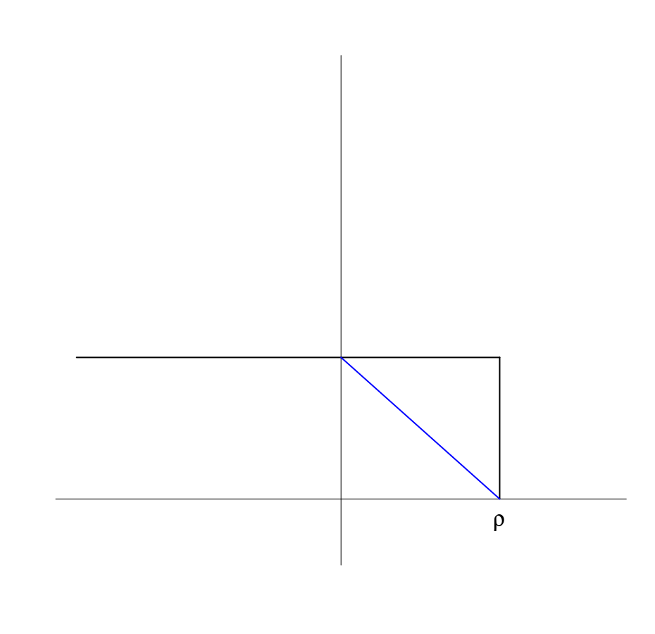
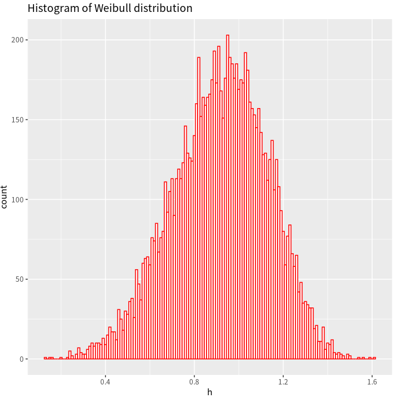
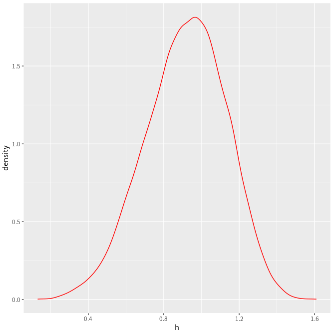

# Plot

## Base

- [R base plotting without wrappers](http://karolis.koncevicius.lt/posts/r_base_plotting_without_wrappers/)
- [r-graphical-parameters-cheatsheet](r-graphical-parameters-cheatsheet.pdf)

### `layout`

For two subplots, the height of the first subplot is 8 times than the height of the second subplot, 

```r
layout(mat = matrix(c(rep(1, 8), 2), ncol = 1, byrow = TRUE))
```

see more details in <https://stats.hohoweiya.xyz/2022/11/21/KEGGgraph/>

### math formula

No need to use `paste` function ([:link:](https://stackoverflow.com/questions/4973898/combining-paste-and-expression-functions-in-plot-labels))

COMMAND | FIGURE
--- | ---
`~` in the expression represents a space: `expression(xLab ~ x^2 ~ m^-2)` | 
`*` in the expression implies no space: `expression(xLab ~ x^2 * m^-2)` | 
`expression(R[group("", list(hat(F),F),"")]^2)` OR `expression(R[hat(F) * ',' ~ F]^2)` | 

### pure figure without axis

Suppose I want to draw the following figure with R,



At first, I try to use `xaxt` option to remove the axis, but the box still remains, just same as the [one question in the StackOverflow](https://stackoverflow.com/questions/4785657/how-to-draw-an-empty-plot), and I found a possible solution, directly use

```r
plot.new()
```

All is well before I tried to add the text $\rho$, if I use

```r
text(0.8, 0, expression(rho), cex = 2)
```

it is OK, but it is exactly on the axis, not proper, but when I tried smaller $y$-coordinate, such as -0.1, the text cannot appear, which seems out of the figure. I have tried `par()` parameters, such as `mar`, but does not work.

Then I have no idea, and do not know how to google it. And even though I want to post an issue in the StackOverflow. But a [random reference](https://www.stat.auckland.ac.nz/~ihaka/120/Notes/ch03.pdf) give me ideas, in which the example saves me,

```r
> plot.new()
> plot.window(xlim=c(0,1), ylim=c(5,10))
> abline(a=6, b=3)
> axis(1)
> axis(2)
> title(main="The Overall Title")
> title(xlab="An x-axis label")
> title(ylab="A y-axis label")
> box()
```

Then I realized that I should add

```r
plot.window(xlim = c(0, 1), ylim = c(-0.1, 0.9))
```

### smooth curve

```r
x <- 1:10
y <- c(2,4,6,8,7,12,14,16,18,20)
lo <- loess(y~x)
plot(x,y)
lines(predict(lo), col='red', lwd=2)
```

参考[How to fit a smooth curve to my data in R?](https://stackoverflow.com/questions/3480388/how-to-fit-a-smooth-curve-to-my-data-in-r)

### margin

有时通过 `par(mfrow=c(2,1))` 画图时间距过大，这可以通过 `mar` 来调节，注意到

- `mar` 调节单张图的 margin
- `oma` 调节整张图外部的 margin

参考 [how to reduce space gap between multiple graphs in R](https://stackoverflow.com/questions/15848942/how-to-reduce-space-gap-between-multiple-graphs-in-r)

比如，[B spline in R, C++ and Python](https://github.com/szcf-weiya/ESL-CN/commit/a79daf246320a7cd0ae57c0b229fc096d98483f6)

### custom panels in pairs

问题来自[R语言绘图？ - 知乎](https://www.zhihu.com/question/268216627/answer/334393347)


```r
my.lower <- function(x,y,...){
  points(x, y)
  lines(lowess(x, y), col = "red", lwd=2)
}

my.upper <- function(x, y, ...){
  cor.val = round(cor(x,y), digits = 3)
  if (abs(cor.val) > 0.5){
    text(mean(x), mean(y), cor.val, cex = 3)
    text(sort(x)[length(x)*0.8], max(y), '***', cex = 4, col = "red")
  } else
  {
    text(mean(x), mean(y), cor.val, cex = 1)
  }
}

pairs(iris[1:4], lower.panel =my.lower, upper.panel = my.upper)
```

参考 [Different data in upper and lower panel of scatterplot matrix](https://stackoverflow.com/questions/15625510/different-data-in-upper-and-lower-panel-of-scatterplot-matrix)

### remove outliers from the boxplot

[How to remove outliers from a dataset](https://stackoverflow.com/questions/4787332/how-to-remove-outliers-from-a-dataset)

### 在grid排列图

[Arranging plots in a grid](https://cran.r-project.org/web/packages/cowplot/vignettes/plot_grid.html)

### combine base and ggplot graphics in R figure

refer to [Combine base and ggplot graphics in R figure window](https://stackoverflow.com/questions/14124373/combine-base-and-ggplot-graphics-in-r-figure-window)


## lattice

The package can easily generate trellis graphs. A trellis graph displays the distribution of a variable or the relationship between variables, separately for each level of one or more other variables. 

A thorough tutorial refers to [Reproduce Figures with Lattice -- ESL CN](https://esl.hohoweiya.xyz/rmds/lattice.html)

## ggplot

- [https://ggplot2-book.org/](https://ggplot2-book.org/getting-started.html)

### multiple density plots

参考[使用ggplot2同时绘制多个密度图](https://www.tuicool.com/articles/3aUnem7)

```r
plots <- NULL
for(i in colnames(train)){ 
    plots[[i]] <- ggplot(train) + 
    geom_density(aes_string(x = i, fill = 'is_black'), alpha = 0.5, show.legend = F) + 
    xlab("") + 
    ylab(""); 
}
plot_grid(plotlist = plots)
```

see also: [Continuously add lines to ggplot with for loop](https://www.biostars.org/p/234142/)

### density of Weibull

adapted from [ggplot2绘制概率密度图](http://www.cnblogs.com/wwxbi/p/6142410.html)

Take the Weibull distribution as an example, 

$$
f(x) = \begin{cases}
\frac k\lambda \left(\frac x\lambda\right)^{k-1}e^{-(x/\lambda)^k} & x\ge 0\\
0 & x < 0
\end{cases}
$$

where $\lambda > 0$ is the scale parameter, and $k > 0$ is the shape parameter. And

- if $k=1$, it becomes to the exponential distribution
- if $k=2$, it becomes to the Rayleigh distribution.

=== "`dweibull`"
    ```r
    d <- seq(0, 5, length.out=10000)
    y <- dweibull(d, shape=5, scale=1, log = FALSE)
    df <- data.frame(x=d,y)
    ggplot(df, aes(x=d, y=y)) + 
        geom_line(col = "orange") + 
        ggtitle("Density of Weibull distribution")
    ```

    {: style="height:40%;width:40%"}

=== "`rweibull` + `histogram`"
    ```r
    h = rweibull(10000, shape=5, scale=1)
    ggplot(NULL, aes(x=h)) + 
        geom_histogram(binwidth=0.01, fill="white", col="red") + 
        ggtitle("Histogram of Weibull distribution")
    ```

    {: style="height:40%;width:40%"}

=== "`rweibull` + `density`"
    ```r
    ggplot(NULL, aes(x=h)) + geom_density(col = "green")
    ```

    {: style="height:40%;width:40%"}

=== "`rweibull` + `line`"
    ```r
    ggplot(NULL, aes(x=h)) + geom_line(stat = "density", col = "red")
    ```

    A minor difference is that here is a horizontal line in the above estimated density.

    {: style="height:40%;width:40%"}

Also refer to [Plotting distributions (ggplot2)](http://www.cookbook-r.com/Graphs/Plotting_distributions_(ggplot2)/)

### legend setup

参考[Legends (ggplot2)](http://www.cookbook-r.com/Graphs/Legends_(ggplot2)/)

#### 默认情形

```r
library(ggplot2)
bp <- ggplot(data=PlantGrowth, aes(x=group, y=weight, fill=group)) + geom_boxplot()
bp
```

#### 自定义图例的顺序

首先移除掉默认图例，有三种方式实现：
```r
# Remove legend for a particular aesthetic (fill)
bp + guides(fill=FALSE)

# It can also be done when specifying the scale
bp + scale_fill_discrete(guide=FALSE)

# This removes all legends
bp + theme(legend.position="none")
```

再改变默认顺序

```r
bp + scale_fill_discrete(breaks=c("trt1","ctrl","trt2"))
```

#### 颠倒图例的顺序

```r
# These two methods are equivalent:
bp + guides(fill = guide_legend(reverse=TRUE))
bp + scale_fill_discrete(guide = guide_legend(reverse=TRUE))

# You can also modify the scale directly:
bp + scale_fill_discrete(breaks = rev(levels(PlantGrowth$group)))
```

#### 隐藏图例标题

```r
# Remove title for fill legend
bp + guides(fill=guide_legend(title=NULL))

# Remove title for all legends
bp + theme(legend.title=element_blank())
```

#### 自定义图例的标题及名称

两种方式，一种
另一种修改数据集

```r

```

#### 图例的整体形状

```r
# Title appearance
bp + theme(legend.title = element_text(colour="blue", size=16, face="bold"))

# Label appearance
bp + theme(legend.text = element_text(colour="blue", size = 16, face = "bold"))
```

图例盒子

```r
bp + theme(legend.background = element_rect())
bp + theme(legend.background = element_rect(fill="gray90", size=.5, linetype="dotted"))
```

图例位置

```r
bp + theme(legend.position="top")

# Position legend in graph, where x,y is 0,0 (bottom left) to 1,1 (top right)
bp + theme(legend.position=c(.5, .5))

# Set the "anchoring point" of the legend (bottom-left is 0,0; top-right is 1,1)
# Put bottom-left corner of legend box in bottom-left corner of graph
bp + theme(legend.justification=c(0,0), legend.position=c(0,0))

# Put bottom-right corner of legend box in bottom-right corner of graph
bp + theme(legend.justification=c(1,0), legend.position=c(1,0))
```

#### 隐藏图例的slashes

```r
# No outline
ggplot(data=PlantGrowth, aes(x=group, fill=group)) +
    geom_bar()

# Add outline, but slashes appear in legend
ggplot(data=PlantGrowth, aes(x=group, fill=group)) +
    geom_bar(colour="black")

# A hack to hide the slashes: first graph the bars with no outline and add the legend,
# then graph the bars again with outline, but with a blank legend.
ggplot(data=PlantGrowth, aes(x=group, fill=group)) +
    geom_bar() +
    geom_bar(colour="black", show.legend=FALSE)
```

### 坐标轴标签字体大小

参考[Size of labels for x-axis and y-axis ggplot in R](https://stackoverflow.com/questions/14363804/size-of-labels-for-x-axis-and-y-axis-ggplot-in-r)

### 多张图片

`par(mfrow=c(1,2))`不起作用，要用到 `gridExtra` 包，如

```r
library(gridExtra)
plot1 <- qplot(1)
plot2 <- qplot(1)
grid.arrange(plot1, plot2, ncol=2)
```

参考[Side-by-side plots with ggplot2](https://stackoverflow.com/questions/1249548/side-by-side-plots-with-ggplot2)

### 绘制地图

参考

1. [Making Maps with R](http://eriqande.github.io/rep-res-web/lectures/making-maps-with-R.html)

### `scale_fill_manual` 和 `scale_color_manual`

更改颜色命令为

```r
scale_fill_manual(values = c("red", "blue"))
```

### save 

NOT `png()...dev.off()`, use

```r
ggsave("sth.eps",device="eps", width=9)
```

### `aes_string` vs `aes`

在重复绘图时，似乎是作用域的缘故，有时 `aes` 只能保留最后一个，此时需要用 `aes_string`.

参考 [Question: Continuously add lines to ggplot with for loop](https://www.biostars.org/p/234142/)

