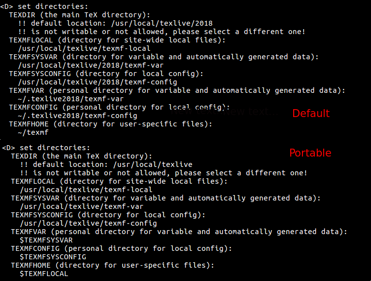
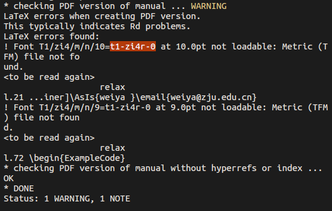
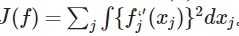

# 关于 TeX

- Online LaTeX Editor: <https://latex.codecogs.com/eqneditor/editor.php>

## Installation of TeXLive

!!! note "TL;DR"
    Following the [official instruction](https://tug.org/texlive/quickinstall.html),

    1. download `install-tl`
    2. run it, and optionally specify the mirror location for faster download speed

### 2021 on Rocky

did not click `create symlinks to standard directories` after running `./install-tl`

create module file, `/usr/share/Modules/modulefiles/texlive/2021`,

```bash
set     version         2021
set     app             texlive
set     modroot         /usr/local/$app/$version

prepend-path PATH $modroot/bin/x86_64-linux
prepend-path MANPATH $modroot/texmf-dist/doc/man
prepend-path INFOPATH $modroot/texmf-dist/doc/info
```

then call it after loading the module,

```bash
$ which pdflatex
/usr/bin/pdflatex
$ module load texlive/2021 
$ which pdflatex
/usr/local/texlive/2021/bin/x86_64-linux/pdflatex
```

### 2017 -> 2020

The TeXLive 2017 for Ubuntu cannot work for me, it reports

> fatal: Could not undump 6994 4-byte item(s) ...

and try

> fmtutil-sys --all

refer to [Error Message: “tex: fatal: Could not undump 1 4-byte item(s) from”](https://tex.stackexchange.com/questions/141838/error-message-tex-fatal-could-not-undump-1-4-byte-items-from), but does not work.

And I also try uninstall and reinstall TexLive, but it still does not work.

Then finally I decided to install the latest TeXLive 2020, [TeX Live - Quick install](https://tug.org/texlive/quickinstall.html), follow the instructions, but note that the mirror url should append `path/systems/texlive/tlnet`.

```bash
install-tl --location http://mirror.example.org/ctan/path/systems/texlive/tlnet
```

And note that the [steps for completely removing the installed TeXLive](https://tex.stackexchange.com/questions/95483/how-to-remove-everything-related-to-tex-live-for-fresh-install-on-ubuntu).

If without root privilege, when running `install-tl`, type `D` to change the directory, and actually changing the first `<1>` would change all other directories.

### portable mode 

!!! info
    [Date: Mar 22, 2019](https://github.com/szcf-weiya/techNotes/commit/b3ed900f0623d6fa1035ee7790fc650bb7ccb1fa)

目前笔记本上 texlive 还是 2015 版的，而 TikePictures.jl 要求的 lualatex 跑不成功，有 bug。于是考虑安装最新版 texlive 2018，只不过笔记本硬盘空间不够，决定在移动硬盘中安装 texlive。

[TexLive 官方说明文档](http://tug.org/texlive/doc/install-tl.html)也介绍了 `-portable` 的安装选项，



其与正常安装时环境变量略有不同，没有单独设置 personal 的配置路径，或许还有其他地方的区别。

另外安装时碰到默认的 mirror 速度很慢的情况，于是考虑换成最近的华为云。

```bash
./install-tl -repository https://mirrors.huaweicloud.com/repository/toolkit/CTAN/systems/texlive/tlnet/
```

路径要指定成

```bash
<CTAN/mirror/root/URL>/systems/texlive/tlnet
```

参考 [Change TeX Live Main Repository](https://tex.stackexchange.com/questions/313271/change-tex-live-main-repository)


## Basic 

??? tip "`\xspace`: space after LaTeX commands"

	```tex
	\usepackage{xspace}
	\newcommand\foo{foo\xspace}
	```

!!! info "Norm: non-breaking space `~` in reference"
	non-breaking space `~` in `Figure~\ref{fig:}`.

??? tip "different ways for line breaks"

	- `\\`, `\newline`, `\tabularnewline` [:material-stack-overflow:](https://tex.stackexchange.com/questions/78796/difference-between-and-tabularnewline): when writing a table, the first one can be confused, while the second one ends the line in a cell, and the latter ends the rows of the table. A good side is that when writing tex using julia, `raw"\command"` does not need to escape `\`, but it is still required to use `raw"\\\\"` to represent `\\`.
	- break line in cells of table: `\makecell{A\\ B}` after loading `\usepackage{makecell}`. [:link:](https://tex.stackexchange.com/questions/2441/how-to-add-a-forced-line-break-inside-a-table-cell)

??? tip "`%` at the end of lines"

	since `%` starts a comment that goes to the end of the line, then the normal effect is that it does not insert the space (or a `par`) from the newline. It would be necessary when creating multiple figures horizontally using `subfigure` environment. [An real example](https://github.com/szcf-weiya/Cell-Video/blob/ec3c2f9c9c76df46f099948435e473992212e171/report/technical-report2.tex#L1314). More details can be found in [:material-stack-overflow:What is the use of percent signs (%) at the end of lines?](https://tex.stackexchange.com/questions/7453/what-is-the-use-of-percent-signs-at-the-end-of-lines-why-is-my-macro-creat)

??? warning "fontsize: only recognize 10-12pt"

	In the following command

	```tex
	\documentclass[12pt]{article}
	```

	the option can be recognized only `10pt`, `11pt` and `12pt`.

	Refer to [How is 14pt giving font size smaller than 12pt?](https://tex.stackexchange.com/questions/413319/how-is-14pt-giving-font-size-smaller-than-12pt)


??? info "Norm: punctuation in formula"

	> Displayed equation usually are considered to be part of the preceding sentence, that is it will get the very same punctuation as if it was inline math

	Refer to [For formal articles, should a displayed equation be followed by a punctuation to conform to the language grammar?](https://tex.stackexchange.com/questions/7542/for-formal-articles-should-a-displayed-equation-be-followed-by-a-punctuation-to)


!!! tip "footnote: symbols instead of numbers as markers"
	`\usepackage[symbol]{footmisc}` ([:link:](https://tex.stackexchange.com/questions/826/symbols-instead-of-numbers-as-footnote-markers))

!!! tip "footnote: without marker"
	```tex
	\newcommand\blfootnote[1]{%
		\begingroup
		\renewcommand\thefootnote{}\footnote{#1}%
		\addtocounter{footnote}{-1}%
		\endgroup
	}
	```
	Refer to [:link:](https://tex.stackexchange.com/questions/30720/footnote-without-a-marker)

## Two Columns

- use star version `table*` and `figure*` to cross two columns, and note that not support `[H]` option. See also [:link:](https://tex.stackexchange.com/questions/263685/latex-table-star-positioning-double-column-tables), [:link:](https://github.com/vtex-soft/texsupport.ims-sts/blob/d9e80b69aa3b237e445c94226002248e36e226d5/sts-sample.tex#L293)
- use `\columnwidth` instead of `\textwidth` (or use `0.5\textwidth`), see also [:link:](https://tex.stackexchange.com/questions/275/how-to-find-the-textwidth-in-two-column-mode)

## Beamer

- customize aspect ratio, from default 4:3 to 16:9 : `\documentclass[aspectratio=169]{beamer}` [:link:](https://tex.stackexchange.com/questions/14336/latex-beamer-presentation-package-169-aspect-ratio)

### fragile option

参考 [LaTeX 技巧 573：beamer 中使用 Listings 包出现的错误](http://blog.sina.com.cn/s/blog_5e16f1770102dxps.html)

错误描述

```none
Runaway argument?
! Paragraph ended before \lst@next was complete.
<to be read again>
                   \par
l.68 \end{frame}
?
```

解决方案

```tex
\begin{frame}[fragile]
\frametitle{Your title}

\begin{lstlisting}
code
\end{lstlisting}
\end{frame}
```

### incompatible with enumitem

详见[lists - Trouble combining enumitem and beamer - TeX - LaTeX Stack Exchange](https://tex.stackexchange.com/questions/31505/trouble-combining-enumitem-and-beamer)

摘录其中一句话

> enumitem “disturbs” beamer.

而其中 `enumitem` 可以实现将列表的序号由数字改成字母，详见 [How do I change the `enumerate` list format to use letters instead of the default Arabic numerals?](https://tex.stackexchange.com/questions/2291/how-do-i-change-the-enumerate-list-format-to-use-letters-instead-of-the-defaul)

### import video

[Can XeLaTeX | LuaTeX import movies?](https://tex.stackexchange.com/questions/12790/can-xelatex-luatex-import-movies)

之前用 xelatex + animate 试过展示动态视频，但是只能在 Acrobat Reader 中起作用，不能在 Ubuntu 18.04 上通过 evince 或者 okular 播放。参考 [How to make Okular play embedded video](https://askubuntu.com/questions/427743/how-to-make-okular-play-embedded-video)，建议使用 multimedia 包，但是这个包不支持 xelatex，会报错

> ! Undefined control sequence. <argument> \pdfmark

参考 multimedia 的文档，里面确实强调了，

> The package can be used together with both dvips plus ps2pdf and pdflatex, though the special sound support is available only in pdflatex.

所以只能用 pdflatex, 不过根据 [Video in Beamer with multimedia, undefined control sequence](https://tex.stackexchange.com/questions/282410/video-in-beamer-with-multimedia-undefined-control-sequence), 似乎也可以用 LuaLaTeX.

## Fonts

- [Overleaf: Font sizes, families, and styles](https://www.overleaf.com/learn/latex/Font_sizes,_families,_and_styles)

??? note "\fontfamily{pcr}"

	Selects the "Courier" font family for the document. This font family is a fixed-width font that is commonly used for programming code or computer terminal outputs. (chatGPT)

	For other "font package name" and its "font code", see also: [:link:](https://www.overleaf.com/learn/latex/Font_typefaces)

### some nice font family

refer to [Suggest a “nice” font family for my basic LaTeX template (text and math)](https://tex.stackexchange.com/a/59706)

and currently I prefer to `newpxtext` and `newpxmath`.

### missing font

报错信息如下图



解决方案为
```bash
sudo apt-get install texlive-fonts-extra
```

有时需要考虑
```
sudo apt-get install texlive-fonts-recommand
```

### common font styles in math formula

[](https://i.stack.imgur.com/eZdhj.png)

refer to [What are all the font styles I can use in math mode?](https://tex.stackexchange.com/questions/58098/what-are-all-the-font-styles-i-can-use-in-math-mode)

### bold math formula

使用 `\mathbf` 加粗完后斜体不见了，这不是想要的结果

```tex
\usepackage{amsmath}
\boldmath
$$
f(x,y) = 3(x+y)y / (2xy-7)
$$
\unboldmath
```

或

```tex
\usepackage{bm}
$$
\bm{f(x,y) = 3(x+y)y / (2xy-7)}
$$
```

参考 [LaTeX 数学字体加粗问题](http://blog.sina.com.cn/s/blog_5e16f1770100nqwx.html)

### use serif math font in beamer

默认数学字体挺丑的，可以在导言区加入

```tex
\usefonttheme[onlymath]{serif}
```

下面摘录自 [Beamer 中数学符号字体 ](http://blog.sina.com.cn/s/blog_4b91d3b50101lupb.html)

> 关于tex的字体样式，其实是通用的，与css和windows字体等，都是通用的。来源于西方的字母写法，大致可分为两类：serif （衬线）和sans-serif（无衬线）。

> 所谓衬线是字体的末端加强，便于阅读。如通常见的Times New Roman, 宋体。sans-serif（sans 源自法语，表示“没有”）字体的代表如Arial，隶书，幼圆。由于衬线的强化作用，serif字体作为正文具有易读性。因此存在大段文本的情况下，常使用衬线字体。但做幻灯片的话，衬线字体会因字体粗细不同，反倒可能降低辨识度。因此建议标题用衬线字体，正文用非衬线字体。

> 数学符号用衬线字体相对美观一些，而Beamer如果不另行设置，默认全文使用sans-serif字体。因此按上述方式设置一下即可。

## List

### 设置item之间的间隔

直接用`itemsep`命令，如

```tex
\begin{itemize}
  \setlength\itemsep{1em}
  \item one
  \item two
  \item three
\end{itemize}
```

### enumerate 编号 样式设定

参考[latex 列举 enumerate 编号 样式设定](http://blog.sina.com.cn/s/blog_7983e5f101019wwq.html)

### itemize 环境下不同 item 中数学公式对齐

参考[Sharing alignment between equations in two different items](https://tex.stackexchange.com/questions/29119/sharing-alignment-between-equations-in-two-different-items)

## Low-Level

- category codes: [What are category codes?](https://tex.stackexchange.com/questions/16410/what-are-category-codes)
- `@` in an `\if` statement: [When to use @ in an \if statement](https://tex.stackexchange.com/questions/27803/when-to-use-in-an-if-statement)
- `\makeatletter` and `\makeatother`: [What do \makeatletter and \makeatother do?](https://tex.stackexchange.com/questions/8351/what-do-makeatletter-and-makeatother-do)

## Bibliography

- `biber` and `bibtex` are external programs to process `.bib` file
- `biblatex` and `natbib` are LaTeX packages that format citations and bibliographies
    - `natbib` works **only** with `bibtex`
    - `biblatex` works with both `biber` and `bibtex`
- [rm `In:`](https://tex.stackexchange.com/questions/10682/suppress-in-biblatex): insert `\renewbibmacro{in:}{}` after loading the package `biblatex`.

Refer to [Bibtex, Latex compiling - TeX - LaTeX Stack Exchange](https://tex.stackexchange.com/questions/204291/bibtex-latex-compiling)

Based on my understanding and experience, `biber + biblatex` is more advanced, and it can easily handle accent characters.

- (2021-10-07 20:55:35) Just encountered that accented characters are correctly displayed in `.bib` file as UTF8 encoding, but after processing with `bibtex`, the accented characters are messy. (Refer to [:link:](https://github.com/szcf-weiya/Cell-Video/issues/219#issuecomment-938060248) for more details.)

### biblatex -> natbib

!!! info
    Post: 2021-10-07 21:13:41
    See also: [:link:](https://github.com/szcf-weiya/Cell-Video/commit/7d54f77a0ac00ae2afa73f02f939156d054f5852)

To switch from "biblatex + biber" to ["natbib + bibtex"](https://www.overleaf.com/learn/latex/Bibliography_management_with_natbib), 

=== "biblatex + biber"

    ```tex
    \usepackage[backend=biber,citestyle=authoryear,sortcites=true,natbib,sorting=nyt,style=apa]{biblatex}
    \DeclareLanguageMapping{american}{american-apa}
    ```

=== "natbib + bibtex"
    
    ```tex
    \usepackage[authoryear]{natbib}
    \bibliographystyle{imsart-nameyear}
    ```

We can just modify the header definition without replacing the commands in the main document.

The idea is to define the command in `natbib+bibtex` as `biblatex+biber`, and keep the main content unchanged. Specifically,

```tex
\newcommand{\parencite}[1]{\citep{#1}}
\newcommand{\textcite}[1]{\citet{#1}}
% \addbibresource{ref_biblatex.bib}
\newcommand{\printbibliography}{\bibliography{ref_bibtex.bib}}
```

!!! warning "A well known issue for biber older than 2.2"
	[missing recode_data.xml file](https://tex.stackexchange.com/questions/140814/biblatex-biber-fails-with-a-strange-error-about-missing-recode-data-xml-file/)

### bibtex文献加颜色

两种方式

第一种

```tex
\hypersetup{
    colorlinks,
    citecolor=green,
    linkcolor=black
}
```

但这个只会对参考文献中可点击的部分起作用，比如实际中只对年份起了作用。

第二种可以自定义命令

```tex
\DeclareCiteCommand{\cite}
  {\color{red}\usebibmacro{prenote}}%
  {\usebibmacro{citeindex}%
   \usebibmacro{cite}}
  {\multicitedelim}
  {\usebibmacro{postnote}}

\DeclareCiteCommand{\parencite}[\mkcolorbibparens]
  {\usebibmacro{prenote}}%
  {\usebibmacro{citeindex}%
   \usebibmacro{cite}}
  {\multicitedelim}
  {\usebibmacro{postnote}}
```


参考 [Beamer, Citation coloring](https://tex.stackexchange.com/questions/369710/beamer-citation-coloring)

实战例子：[szcf-weiya/zju-thesis](https://github.com/szcf-weiya/zju-thesis/blob/ef03ae6c484bf4c9b23dd62d06cb751c05ed120d/src/zju-thesis.dtx#L499-L528)

### modify style of specific field

例如想加粗并用橙色显示 `note` field, 则可以采用

```tex
\DeclareFieldFormat{note}{\bfseries\color{orange}{#1}}
```

例如 [:link:](https://github.com/szcf-weiya/CV/blob/bdf6c7c02150d31097917d3b128c03c3d45b200b/2022ExploreAward/settings.sty#L93)

另见 [Biblatex Change field format for a specific entry type - TeX - LaTeX Stack Exchange](https://tex.stackexchange.com/questions/440196/biblatex-change-field-format-for-a-specific-entry-type)

### 将引用的年份用括号框起来

参考[Put parentheses around year in citation](https://tex.stackexchange.com/questions/104518/put-parentheses-around-year-in-citation)

采用`natbib`中的`\citet`

但若已经按照上个问题设置了颜色，则颜色失效。

### Biblatex/biber fails with a strange error about missing recode_data.xml file

参考[Biblatex/biber fails with a strange error about missing recode_data.xml file](https://tex.stackexchange.com/questions/140814/biblatex-biber-fails-with-a-strange-error-about-missing-recode-data-xml-file/258217#258217)

### APA

- APA 带编号

默认 APA 格式的参考文献是不带标号的，如果需要，参考

[APA bibliography style with numbers](https://tex.stackexchange.com/questions/373336/apa-bibliography-style-with-numbers)

- 保留大小写

除了第一个单词的首字母，默认会将 title 中其它单词的首字母的大写改成小写，如果没有被 `{{}}` 保护的话。

使用

```tex
\DeclareFieldFormat{apacase}{#1}
```

例如 [:link:](https://github.com/szcf-weiya/CV/blob/bdf6c7c02150d31097917d3b128c03c3d45b200b/2022ExploreAward/settings.sty#L159)

### export to `.bib` from Zotero

!!! tip
    The plugin [Better BibTeX](https://retorque.re/zotero-better-bibtex/) can keep the `.bib` file once new references are added. Also, it can be exported to either `biblatex` or `bibtex`. 

    - With `biblatex`, do not care about the accented characters, just use its original format
    - With `bibtex`, it will automatically convert the accented characters with necessary backslashes.

The original abstract field is,

> Karhunen--Lo\`{e}ve decomposition

after exporting to `.bib` file, it becomes

> Karhunen--Lo{\textbackslash}`\{e\}ve decomposition

and it throws an error when compiling,

> ! File ended while scanning use of \field.

My first solution is to check if there are some setting when exporting to `.bib` file to drop some field, such as abstract here, but finally I failed to find one, and here is [a discussion](https://forums.zotero.org/discussion/22629/bibtex-export-request-option-to-omit-certain-fields-for-less-cluttered-bibliographies) in the Zotero community.

Then I try to replace

> \`{e}

with

> {\`e}

in the Zotero's abstract field as said in [How to write “ä” and other umlauts and accented letters in bibliography?](https://tex.stackexchange.com/questions/57743/how-to-write-%C3%A4-and-other-umlauts-and-accented-letters-in-bibliography), which also list several accented characters,

> {\"a} {\^e} {\`i} {\.I} {\o} {\'u} {\aa} {\c c} {\u g} {\l} {\~n} {\H o} {\v r} {\ss} {\r u}


but it still doesnt work.

Finally, I directly correct the exported file using the above technique, and it works. But I still think it is not a good idea since I prefer to export without any further modifications. [TODO]

### display full name

For `natbib`, check the documentation of `natbib` by typing

```bash
texdoc natbib
```

`longnamesfirst` option will display full name for the first citation of any given reference, but all subsequent ones will be used with `et al.`

- without `longnamesfirst`, all citations would be `et al.`
- with `\citet*`, `\citep*`, the citation would be full author list.

For `biblatex`, seems that we can set the global argument `maxcitenames` to control the number of author in the citation, such as [only display all authors, of multi-author works, the first time a citation is used with biblatex](https://tex.stackexchange.com/questions/175801/only-display-all-authors-of-multi-author-works-the-first-time-a-citation-is-us)

### DeclareLanguageMapping

```tex
\DeclareLanguageMapping{american}{american-apa}
```

refer to [Problem with \mkbibdateapalongextra of biblatex-apa](https://tex.stackexchange.com/questions/133700/problem-with-mkbibdateapalongextra-of-biblatex-apa)

### printbibliography

```tex
\usepackage[american]{babel}
\usepackage[style=apa,backend=biber]{biblatex}
\DeclareLanguageMapping{american}{american-apa} %Literaturverzeichnis american-apa style
\addbibresource{library.bib}
\usepackage[babel,threshold=2]{csquotes}
```

and then

```tex
\printbibliography[heading=bibintoc,title=References]
```

refer to [Problems with \printbibliography](https://tex.stackexchange.com/questions/351079/problems-with-printbibliography/351091)

## TiKZ

- `tikzset`, `tikzstyle`, or directly around `tikzpicture`. [:link:](https://tex.stackexchange.com/questions/52372/should-tikzset-or-tikzstyle-be-used-to-define-tikz-styles)

- `xshift` for arrow: [Start line shifted from anchor point node](https://tex.stackexchange.com/questions/391417/start-line-shifted-from-anchor-point-node)

- [border of a shape inside](https://tex.stackexchange.com/questions/245141/pgf-tikz-draw-the-border-of-a-shape-inside-it)

- label in place:

```tex
  \tikzset{%
    in place/.style={
      auto=false,
      fill=white,
      inner sep=2pt,
    },
  }
```

refer to [avoid overlapping of labels and arcs in Tikz - TeX - LaTeX Stack Exchange](https://tex.stackexchange.com/questions/352562/avoid-overlapping-of-labels-and-arcs-in-tikz)

- axis title position: use `every axis title/.style={..}`, refer to [pgfplot axis title position](https://tex.stackexchange.com/questions/277633/pgfplot-axis-title-position)

## Figures

- force subfigures to have same height and scale proportionally: [:link:](https://tex.stackexchange.com/questions/218378/forcing-subfigures-to-have-same-height-and-take-overall-x-of-linewidth-in-latex)
	- examples: [:material-file-code:](https://github.com/szcf-weiya/Cell-Video/blob/5b6119ba5517a5e94ce0440586c62c25a3f9846d/report/technical-report2.tex#L180-L212)

## Formula

### Some ways to number equations

- `split` for a single number
- `multiline` for a single number
- `align*` with `tag`

more details refer to [A test of Equation Numbering](https://cdn.rawgit.com/mathjax/MathJax/2.7.1/test/sample-eqnum.html)

### align multi cases

refer to [How can I align multiple cases environment simultaneously?](https://tex.stackexchange.com/questions/96568/how-can-i-align-multiple-cases-environment-simultaneously)

Key point: enclose one of the entries in the first `cases` environment in a box whose width is that of the longest of the second `cases` environment.

or use `\hphantom{}`.

### 带 `\hat` 时的上标

```tex
\hat\beta^n
```

$$
\hat\beta^n
$$

和

```tex
\hat\beta{}^n
```

$$
\hat\beta{}^n
$$

参考 [Position of superscript when superscriptd item has \hat over it](https://tex.stackexchange.com/questions/9184/position-of-superscript-when-superscriptd-item-has-hat-over-it)

### 二阶导数符号

在tex中一般直接用

```tex
$f''$
```

但是在md中，当渲染成网页后，有时会渲染成了普通的引号，如下图



参考[How to write doubleprime in latex](https://tex.stackexchange.com/questions/210290/how-to-write-doubleprime-in-latex)

1. `\dprime`和`\trprime`需要`unicode-math`
2. `f^{\prime\prime}`代替`f''`可以解决问题。

### 数学公式插入图片

参考 [Can I insert an image into an equation?](https://tex.stackexchange.com/questions/11069/can-i-insert-an-image-into-an-equation)

### 同时在等号上下注明

参考 [Writing above and below a symbol simultaneously ](https://tex.stackexchange.com/questions/123219/writing-above-and-below-a-symbol-simultaneously)

### `\hat f` 的脚标太远

当对 `f` 同时加上 `hat` 和脚标时，脚标会离得很远，感觉很丑，如


一种解决方案如图所示，将 `hat` 框住脚标。当然这个解决方案对于其它字符并不需要，比如对于 `pi`, 反而不好。

## Theorem

### bold for theorem title.

Without `amsthm`, the title is bold by default. Refer to [Title of the theorem](https://tex.stackexchange.com/questions/22223/title-of-the-theorem).

With `amsthm`, one solution is to add these in the preamble.

```tex
\usepackage{amsthm}
\makeatletter
\def\th@plain{%
  \thm@notefont{}% same as heading font
  \itshape % body font
}
\def\th@definition{%
  \thm@notefont{}% same as heading font
  \normalfont % body font
}
\makeatother
```

refer to [How to make the optional title of a theorem bold with amsthm?](https://tex.stackexchange.com/questions/43966/how-to-make-the-optional-title-of-a-theorem-bold-with-amsthm)

### proof by parts

```tex
\newtheorem{proofpart}{Part}
\newtheorem{theorem}{Theorem}
\makeatletter
\@addtoreset{proofpart}{theorem}
\makeatother
```

here `\@addtoreset{foo}{bar}` is to add counter `foo` to the list of counters `\cl@bar` to be reset when counter `bar` is stepped.

Refer to [Parts numbering in Proofs](https://tex.stackexchange.com/questions/101880/parts-numbering-in-proofs)


## 缺少 `.sty` 文件

比如缺少 `mhchem.sty`

```error
! LaTeX Error: File 'mhchem.sty' not found
```
解决方案为
```bash
# 1. 检查是否存在 `mhchem.sty` 文件
$ locate mhchem.sty
# 2. 查找需要安装的 package
$ apt-cache search mhchem | grep tex
# texlive-science - TeX Live: Natural and computer sciences
# 3. 安装相应的package
$ sudo apt-get install texlive-science
```

参考 [Latex can't find .sty files altough packages are installed — TexLive, Ubuntu 12.04](http://tex.stackexchange.com/questions/158700/latex-cant-find-sty-files-altough-packages-are-installed-texlive-ubuntu-12)


## 调整目录的显示层数

在使用 `tableofcontents` 命令的时候，可分别显示 `chapter`，`section`，`subsection`，`subsubsection` 等目录，有时候，不希望显示级别较低的内容，比如只显示到 `chapter` 和 `section`，而 `subsection` 和 `subsubsection` 不显示，这时候可通过命令 `setcounter` 命令来控制，具体做法如下：

```tex
\setcounter{tocdepth}{2}
```

即只显示两级目录。

## pdf 添加 Metadata 信息

```tex
\usepackage[pdfauthor={Your Name},
            pdftitle={The Title},
            pdfsubject={The Subject},
            pdfkeywords={Some Keywords},
            pdfproducer={XeLateX with hyperref},
            pdfcreator={Xelatex}]{hyperref}
```


## “texi2dvi” command not found

```bash
sudo apt-get install texinfo
```

## Why can't the end code of an environment contain an argument?

参考[Why can't the end code of an environment contain an argument?](https://tex.stackexchange.com/questions/17036/why-cant-the-end-code-of-an-environment-contain-an-argument)

## Formatting section titles

参考[Formatting section titles](https://tex.stackexchange.com/questions/36609/formatting-section-titles)

## Table

### `multirow` and `multicolumn`

!!! example
    [private project](https://github.com/szcf-weiya/Clouds/commit/1f8cfc43b773952eddb9477b7859a2566f3536a3)

```tex
\usepackage{multirow}
\multirow{number of rows}{width}{text} % using `*` as width implies natural width

% no extra package
\multicolumn{number of cols}{align}{text} % align `l, c, r`
```

refer to [Multi-column and multi-row cells in LaTeX tables](https://texblog.org/2012/12/21/multi-column-and-multi-row-cells-in-latex-tables/)

If we want to add line break in multi rows, we add specify the width, and also center the text, such as

```bash
\multirow{3}{2cm}{\centering some long sentences}
```

### `midrule`

- with `midrule` provided by `booktabs`, the vertical table lines become discontinuous. According to [@egreg](https://tex.stackexchange.com/a/88939/), that is by design, and it is suggested to use `\cmidrule` to show the grouping of the header. [practical example](https://github.com/szcf-weiya/Clouds/commit/1f8cfc43b773952eddb9477b7859a2566f3536a3)
    - to add gap between two midrule, use `\cmidrule(lr){2-3}\cmidrule(lr){4-5}`, refer to [Table with gap between cmidrule's (extra space between two columns)](https://tex.stackexchange.com/questions/180368/table-with-gap-between-cmidrules-extra-space-between-two-columns) and [a practical example](https://github.com/szcf-weiya/Clouds/blob/fe8ee8b36331eef71db914072de797ce635c022b/src/cmpr_mono_fitting.R#L302)

### `resizebox`

It is defined in `graphics`, so it is necessary to load `\usepackage{graphicx}`.

```bash
$ latexdef -f resizebox

\resizebox:
undefined

$ latexdef -p graphicx -f resizebox
\resizebox first defined in "graphics.sty".

\resizebox:
\protected macro:->\leavevmode \@ifstar {\Gscale@@box \totalheight }{\Gscale@@box \height }

```

!!! question
    In general, how can I find the packages that a command belongs to? Here is a [dicussion](https://stackoverflow.com/questions/2440588/latex-how-to-find-packages-that-a-command-belongs-to), but seems not enough.

the basic grammar is

```tex
\begin{table}
\resizebox{\textwidth}{!}{
	\begin{tabular}
	...
  \end{tabular}
}
\end{table}
```

it works for images and tables

> For rescaling in general you can use a `resizebox` (from the `graphicx` package), which also works for `tikzpicture`. The first argument is the width, the second the height, or `!` to scale proportionally.
>
> source: [@Marijn](https://tex.stackexchange.com/a/363884/)

and application in 

- [Forcing subfigures to have same height and take overall X% of linewidth in LaTeX](https://tex.stackexchange.com/questions/218378/forcing-subfigures-to-have-same-height-and-take-overall-x-of-linewidth-in-latex)
- [Is there a way to slightly shrink a table, including font size, to fit within the column boundaries? - TeX - LaTeX Stack Exchange](https://tex.stackexchange.com/questions/10863/is-there-a-way-to-slightly-shrink-a-table-including-font-size-to-fit-within-th)

!!! example
    - [in table](https://github.com/szcf-weiya/Cell-Video/blob/d7725152fc5b5243d74d756f9db625e4f0e3d886/report/technical-report2.tex#L1406-L1412)
	- use in beamer to shrink tables, and refer to [:link:](https://tex.stackexchange.com/questions/5067/shrinking-tables-for-presentations) for alternative ways.

!!! bug
    > Error: extra alignment tab has been changed to \cr

    check the number of columns.


## 替换换行符

详见[strings - Replacing substrings by linebreaks - TeX - LaTeX Stack Exchange](https://tex.stackexchange.com/questions/178610/replacing-substrings-by-linebreaks)

这是 zju-thesis 模板允许封面标题换行的处理策略，同时参见

1. [Line break inside \makebox](https://tug.org/pipermail/texhax/2007-November/009566.html)

## fancyhdr warning headheight is too small after setting font size

Refer to [headheight-problem](https://tex.stackexchange.com/questions/198692/headheight-problem)

## [re]newcommand

### `Capacity exceeded [semantic nest …]`

check your `newcommand` definition, to see if there is some silly definition such as

```tex
\newcommand\silly{\silly}
```

refer to [Capacity exceeded](https://texfaq.org/FAQ-semanticnest)

### avoid space after command

with definition,

```tex
\newcommand\test{test}
```

will cause no space in the middle of text. A remedy is to use `\test\ ` in the middle of text, refer to 

- [Space after LaTeX commands - TeX - LaTeX Stack Exchange](https://tex.stackexchange.com/questions/31091/space-after-latex-commands)
- [Drawbacks of csname method to avoid spaces after command - TeX - LaTeX Stack Exchange](https://tex.stackexchange.com/questions/293924/drawbacks-of-csname-method-to-avoid-spaces-after-command) 

for other possible solutions. 

## `standalone` 环境

1. 不支持 `algorithm`
2. 对于 `algorithmic` 要加上 `varwidth` 或 `preview` 选项。

参考

- [using standalone with algorithmicx or algorithm2e](https://tex.stackexchange.com/questions/113394/using-standalone-with-algorithmicx-or-algorithm2e/125863)
- [standalone does not work with algorithms](https://tex.stackexchange.com/questions/373608/standalone-does-not-work-with-algorithms)
- [algorithmicx crashes standalone](https://tex.stackexchange.com/questions/61281/algorithmicx-crashes-standalone)


## Greek Symbols

### howto bold

`\mathbf` 只对公式中的普通字母 `ABC...abcdef` 等起作用。

=== "Method 1"
	```tex
	\usepackage{amsmath}
	\boldsymbol{\sigma}
	```

=== "Method 2"
	```tex
	\usepackage{bm}
	\bm{\sigma}
	```

### variant forms

详见 [Variant forms of Greek symbols](vargreek.md)。

## Operator

### `operatorname` vs `mathrm`


`\operatorname`:

The argument is written in upright mode but with some additional space before and behind.

`\mathrm`:

It is like math mode (no spaces), but in upright mode. The font size isn't changed.

[What's the difference between \mathrm and \operatorname?](https://tex.stackexchange.com/questions/48459/whats-the-difference-between-mathrm-and-operatorname)

### `\limits is allowed only on operators`


## New usage of `cases`

see

```tex
\ind{A} = \cases{
        1 & if $A$ is true,\\
        0 & otherwise,}
```

refer to [Matching Content to MathJax](http://drz.ac/2013/01/14/matching-content-to-mathjax/), which originally for illustrating the typeface of mathjax.

## Make a love heart

- by equation:
- by pure latex
- by tikz based on filtered paths

refer to [Can we make a love heart with LaTeX?](https://tex.stackexchange.com/questions/139733/can-we-make-a-love-heart-with-latex)

	
## Change section title without altering the cleveref cross-referencing system

!!! info
    Contributed by [ZexiCAI](https://github.com/ZexiCAI) on 2021-09-06.

Suppose you 

1. want the section title to be "Good Title 1", "Good Title 2", etc., and 
2. you want cross-reference two sections at the same time as "Good Titles 1 and 2" instead of "Good Title 1 and Good Title 2". Although one can do it mannually, the author is lazy and would like the cross-referencing system to do it automatically.
	
The simplest way to do (1) is to change the `\thesection` definition:

```tex
\renewcommand{\thesection}{Good Title \arabic{section}}
```

However, when you do cross-referencing ("cref" or "Cref"), it will appear to be "section Good Title 1" and "section Good Title 2". A feasible way to do it is to directly modify the definition of `\section` command. Its original definition is 

```tex
\newcommand\section{\@startsection {section}{1}{\z@}%
{-3.5ex \@plus -1ex \@minus -.2ex}%
{2.3ex \@plus.2ex}%
{\normalfont\Large\bfseries}}
```

We can modify it as

```tex
\renewcommand\section{\@startsection {section}{1}{\z@}%
{-3.5ex \@plus -1ex \@minus -.2ex}%
{2.3ex \@plus.2ex}%
{\normalfont\Large\bfseries\noindent Good Title~}}
```

This solves (1). To solve (2), we need to change the name of section when calling "cref" or "Cref", by doing

```tex	
\crefname{section}{Good Title}{Good Titles}
\Crefname{section}{Good Title}{Good Titles}
```

!!! warning
    Note that however this will change the name globally.
