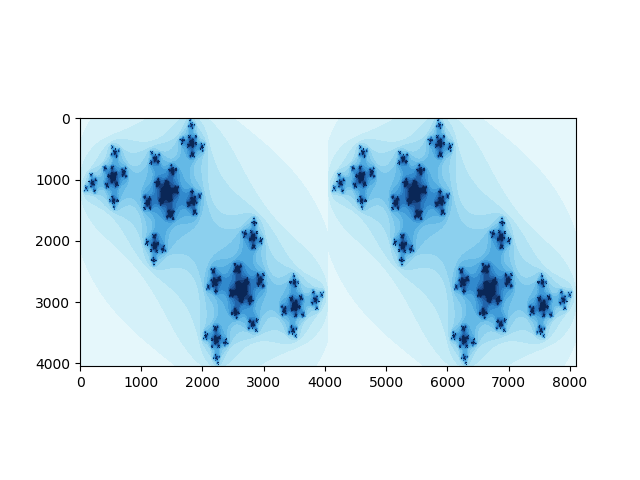

# 新鲜事

## pclasso

Refer to [pcLasso: a new method for sparse regression](https://statisticaloddsandends.wordpress.com/)

```r
set.seed(1234)
n = 100; p = 10
X = matrix(rnorm(n * p), nrow = n)
y = rnorm(n)
library(pcLasso)
fit <- pcLasso(X, y, theta = 10)

predict(fit, X[1:3, ])[, 5]

groups = list(1:5, 6:10)
fit = pcLasso(X, y, theta = 10, groups = groups)

fit = cv.pcLasso(X, y, theta = 10)
predict(fit, X[1:3,], s = "lambda.min")
```

## Emojis in scatterplot

References:

1. [Using emojis as scatterplot points](https://statisticaloddsandends.wordpress.com/2018/12/28/using-emojis-as-scatterplot-points/)
2. [dill/emoGG](https://github.com/dill/emoGG)

```r
library(ggplot2)
library(emoGG)
data("ToothGrowth")
p1 <- geom_emoji(data = subset(ToothGrowth, supp == "OJ"),
                aes(dose + runif(sum(ToothGrowth$supp == "OJ"), min = -0.2, max = 0.2),
                   len), emoji = "1f34a")
p2 <- geom_emoji(data = subset(ToothGrowth, supp == "VC"),
                 aes(dose + runif(sum(ToothGrowth$supp == "OJ"), min = -0.2, max = 0.2),
                     len), emoji = "1f48a")

ggplot() +
    p1 + p2 +
    labs(x = "Dose (mg/day)", y = "Tooth length")
```

## Medians in high dimensions

Refer to [Medians in high dimensions](https://statisticaloddsandends.wordpress.com/2018/12/21/medians-in-high-dimensions/)

- marginal median
- geometric median
- medoid
- centerpoint
- Tukey median

## Laplace distribution as a mixture of normal distributions

Refer to [Laplace distribution as a mixture of normals](https://statisticaloddsandends.wordpress.com/2018/12/21/laplace-distribution-as-a-mixture-of-normals/)

$$
\int_0^\infty f_{X\mid W=w}(x)f_W(w)dw=\frac{1}{2b}\exp\Big(-\frac{\vert x\vert}{b}\Big)\,.
$$

## Gradient descent as a minimization problem

Refer to [Gradient descent as a minimization problem](https://statisticaloddsandends.wordpress.com/2018/11/09/gradient-descent-as-a-minimization-problem/)

put gradient decent into the optimization framework, then derive

- projected gradient descent
- proximal gradient methods

## Coordinate descent doesn’t always work for convex functions

Refer to [Coordinate descent doesn’t always work for convex functions](https://statisticaloddsandends.wordpress.com/2018/10/30/coordinate-descent-doesnt-always-work-for-convex-functions/)

A counterexample:

$$
z=\max(x,y)+\vert x-y\vert
$$

## Solution to a `sgn` equation

Refer to [Soft-thresholding and the sgn function](https://statisticaloddsandends.wordpress.com/2018/10/29/soft-thresholding-and-the-sgn-function/)

Give a proof of the solution of

$$
ax-b+c\mathrm{sgn}(x)=0
$$

where $a>0$ and $c\ge 0$.

## Horvitz–Thompson estimator

Refer to [Horvitz–Thompson estimator](https://statisticaloddsandends.wordpress.com/2018/10/18/horvitz-thompson-estimator/)

Perform an **inverse probability weighting** to (unbiasedly) estimate the total $T=\sum X_i$.

## Illustration of SCAD penalty

Refer to [The SCAD penalty](https://statisticaloddsandends.wordpress.com/2018/07/31/the-scad-penalty/)


The dotted line is the $y=x$ line. The line in black represents soft-thresholding (LASSO estimates) while the line in red represents the SCAD estimates.

## Leverage in Linear regression

Refer to [Bounds/constraints on leverage in linear regression](https://statisticaloddsandends.wordpress.com/2018/07/30/bounds-constraints-on-leverage-in-linear-regression/)

The leverage of data point $i$ is the $i$-th diagonal entry of the hat matrix.

## Modification to fundamental sampling formula

Refer to [Inverse transform sampling for truncated distributions](https://statisticaloddsandends.wordpress.com/2018/01/28/inverse-transform-sampling-for-truncated-distributions/#comments)

We can draw sample $X\sim F$ conditional on $X\ge t$.

## Borel's Paradox

- [ETJ: PARADOXES OF PROBABILITY THEORY](http://omega.albany.edu:8008/ETJ-PDF/cc15t.pdf)
- [An Explanation of Borel’s Paradox That You Can Understand](http://gandenberger.org/2013/07/22/borels-paradox/)
- [Yarin Gal' slide: The Borel–Kolmogorov paradox](http://www.cs.ox.ac.uk/people/yarin.gal/website/PDFs/Short-talk-03-2014.pdf)
- [Edwin Thompson Jaynes's homepage](https://bayes.wustl.edu/etj/etj.html)
- [ETJ's book](http://omega.albany.edu:8008/JaynesBook.html)

## Retire Statistical Significance

[A petition](https://statmodeling.stat.columbia.edu/2019/03/05/abandon-retire-statistical-significance-your-chance-to-sign-a-petition/)

## EM estimation for Weibull distribution

$$
f_k(x) = k x^{k-1} e^{-x^k} \quad x >0
$$

Refer to [EM maximum likelihood estimation for Weibull distribution](https://stats.stackexchange.com/questions/22787/em-maximum-likelihood-estimation-for-weibull-distribution)

A little confused about [the answer](https://stats.stackexchange.com/a/343568/171750)

## Power method for top eigenvector

[Power method for obtaining the top eigenvector](https://statisticaloddsandends.wordpress.com/2019/03/27/power-method-for-obtaining-the-top-eigenvector/)

## Generalized Beta Prime

This distribution, characterized by one scale and three shape parameters, is incredibly flexible in that it can mimic behavior of many other distributions.

GB2 exhibits power-law behavior at both front and tail ends and is a steady-state distribution of a simple stochastic differential equation.

## Julia Set

在复杂动力学里，Julia集是个著名的“混沌”行为的集（与之对应的是Fatou集，“非混沌”集）



References:

- [看明白Julia集](https://zhuanlan.zhihu.com/p/28378988)
- [神奇的分形艺术（四）：Julia集和Mandelbrot集](http://www.matrix67.com/blog/archives/292)
- [Julia GPU plots Julia Set](https://nextjournal.com/sdanisch/julia-gpu-programming)


## 陈素数

> 陈素数是陈景润素数的简称，特指符合陈氏定理的素数，即：如果一个素数 p 是陈素数，那么 p+2 是一个素数或两个素数的乘积，它是素数的子集，陈素数有无穷多个，已经被陈景润证明。
> 
> source: https://zh.wikipedia.org/wiki/%E9%99%88%E7%B4%A0%E6%95%B0

陈素数数列：[A109611@OEIS](https://oeis.org/A109611)

> 2, 3, 5, 7, 11, 13, 17, 19, 23, 29, 31, 37, 41, 47, 53, 59, 67, 71, 83, 89, 101, 107, 109, 113, 127, 131, 137, 139, 149, 157, 167, 179, 181, 191, 197, 199, 211, 227, 233, 239, 251, 257, 263, 269, 281, 293, 307, 311, 317, 337, 347, 353, 359, 379, 389, 401, 409

## 孪生素数

> 孪生素数（英语：twin prime），也称为孪生质数、双生质数，是指一对素数，它们之间相差2。例如3和5，5和7，11和13，10016957和10016959等等都是孪生素数。
>
> 与之相关的，两者相差为1的素数对只有 (2, 3)；两者相差为3的素数对只有 (2, 5)。

孪生素数猜想：孪生素数有无穷多个。这个猜想至今仍未被证明。

2013年5月14日，《自然》杂志报道，数学家张益唐证明存在无穷多个素数对相差（上界）都小于7000万。论文已被《数学年刊》（Annals of Mathematics）接受。截至2014年10月9日, 素数对之差被缩小为 <=246。另见果壳科普：[孪生素数猜想，张益唐究竟做了一个什么研究？](https://www.guokr.com/article/437023/)

## minimax @ 知乎

[在统计中，什么是minimax risk 呀，这个和通常的收敛速度有什么区别？](https://www.zhihu.com/question/347730562/answer/835310688)

## 随机矩阵

[李军@zhihu - 随机矩阵理论综述](https://zhuanlan.zhihu.com/p/37591888)

> 本文，我们来谈谈随机矩阵理论的历史、已有的理论成果以及一些新的研究探索。为了方便更多不同学科背景，不同知识层级的同学学习RMT，本文内容尽量循序渐进。由于内容众多，这里我只列出，具体内容、参考文献以及Python实现(本人一个个细致推敲实现，但很多分布仍未进行很好的normalization)，请见我的[Github](https://github.com/brucejunlee/RMT_Theory_Applications)。由于时间有限，不免有很多内容没有讲到，而且RMT理论及应用涉及众多学科领域，更难完全罗列介绍，本文只选择一些重要成果进行介绍，只对部分内容进行了较细致分析，更多的理论推导请查阅相关文献。

## 二元二次函数最值

参考 

## Three leading medical journals

- the Journal of the American Medical Association, 
- the Lancet, and 
- the New England Journal of Medicine

## Two Most Popular Creative Commons (CC) licences

- CC-BY-NC (Attribution-NonCommercial): letting others remix, tweak and build up your work non-commercially
- CC-BY-NC-SA (Attribution-NonCommercial-ShareAlike): letting others remix, tweak and build upon your work non-commercially, and the person also need to distribute their contributions under the same licence as the original.

## License

- 普通许可：non-exclusive license
- 排他许可：sole license
- 独占许可：exclusive license
- 分售许可：sub-license
- 交叉许可：cross license

## dogleg method vs `dodge` option

`dodge` option in [StatsPlots.jl](https://github.com/JuliaPlots/StatsPlots.jl)

```julia
groupedbar(rand(10,3), bar_position = :dodge, bar_width=0.7)
``

while "dogleg method" refers to an approach in optimization.
