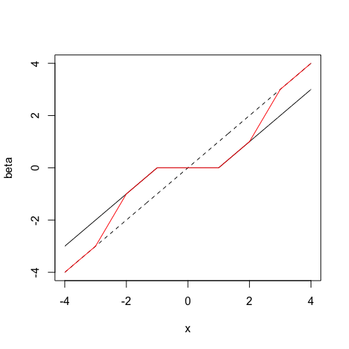

# 新鲜事

## pclasso

Refer to [pcLasso: a new method for sparse regression](https://statisticaloddsandends.wordpress.com/)

```r
set.seed(1234)
n = 100; p = 10
X = matrix(rnorm(n * p), nrow = n)
y = rnorm(n)
library(pcLasso)
fit <- pcLasso(X, y, theta = 10)

predict(fit, X[1:3, ])[, 5]

groups = list(1:5, 6:10)
fit = pcLasso(X, y, theta = 10, groups = groups)

fit = cv.pcLasso(X, y, theta = 10)
predict(fit, X[1:3,], s = "lambda.min")
```

## Emojis in scatterplot

References:

1. [Using emojis as scatterplot points](https://statisticaloddsandends.wordpress.com/2018/12/28/using-emojis-as-scatterplot-points/)
2. [dill/emoGG](https://github.com/dill/emoGG)

```r
library(ggplot2)
library(emoGG)
data("ToothGrowth")
p1 <- geom_emoji(data = subset(ToothGrowth, supp == "OJ"), 
                aes(dose + runif(sum(ToothGrowth$supp == "OJ"), min = -0.2, max = 0.2), 
                   len), emoji = "1f34a")
p2 <- geom_emoji(data = subset(ToothGrowth, supp == "VC"), 
                 aes(dose + runif(sum(ToothGrowth$supp == "OJ"), min = -0.2, max = 0.2), 
                     len), emoji = "1f48a")
 
ggplot() +
    p1 + p2 +
    labs(x = "Dose (mg/day)", y = "Tooth length")
```

## Medians in high dimensions

Refer to [Medians in high dimensions](https://statisticaloddsandends.wordpress.com/2018/12/21/medians-in-high-dimensions/)

- marginal median
- geometric median
- medoid
- centerpoint
- Tukey median

## Laplace distribution as a mixture of normal distributions

Refer to [Laplace distribution as a mixture of normals](https://statisticaloddsandends.wordpress.com/2018/12/21/laplace-distribution-as-a-mixture-of-normals/)

$$
\int_0^\infty f_{X\mid W=w}(x)f_W(w)dw=\frac{1}{2b}\exp\Big(-\frac{\vert x\vert}{b}\Big)\,.
$$

## Gradient descent as a minimization problem

Refer to [Gradient descent as a minimization problem](https://statisticaloddsandends.wordpress.com/2018/11/09/gradient-descent-as-a-minimization-problem/)

put gradient decent into the optimization framework, then derive 

- projected gradient descent
- proximal gradient methods

## Coordinate descent doesn’t always work for convex functions

Refer to [Coordinate descent doesn’t always work for convex functions](https://statisticaloddsandends.wordpress.com/2018/10/30/coordinate-descent-doesnt-always-work-for-convex-functions/)

A counterexample: 

$$
z=\max(x,y)+\vert x-y\vert
$$

## Solution to a `sgn` equation

Refer to [Soft-thresholding and the sgn function](https://statisticaloddsandends.wordpress.com/2018/10/29/soft-thresholding-and-the-sgn-function/)

Give a proof of the solution of 

$$
ax-b+c\mathrm{sgn}(x)=0
$$

where $a>0$ and $c\ge 0$.

## Horvitz–Thompson estimator

Refer to [Horvitz–Thompson estimator](https://statisticaloddsandends.wordpress.com/2018/10/18/horvitz-thompson-estimator/)

Perform an **inverse probability weighting** to (unbiasedly) estimate the total $T=\sum X_i$.

## Illustration of SCAD penalty

Refer to [The SCAD penalty](https://statisticaloddsandends.wordpress.com/2018/07/31/the-scad-penalty/)



The dotted line is the $y=x$ line. The line in black represents soft-thresholding (LASSO estimates) while the line in red represents the SCAD estimates.

## Leverage in Linear regression

Refer to [Bounds/constraints on leverage in linear regression](https://statisticaloddsandends.wordpress.com/2018/07/30/bounds-constraints-on-leverage-in-linear-regression/)

The leverage of data point $i$ is the $i$-th diagonal entry of the hat matrix.

## Modification to fundamental sampling formula

Refer to [Inverse transform sampling for truncated distributions](https://statisticaloddsandends.wordpress.com/2018/01/28/inverse-transform-sampling-for-truncated-distributions/#comments)

We can draw sample $X\sim F$ conditional on $X\ge t$.