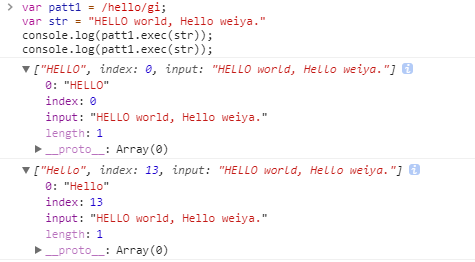
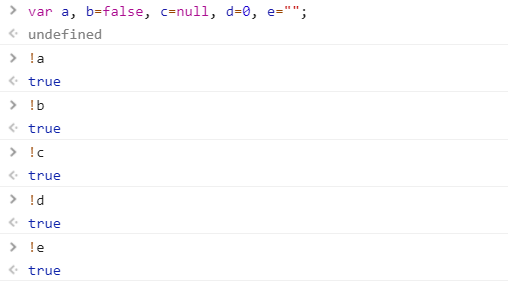

# JavaScript相关

JavaScript是Web的编程语言。

[菜鸟教程](http://www.runoob.com/js/js-tutorial.html)

> JavaScript 与 Java 是两种完全不同的语言，无论在概念上还是设计上。
> Java（由 Sun 发明）是更复杂的编程语言。
>
> ECMA-262 是 JavaScript 标准的官方名称。
>
> JavaScript 由 Brendan Eich 发明。它于 1995 年出现在 Netscape 中（该浏览器已停止更新），并于 1997 年被 ECMA（一个标准协会）采纳。
>
> 摘自[JavaScript 简介](http://www.runoob.com/js/js-intro.html)

!!! note
    JavaScript 是脚本语言。浏览器会在读取代码时，逐行地执行脚本代码。而对于传统编程来说，会在执行前对所有代码进行编译。

## 一些术语

- DOM: Document Object Model(文档对象模型) 是用于访问 HTML 元素的正式 W3C 标准。

## js输出数据的方式

- `window.alert()`
- `document.write()`
- `innerHTML`
- `console.log()`

## js script中的async

参考[js之script属性async与defer](https://www.cnblogs.com/tanhehe/p/4236021.html)

## JS放在head和放在body中的区别

参考[JS放在head和放在body中的区别](http://blog.csdn.net/lumeier/article/details/46398009)

## 百度站长自动推送

```js linenums="1"
(function(){
    var bp = document.createElement('script');
    var curProtocol = window.location.protocol.split(':')[0];
    if (curProtocol === 'https'){
      bp.src = 'https://zz.bdstatic.com/linksubmit/push.js';
    }
    else{
      bp.src = 'http://push.zhanzhang.baidu.com/push.js';
    }
    var s = document.getElementsByTagName("script")[0];
    s.parentNode.insertBefore(bp, s);
})();
```

当 `curProtocol === 'https'`，其 `push.js` 为

```js linenums="1"
!function(){
  var e = /([http|https]:\/\/[a-zA-Z0-9\_\.]+\.baidu\.com)/gi,
  r = window.location.href,
  t = document.referrer;
  if(!e.test(r)){
    var o = "https://sp0.baidu.com/9_Q4simg2RQJ8t7jm9iCKT-xh_/s.gif";
    t?(o += "?r="+encodeURIComponent(document.referrer),r&&(o+="&l="+r)):r&&(o+="?l="+r);
    var i=new Image;
    i.src=o
  }
}(window);
```

### 匿名函数

首先，这是一个匿名函数，可以参考[js匿名函数](https://www.cnblogs.com/jiejiejy/p/7434857.html)。

参考的博客里面总结到，有三种使用匿名函数的方式

1. 声明匿名函数，直接赋值给某一个事件

```js
window.onload = function(){
  alert(123);
}
```

2. 使用匿名函数表达式，将匿名函数赋值给某个变量

```js
var func = function(){
  alert(123);
}
func();
```

3. 自执行函数

a) 使用`!`开头

```js
!function(){
  alert(123);
}();
```

b) 使用`()`将函数及函数后的括号包裹

```js
(function(){
  alert(123);
}());
```

c) 使用`()`包裹函数值

```js
(function(){
  alert(123);
})();
```

百度站长采用的是c)。

### 浏览器对象模型(Browser Object Model (BOM))

上述代码中涉及到`window.location`，而window.location属于BOM，一般用于获得当前页面的地址 (URL)，并把浏览器重定向到新的页面。参考[JavaScript Window Location](http://www.runoob.com/js/js-window-location.html)

- location.hostname 返回 web 主机的域名
- location.pathname 返回当前页面的路径和文件名
- location.port 返回 web 主机的端口 （80 或 443）
- location.protocol 返回所使用的 web 协议（http:// 或 https://）

### 字符串处理

具体参考[JavaScript 字符串（String） 对象](http://www.runoob.com/js/js-obj-string.html)

### insertBefore()

参考[HTML DOM insertBefore() 方法](http://www.runoob.com/jsref/met-node-insertbefore.html)

### 正则表达式

参考[JavaScript RegExp 对象](http://www.runoob.com/js/js-obj-regexp.html)

定义一个RegExp对象如下

```js
var patt=new RegExp(pattern,modifiers);
// or more directly
var patt=/pattern/modifiers;
```

其中有两种修饰器

- i: 用来执行不区分大小写的匹配
- g: 用于执行全文的搜索（而不是在找到第一个就停止查找,而是找到所有的匹配）

`test()`方法搜索，根据结果返回true或false;
`exec()`方法返回匹配的结果，但其跟是否全局匹配有很多关系，具体参考[js正则表达式之exec方法讲解](http://www.jb51.net/article/31561.htm)。在全局匹配下，这个机制通过`lastIndex`实现，用于规定下次匹配起始位置，参考[JavaScript lastIndex 属性](http://www.runoob.com/jsref/jsref-lastindex-regexp.html)。
如

```js
var patt1 = /hello/gi;
var str = "HELLO world, Hello weiya."
console.log(patt1.test(str));
// match the second one, because the lastIndex skip the first one.
console.log(patt1.exec(str));
```
运行结果为


```js
var patt1 = /hello/gi;
var str = "HELLO world, Hello weiya."
console.log(patt1.exec(str));
console.log(patt1.exec(str));
```
运行结果为



### HTML DOM Document 对象

参考[HTML DOM Document 对象](http://www.runoob.com/jsref/dom-obj-document.html)

本例中，`document.referrer`用来返回载入当前文档的文档的 URL。

## Remove Disqus Ads

!!! info
    Original records on the usage: [remove ads #7](https://github.com/szcf-weiya/cn/issues/7)    

```js linenums="1"
  (function($){
    setInterval(() => {
        $.each($('iframe'), (arr,x) => {
            let src = $(x).attr('src');
            if (src && src.match(/(ads-iframe)|(disqusads)/gi)) {
                $(x).remove();
            }
            let title = $(x).attr('title');
            if (!src && title == "Disqus") {
              $(x).remove();
            }
        });
    }, 300);
})(jQuery);
```

## 命令行压缩js

参考[command line - Minify tool that can be executed through terminal - Ask Ubuntu](https://askubuntu.com/questions/321146/minify-tool-that-can-be-executed-through-terminal)

```bash
sudo apt-get install yui-compressor
yui-compressor myfile.js > myfile.min.js
```

## 双感叹号

参考[JavaScript中双叹号(!!)作用示例介绍_javascript技巧_脚本之家](http://www.jb51.net/article/48881.htm)

举个例子

```js
var a;
var b=!!a;
```

`a`默认是`undefined`。`!a`为`true`，`!!a`则为`false`。

`!!`一般用来将后面的表达式强制转换为布尔类型的数据。

> 因为JavaScript是弱类型的语言（变量没有固定的数据类型），所以有时需要强制转换为相应的类型，如

```js
a=parseInt(“1234″) 
a=”1234″-0 //转换为数字 
b=1234+”” //转换为字符串 
c=someObject.toString() //将对象转换为字符串
```

其中第1种、第4种为显式转换，2、3为隐式转换 

## 布尔类型的转换




## setTimeout 返回值

1. [js promise怎么返回值？](https://segmentfault.com/q/1010000007889310?_ea=1483501)

## 箭头函数

[js中 => 的含义](https://www.cnblogs.com/developer-os/p/6268479.html)

