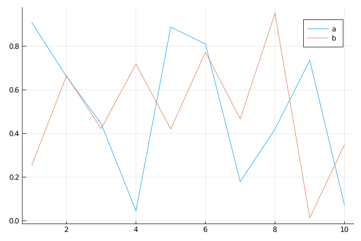

# julia相关

- [主页](https://julialang.org/)
- [My New Workflow with Julia 1.0](https://medium.com/@Jernfrost/my-new-workflow-with-julia-1-0-99711103d97c), mainly focus on how to develop a Julia package.
- [Timing in Julia](http://www.pkofod.com/2017/04/24/timing-in-julia/)
- [Publication quality plots in Julia](https://tamaspapp.eu/post/plot-workflow/)

## Is there a way to undo `using` in Julia?

NO

1. [https://stackoverflow.com/questions/33927523/can-i-make-julia-forget-a-method-from-the-repl](https://stackoverflow.com/questions/33927523/can-i-make-julia-forget-a-method-from-the-repl)
2. [https://stackoverflow.com/questions/36249313/is-there-a-way-to-undo-using-in-julia](https://stackoverflow.com/questions/36249313/is-there-a-way-to-undo-using-in-julia)

Although we cannot remove some defined function, with the powerful [Revise.jl](https://github.com/timholy/Revise.jl), we can update the functions without reloading the scripts.

## 关于 `mean()`

1. `using Statistics` 后才能用 `mean()`，而 `using Distributions` 后也能用 `mean()`。前者表示 `generic function with 5 methods`，后者称 `generic function with 78 methods`.

## `Normal` 中标准差为 0 的问题


可知，最低可以支持 `1e-323`，所以似乎也支持 `sqrt(1e-646)`，但并没有，而且当 `sqrt(1e-324)` 时精度就不够了，似乎 `sqrt(x)` 的精度与 `x` 的精度相当。

## 连等号赋值

如果采用 `a=b=c=ones(10)` 形式赋值的话，则如果后面改变 `a` 的值，`b` 和 `c` 的值也将随之改变。

但如果 `a=b=c=1` 为常值的话，则三个变量的值还是独立的。

## `@distributed`

如果配合 `sharedarrays` 使用时，需要加上 `@sync`, 参考[@fetch](https://docs.julialang.org/en/v1/stdlib/Distributed/#Distributed.@fetch)

## ERROR: `expected Type{T}`

参考 [ERROR: LoadError: TypeError: Type{...} expression: expected Type{T}, got Module](https://discourse.julialang.org/t/error-loaderror-typeerror-type-expression-expected-type-t-got-module/1230/4)

其中举了一个小例子

```julia
module Foo end
Foo{Int64}
```

会爆出这样的错误。但是一开始竟然没有仔细类比，最后在 REPL 中逐行试验才发现是，`using SharedArrays` 后直接用 `SharedArrays{Float64}(10)`，这与上面 `Foo` 的错误形式完全一样，竟然没有仔细类比。哎，看来以后多思考一下错误可能的原因，不要一味蛮力试验。

## type, instance, and object

看两个句子：

1. A type union is a special abstract type which includes as objects all instances of any of its argument types
2. `Nothing` is the singleton type whose only instance is the object `nothing`.

从中分析知道，instance 相对于 types，而 object 相对 instance。一个 type 可能有多个 instance，每个 instance 称之为 object。

1. instance of some types
2. object of some instances

## Couldn't find libpython error

```julia
ENV["PYTHON"]=""; Pkg.build("PyCall")
```

to install its own private Miniconda distribution for you, in a way that won't interfere with your other Python installations.

Refer to [Couldn't find libpython error #199](https://github.com/JuliaPy/PyCall.jl/issues/199)

Actually, using `PyPlot` also encounters the similar question, cannot find `matplotlib`, then I changed to the conda environment contained such package, and then

```julia
ENV["PYTHON"]="the-python-path";
# change to package command line
build PyCall
```

it works. And it seems that it does NOT depend on conda environment any more, i.e., `PyPlot` still works for different conda environment, even without `matplotlib` package in such environment.

In the words of the [official documentation](https://github.com/JuliaPy/PyCall.jl),

>  If you use Python virtualenvs, then be aware that PyCall uses the virtualenv it was built with by default, even if you switch virtualenvs. If you want to switch PyCall to use a different virtualenv, then you should switch virtualenvs and run rm(Pkg.dir("PyCall","deps","PYTHON")); Pkg.build("PyCall").

which supports my above guess.

## Record for install `PyCall`

Switch to `py37` conda environment, then run `julia1.2.0`

```julia
(v1.2) pkg> add PyCall
```

Then test to import module in the same REPL,

```julia
julia> using PyCall
[ Info: Recompiling stale cache file /home/weiya/.julia/compiled/v1.2/PyCall/GkzkC.ji for PyCall [438e738f-606a-5dbb-bf0a-cddfbfd45ab0]

julia> math = pyimport("math")
PyObject <module 'math' from '/home/weiya/anaconda3/lib/python3.7/lib-dynload/math.cpython-37m-x86_64-linux-gnu.so'>
```

Now open a new julia session under different conda environment (or no any conda environment), re-run the above code

```julia
julia> using PyCall

julia> math = pyimport("math")
PyObject <module 'math' from '/home/weiya/anaconda3/lib/python3.7/lib-dynload/math.cpython-37m-x86_64-linux-gnu.so'>
```

As you can see, no any compiling info when using `PyCall`, and return the same `math` module. However such module does not corresponds to the `py37` conda environment. The official documentation says

> On GNU/Linux systems, PyCall will default to using the python3 program (if any, otherwise `python`) in your PATH.

Then to specify the version of python such as

```julia
julia> ENV["PYTHON"] = Sys.which("python")
"/home/weiya/anaconda3/envs/py37/bin/python3.7"
```

and rebuild, note that need to restart the julia session to recompiling,

```julia
julia> using PyCall
[ Info: Recompiling stale cache file /home/weiya/.julia/compiled/v1.2/PyCall/GkzkC.ji for PyCall [438e738f-606a-5dbb-bf0a-cddfbfd45ab0]

julia> pyimport("math")
PyObject <module 'math' from '/home/weiya/anaconda3/envs/py37/lib/python3.7/lib-dynload/math.cpython-37m-x86_64-linux-gnu.so'>
```

then the module corresponds to the specified conda environment, and then like the above test, it also can be used in other conda environment without recompiling.

## parallel

references

1. [Julia parallel computing over multiple nodes in cluster](https://stackoverflow.com/questions/43079309/julia-parallel-computing-over-multiple-nodes-in-cluster)
2. [Using julia -L startupfile.jl, rather than machinefiles for starting workers.](https://white.ucc.asn.au/2017/08/17/starting-workers.html)
3. [Help setting up Julia on a cluster](https://discourse.julialang.org/t/help-setting-up-julia-on-a-cluster/5519)

## pbsdsh (unsolved)

Submit a pbsdsh job and specify multiply nodes with multiply cores, say `nodes=2:ppn=4`

error log file (see full file in the cluster: `dshmcmc.e21907`):

```
fatal: error thrown and no exception handler available.
InitError(mod=:Base, error=ArgumentError(msg="Package Sockets not found in current path:
- Run `Pkg.add("Sockets")` to install the Sockets package.
"))
rec_backtrace at /buildworker/worker/package_linux64/build/src/stackwalk.c:94
record_backtrace at /buildworker/worker/package_linux64/build/src/task.c:246
jl_throw at /buildworker/worker/package_linux64/build/src/task.c:577
require at ./loading.jl:817
init_stdio at ./stream.jl:237
jfptr_init_stdio_4446.clone_1 at /opt/share/julia-1.0.0/lib/julia/sys.so (unknown line)
jl_apply_generic at /buildworker/worker/package_linux64/build/src/gf.c:2182
reinit_stdio at ./libuv.jl:121
__init__ at ./sysimg.jl:470
jl_apply_generic at /buildworker/worker/package_linux64/build/src/gf.c:2182
jl_apply at /buildworker/worker/package_linux64/build/src/julia.h:1536 [inlined]
jl_module_run_initializer at /buildworker/worker/package_linux64/build/src/toplevel.c:90
_julia_init at /buildworker/worker/package_linux64/build/src/init.c:811
julia_init__threading at /buildworker/worker/package_linux64/build/src/task.c:302
main at /buildworker/worker/package_linux64/build/ui/repl.c:227
__libc_start_main at /lib64/libc.so.6 (unknown line)
_start at /opt/share/julia-1.0.0/bin/julia (unknown line)
```

But when I just use single node, and arbitrary cores, say `nodes=1:ppn=2`, it works well.

### references

1. [PBSDSH - High Performance Computing at NYU - NYU Wikis](https://wikis.nyu.edu/display/NYUHPC/PBSDSH)
2. [pbsdsh usage](http://docs.adaptivecomputing.com/torque/4-1-3/Content/topics/commands/pbsdsh.htm)

## julia local package 失败折腾记录

1. no error after `add ~/GitHub/adm.jl`, but `using adm` cannot work. refer to [Adding a local package](https://docs.julialang.org/en/latest/stdlib/Pkg/#Adding-a-local-package-1)
2. set `startup.jl` but still not work. refer to [How does Julia find a module?](https://en.wikibooks.org/wiki/Introducing_Julia/Modules_and_packages)
3. one possible way: [Finalizing Your Julia Package: Documentation, Testing, Coverage, and Publishing](http://www.stochasticlifestyle.com/finalizing-julia-package-documentation-testing-coverage-publishing/)

## julia `for` scope

The following code
```julia
i = 0
for j = 1:10
    i = i + 1
end
```
will report
```julia
ERROR: UndefVarError: i not defined
```

A (possible) reasonable explanation is, $i$ is a global variable, we cannot modify a global variable in a local block without `global` keyword, but we can read `i` in the `for` loop.

Alternatively, we can use `let` block,

```julia
let
i = 0
for j = 1:10
    i = i + 1
end
i
end
```

then `i` isn't really a global variable anymore.

References:

1. [REPL and for loops (scope behavior change)](https://discourse.julialang.org/t/repl-and-for-loops-scope-behavior-change/13514/3)
2. [Scope of variables in Julia](https://stackoverflow.com/questions/51930537/scope-of-variables-in-julia/)
3. [Manual: Scope of Variables](https://docs.julialang.org/en/v1/manual/variables-and-scoping/index.html)

## convert a matrix into an array of array


```julia
mapslices(x->[x], randn(5,5), dims=2)[:]
```

refer to

[Converting a matrix into an array of arrays](https://discourse.julialang.org/t/converting-a-matrix-into-an-array-of-arrays/17038)

Conversely, we can converting the array of arrays to a matrix, refer to [How to convert an array of array into a matrix?](https://stackoverflow.com/questions/26673412/how-to-convert-an-array-of-array-into-a-matrix)

## index from 0

using `OffsetArrays` package, refer to

[Github: OffsetArrays](https://github.com/JuliaArrays/OffsetArrays.jl)

## plot kernel density

refer to [Kernel density estimation status](https://discourse.julialang.org/t/kernel-density-estimation-status/5928)

## 自定义 `==` and `hash()`

对于自定义的 mutable struct, 直接用 `==` 返回 `false`，因此需要自己定义等号，比如

```julia
Base.:(==)(x::Reaction, y::Reaction) = all([
    x.substrate == y.substrate,
    x.product == y.product,
    x.reversible == y.reversible,
    x.species == y.species])
```

而如果想用 `unique` 函数的话，其基于 `isequal` 函数，而 `isequal` 是通过判断 hash 值来判定的，所以仅仅定义了 `==` 仍不够，还需要定义 `hash` 函数，这很简单，比如

```julia
function Base.hash(obj::Reaction, h::UInt)
    return hash((obj.substrate, obj.product, obj.reversible, obj.species), h)
end
```

> hash（散列、杂凑）函数，是将任意长度的数据映射到有限长度的域上。直观解释起来，就是对一串数据m进行杂糅，输出另一段固定长度的数据h，作为这段数据的特征（指纹）。
>
> or
>
> HASH函数是这么一种函数，他接受一段数据作为输入，然后生成一串数据作为输出，从理论上说，设计良好的HASH函数，对于任何不同的输入数据，都应该以极高的概率生成不同的输出数据，因此可以作为“指纹”使用，来判断两个文件是否相同。
>     数据 ---->输入 HASH 函数  ---->输出指纹数据


参考

1. [Hash function for custom type](https://stackoverflow.com/questions/50052668/hash-function-for-custom-type)
2. [到底什么是hash?](https://www.zhihu.com/question/26762707)
3. [Surprising struct equality test](https://discourse.julialang.org/t/surprising-struct-equality-test/4890)
4. [What is the difference between "using" and "import"?](https://docs.julialang.org/en/v1/manual/faq/#What-is-the-difference-between-%22using%22-and-%22import%22?-1)

## `&` 优先级

use

```julia
(x[1] <= width) & (x[1] >= 0) & (x[2] <= height) & (x[2] >=0)
```

instead of

```julia
x[1] <= width & x[1] >= 0 & x[2] <= height & x[2] >=0
```

## `MethodError: objects of type Module are not callable`

check if the function is mistaken by the module name, such as `AxisArray` vs. `AxisArrays`.

## `/lib/x86_64-linux-gnu/libz.so.1: version `ZLIB_1.2.9' not found`

ref to [https://stackoverflow.com/questions/48306849/lib-x86-64-linux-gnu-libz-so-1-version-zlib-1-2-9-not-found](https://stackoverflow.com/questions/48306849/lib-x86-64-linux-gnu-libz-so-1-version-zlib-1-2-9-not-found)

## work with GPU

- [An Introduction to GPU Programming in Julia](https://nextjournal.com/sdanisch/julia-gpu-programming)
- Re-build after install cudnn, refer to [GPU on cluster: conversion to pointer not defined for CuArray{Float32,2}](https://github.com/FluxML/Flux.jl/issues/286)


## load `ImageView` on Server

when `using ImageView`, it throws an error,

> ERROR: LoadError: InitError: Cannot open display:

fixed by `ssh -X`. If further ssh on the node, it still works.

## `-i` vs `-L`

if need to REPL and also arguments, then `-i` would be suitable.

And note that `--` should be separated the switches and program files. (but seems not necessary)

[Julia docs: Getting Started](https://docs.julialang.org/en/v1/manual/getting-started/index.html)

## Unable to display plot using the REPL. GKS errors

The reason would be relate to the `GR` package,

```bash
cd .julia/packages/GR/ZI5OE/deps/gr/bin/
ldd gksqt
```

and then get

```bash
linux-vdso.so.1 =>  (0x00007ffdc1e58000)
libQt5Widgets.so.5 => not found
libQt5Gui.so.5 => not found
libQt5Network.so.5 => not found
libQt5Core.so.5 => not found
libGL.so.1 => /lib64/libGL.so.1 (0x00002ae608a73000)
libpthread.so.0 => /lib64/libpthread.so.0 (0x00002ae608ce5000)
libstdc++.so.6 => /lib64/libstdc++.so.6 (0x00002ae608f01000)
libm.so.6 => /lib64/libm.so.6 (0x00002ae609209000)
libgcc_s.so.1 => /lib64/libgcc_s.so.1 (0x00002ae60950b000)
libc.so.6 => /lib64/libc.so.6 (0x00002ae609721000)
libexpat.so.1 => /lib64/libexpat.so.1 (0x00002ae609aef000)
libxcb-dri3.so.0 => /lib64/libxcb-dri3.so.0 (0x00002ae609d19000)
libxcb-xfixes.so.0 => /lib64/libxcb-xfixes.so.0 (0x00002ae609f1c000)
libxcb-present.so.0 => /lib64/libxcb-present.so.0 (0x00002ae60a125000)
libxcb-sync.so.1 => /lib64/libxcb-sync.so.1 (0x00002ae60a328000)
libxshmfence.so.1 => /lib64/libxshmfence.so.1 (0x00002ae60a52f000)
libglapi.so.0 => /lib64/libglapi.so.0 (0x00002ae60a733000)
libselinux.so.1 => /lib64/libselinux.so.1 (0x00002ae60a963000)
libXext.so.6 => /lib64/libXext.so.6 (0x00002ae60ab8a000)
libXdamage.so.1 => /lib64/libXdamage.so.1 (0x00002ae60ad9d000)
libXfixes.so.3 => /lib64/libXfixes.so.3 (0x00002ae60afa0000)
libX11-xcb.so.1 => /lib64/libX11-xcb.so.1 (0x00002ae60b1a6000)
libX11.so.6 => /lib64/libX11.so.6 (0x00002ae60b3a9000)
libxcb.so.1 => /lib64/libxcb.so.1 (0x00002ae60b6e7000)
libxcb-glx.so.0 => /lib64/libxcb-glx.so.0 (0x00002ae60b90f000)
libxcb-dri2.so.0 => /lib64/libxcb-dri2.so.0 (0x00002ae60bb2b000)
libXxf86vm.so.1 => /lib64/libXxf86vm.so.1 (0x00002ae60bd30000)
libdrm.so.2 => /lib64/libdrm.so.2 (0x00002ae60bf36000)
libdl.so.2 => /lib64/libdl.so.2 (0x00002ae60c148000)
/lib64/ld-linux-x86-64.so.2 (0x0000557abc358000)
libXau.so.6 => /lib64/libXau.so.6 (0x00002ae60c34c000)
libpcre.so.1 => /lib64/libpcre.so.1 (0x00002ae60c551000)
```

(refer to [one comment in Error: GKS: can't connect to GKS socket application](https://github.com/JuliaPlots/Plots.jl/issues/1649#issuecomment-478520497))

So it seems that it is due to the missing of `libqt5`. If I have the `sudo` privilege, maybe just type

```bash
sudo apt-get install qt5-default
```

but I cannot. But I noticed that I have installed `miniconda3`, and the `qt` is installed,

```bash
qmake -v
# QMake version 3.1
# Using Qt version 5.9.7 in /users/xxx/miniconda3/lib
```

So a natural way is to append the library path of `qt` to `LD_LIBRARY_PATH`, that is,

```bash
# in .bashrc
export LD_LIBRARY_PATH=/users/xxx/miniconda3/lib:$LD_LIBRARY_PATH
```

then rebuild `GR` package in the julia REPL.

This solution should work, but actually it failed at the first time. Do not be too frustrated, I found the reason is that I type `miniconda3` as `minconda3` in the path.

It works now, although it still throw an error,

```julia
julia> libGL error: unable to load driver: swrast_dri.so
libGL error: failed to load driver: swrast
```
## `dims=1`

总是记不太清 `sum`, `mean` 的时候 `dims=1` 是按行求和还是按列求和，经常先玩个 toy example 才能分辨出来。比如，

```julia
julia> a = rand(4, 3)
4×3 Array{Float64,2}:
 0.279181  0.0903167  0.148329
 0.486691  0.869156   0.0538834
 0.110781  0.836284   0.486467
 0.810343  0.208659   0.759561

julia> sum(a, dims=1)
1×3 Array{Float64,2}:
 1.687  2.00442  1.44824
```

即把 `dims` 所代表的维度元素加起来，或者说沿着 dims 进行运算。这一点与 `R` 的函数 `apply` 中 `margin` 参数作用刚好相反，

```r
> a = matrix(rnorm(12), 4, 3)
> a
           [,1]        [,2]       [,3]
[1,]  1.1535199  0.03198768  0.2857126
[2,] -1.3616720  0.32325598  1.9242805
[3,] -0.6519595 -1.14800119 -0.3635221
[4,]  1.2713182  0.98515312  0.2269218
> apply(a, 1, sum)
[1]  1.4712202  0.8858644 -2.1634828  2.4833932
```

这样交叉记忆，不知道效果会不会好点。

## reset `kw...` value

In the following situation, I want to reset a particular argument in `kw...`.

```julia
function f(; kw...)
    g(; kw...)
end
```

Note that the type of `kw` is `Base.Iterators.Pairs`, firstly I want to directly reset the value via

```julia
h(;kw...) = kw
h(a=1).data.a = 2
```

but it throws

```
ERROR: setfield! immutable struct of type NamedTuple cannot be changed
Stacktrace:
 [1] setproperty!(::NamedTuple{(:a,),Tuple{Int64}}, ::Symbol, ::Int64) at ./Base.jl:21
 [2] top-level scope at none:0
```

So I need to find new method, or give up such idea. Fortunately, the [official documentation of Julia](https://docs.julialang.org/en/v1/manual/functions/) says

> The nature of keyword arguments makes it possible to specify the same argument more than once. For example, in the call `plot(x, y; options..., width=2)` it is possible that the options structure also contains a value for `width`.

Thus, I can write

```julia
function f(; kw...)
    g(; kw..., b = 6)
end
```
to solve my problem, where `b` is the argument I want to reset.

## some interesting behavior

```julia
d = Dict{Int, Int}()
d[1] = 1
```

if we access

```julia
d.vals
# d.keys
```

it will return a `16-element Array{Int64,1}`, but if we use

```julia
values(d)
keys(d)
```

it correctly returns the exactly one elements, but with type `Base.ValueIterator for a Dict{Int64,Int64} with 1 entry`.

## function in function

```julia
julia> function f2()
           a = 10
           function g()
               a = a+10
           end
           g()
           println(a)
       end
f2 (generic function with 1 method)

julia> f2()
20
```

but

```julia
julia> function f2()
           a = 10
           g() = a + 10
           g()
           println(a)
       end
f2 (generic function with 1 method)

julia> f2()
10
```

since the first one does not have `return`, but `g()` has `return` and the addition is not on `a`.

## pass array into function

```julia
julia> a = [1,2]
2-element Array{Int64,1}:
 1
 2

julia> function f(a)
           a = a .+ 1
       end
f (generic function with 1 method)

julia> f(a)
2-element Array{Int64,1}:
 2
 3

julia> a
2-element Array{Int64,1}:
 1
 2

julia> function g(a)
           a .= a .+ 1
       end
g (generic function with 1 method)

julia> g(a)
2-element Array{Int64,1}:
 2
 3

julia> a
2-element Array{Int64,1}:
 2
 3
```

## check whether array entry is undef

```julia
b = Array{Array{Int, 1}}(undef, 3)
isdefined(b, 1)
# or
isassigned(b, 1)
# not
# isdefined(b[1])
```

refer to [Julia: check whether array entry is undef](https://stackoverflow.com/questions/25020448/julia-check-whether-array-entry-is-undef)

## memory allocation of `undef`


```julia
julia> @time Array{Array{Int, 1}, 2}(undef, 100, 100);
  0.000024 seconds (6 allocations: 78.359 KiB)
julia> @time zeros(100,100, 1);
  0.000014 seconds (6 allocations: 78.359 KiB)
julia> @time zeros(100,100, 10);
  0.000077 seconds (6 allocations: 781.484 KiB)
```

## 单引号和双引号

```julia
julia> a = 'www'
ERROR: syntax: invalid character literal

julia> a = 'w'
'w': ASCII/Unicode U+0077 (category Ll: Letter, lowercase)

julia> a = "ww"
"ww"
```

refer to [#105](https://github.com/szcf-weiya/Cell-Video/issues/105).

## Juno 中 `Cltr + Enter` 的 bug

当我使用 `Ctrl + Enter` 运行下列语句时，

```julia
using Images, ImageView
img = load(download("https://juliaimages.org/latest/assets/segmentation/horse.jpg"));
imshow(img)
```

REPL 冻住了，一直停在

```julia
Dict{String,Any} with 4 entries:
```

而我如果直接将上述语句复制到 REPL 中运行时，一切 OK，正常显示为

```julia
Dict{String,Any} with 4 entries:
  "gui"         => Dict{String,Any}("window"=>GtkWindowLeaf(name="", parent, wi…
  "roi"         => Dict{String,Any}("redraw"=>50: "map(clim-mapped image, input…
  "annotations" => 3: "input-2" = Dict{UInt64,Any}() Dict{UInt64,Any}
  "clim"        => 2: "CLim" = CLim{RGB{Float64}}(RGB{Float64}(0.0,0.0,0.0), RG…
```

找到类似的 Issue: [[BUG] Evaluation in Editor freezes Atom occasionally](https://github.com/JunoLab/Juno.jl/issues/320)

虽然其解决方案不太清楚，是有关 notification-daemon，但是维护者 @pfitzseb 的回复

> OS level notifications are disabled completly in the latest Juno release because they were causing crashes on Mac and didn't really seem to work on other platforms.

提醒我或许是因为 Juno 的版本问题，当前版本为 v0.7.2, 最新版本为 v0.8.1

仅仅更新 Juno.jl 的版本似乎还不行，另外将 Atom.jl 从 v0.12.8 更新到 v0.12.9

最后竟然[真的解决了！](https://github.com/JunoLab/Juno.jl/issues/320#issuecomment-599213691)

## Juno 使用系统代理

当在 `.bashrc` 添加 `http_proxy` 和 `https_proxy` 中并 source 之后，直接在 shell 里面开的 julia session 中，验证当前 ip

```julia
run(`curl ifconfig.me`)
```

或者直接查看

```julia
ENV["http_proxy"]
```

发现可以使用系统代理。但是在 Atom 中开的 julia，则不行。找到 Atom 一条相关的 issue: [[Atom 1.32.0] Does not inherit environment variables when launched not from the command line](https://github.com/atom/atom/issues/18318)，但是我已经是最新版了，不应该存在这个问题。但是当我通过 `Ctrl-Shift-i` 打开 devtools，验证 `process.env["http_proxy"]`，显示 undefined；而且直接在 source 之后的 terminal 中打开，也显示 undefined。猜想，只对 PATH 有效？或者因为 Juno.jl?

跳过这个问题，最后直接在 `startup.jl` 文件中添加

```julia
ENV["http_proxy"] =
ENV["https_proxy"]
```

进行设置，这参考了 [Install packages behind the proxy](https://discourse.julialang.org/t/install-packages-behind-the-proxy/23298/2)

## wrong arrangement of multiple figures in a grid

Hi, I am confused by the arrangement of multiple figures in a grid. I begin with the example code in the README,

```julia
gui = imshow_gui((300, 300), (2, 1))  # 2 columns, 1 row of images (each initially 300×300)
canvases = gui["canvas"]
imshow(canvases[1,1], testimage("lighthouse"))
imshow(canvases[1,2], testimage("mandrill"))
Gtk.showall(gui["window"])
```

it throws an error when accessing `canvases[1,2]`

```julia
julia> imshow(canvases[1,2], testimage("mandrill"))
ERROR: BoundsError: attempt to access 2×1 Array{Any,2} at index [1, 2]
```

and I check the size of `canvases` is

```julia
julia> size(canvases)
(2, 1)
```

it seems that the canvases will arrage by column while the gui declares it should be by rows.

On the other hand, if I run

```julia
gui = imshow_gui((300, 300), (2, 1))  # 2 columns, 1 row of images (each initially 300×300)
canvases = gui["canvas"]
imshow(canvases[1,1], testimage("lighthouse"))
imshow(canvases[2,1], testimage("mandrill"))
Gtk.showall(gui["window"])
```

```julia
gui = imshow_gui((300, 300), (1, 2))  # 2 columns, 1 row of images (each initially 300×300)
canvases = gui["canvas"]
imshow(canvases[1,1], testimage("lighthouse"))
imshow(canvases[1,2], testimage("mandrill"))
Gtk.showall(gui["window"])
```

Then I guess it might due to the version of some packages...

## Manage Different Versions of Julia

1. download the "Generic Linux Binaries for x86 (64-bit)" of a particular version from [Download Julia](https://julialang.org/downloads/)
2. put it into customed folder, such as `src` under home directory,
3. link it to the system path, such as

```bash
cd /usr/local/bin
sudo ln -s /home/weiya/src/julia-1.3.1/bin/julia julia1.3.1
```

Currently, I have installed the following different versions.

```bash
$ ll | grep julia
lrwxrwxrwx  1 root root      37 8月  31  2018 julia -> /home/weiya/src/julia-1.0.0/bin/julia*
lrwxrwxrwx  1 root root      37 7月  30  2019 julia1.1.1 -> /home/weiya/src/julia-1.1.1/bin/julia*
lrwxrwxrwx  1 root root      37 9月  18 15:28 julia1.2.0 -> /home/weiya/src/julia-1.2.0/bin/julia*
lrwxrwxrwx  1 root root      37 3月  18 10:25 julia1.3.1 -> /home/weiya/src/julia-1.3.1/bin/julia*
```

The source folders can be freely moved to another place, and only need to update the symbol links, which can be firstly deleted and then created, or use

```bash
sudo ln -sf ... ...
```

to override current link. But, if the links is to a folder, then another flag need to be added to override,

```bash
sudo ln -sfn ... ...
```

refer to [How to change where a symlink points](https://unix.stackexchange.com/questions/151999/how-to-change-where-a-symlink-points)

Also, note that the link to a folder should be deleted with

```bash
rm folder
```

instead of

```bash
rm -r folder/ # delete the original folder
```

## array in functions

```julia
julia> function g(x)
           x += [1, 2]
       end
g (generic function with 1 method)
julia> function g!(x)
           x .+= [1, 2]
       end
g! (generic function with 1 method)
julia> x = [1,2];

julia> g(x)'
1×2 Adjoint{Int64,Array{Int64,1}}:
 2  4

julia> x'
1×2 Adjoint{Int64,Array{Int64,1}}:
 1  2

julia> g!(x)'
1×2 Adjoint{Int64,Array{Int64,1}}:
 2  4

julia> x'
1×2 Adjoint{Int64,Array{Int64,1}}:
 2  4
```

Note that sometimes `.+=` may make the program much slower, such as [en/code/2019-06-14-ML/GD2.jl](https://github.com/szcf-weiya/en/blob/3c8daeb4e0f477f5ea40dc2bb44d832faa4bbbb6/code/2019-06-14-ML/GD2.jl#L10)

## 同时安装多个 package

用空格隔开，如

```julia
add Distributions Combinatorics MATLAB PyPlot LightGraphsFlows LightGraphs Clp Plots
```

## 内地镜像源

安装 [PkgMirrors](https://github.com/sunoru/PkgMirrors.jl)，则可以用中科大或者浙大的镜像源了

初次设置后，以后直接 `using PkgMirrors` 便切换到设置好的镜像，以后直接通过镜像源安装。

## select text in the output pdf

Several weeks ago, the text, such as the label, title or legend, in the output pdf via `savefig("xxx.pdf")` can be selected, but recently I found that I cannot select the text in the pdf. The reason would be the version of the packages.

I had tried [`GRUtils`](https://heliosdrm.github.io/GRUtils.jl/stable/), and `GRUtils.savefig` can output pdf to select the texts, so I think the reason is some changes in `Plots` package.

And I found that with `Plots@0.27.0` in `Julia1.0`, I can select the text, but currently the newer `Plots@1.2.0` cannot produce such pdf. To determine the change, maybe I need more effort to try different versions. But now I can downgrade the version to satisfy my requirement.

## multiple labels

In Julia 1.4.0 with Plots.jl v1.0.14,

```julia
using Plots
x = rand(10, 2)
plot(1:10, x, label = ["a", "b"])
```

will produce


where these two lines share the same label instead of one label for one line. But if replacing the column vector with row vector,

```julia
plot(1:10, x, label = ["a" "b"])
```

will return the correct result,



Refer to [Plots (plotly) multiple series or line labels in legend](https://discourse.julialang.org/t/plots-plotly-multiple-series-or-line-labels-in-legend/13001), which also works `GR` backend.

## suptitle for subplots

currently， no a option to set a suptitle for subplots, but we can use `@layout` to plot the title in a grid, such as [szcf-weiya/TB](https://github.com/szcf-weiya/TB/blob/c332307263cdbab20a453e6abe74790236321048/CFPC/sim_cpc_scores.jl#L87-L93)

refer to [Super title in Plots and subplots](https://discourse.julialang.org/t/super-title-in-plots-and-subplots/29865/4)

## `colorviews` for images

check the help document by `?colorviews`, and there are some examples to illustrate its usage, but here I add some examples that I used in my projects.

```julia
julia> colorview(RGB, rand(3,10,10))
10×10 reshape(reinterpret(RGB{Float64}, ::Array{Float64,3}), 10, 10) with eltype RGB{Float64}:
```

and we need to permutate the dims such that the first dim matches with RGB.

```julia
julia> colorview(RGB, permutedims(rand(10, 10, 3), (3, 1, 2)))
10×10 reshape(reinterpret(RGB{Float64}, ::Array{Float64,3}), 10, 10) with eltype RGB{Float64}:
```

we also can append the alpha channel to an image, such as

```julia
julia> colorview(RGBA, colorview(RGB, rand(3, 10, 10)), rand(10, 10))
10×10 mappedarray(RGBA{Float64}, ImageCore.extractchannels, reshape(reinterpret(RGB{Float64}, ::Array{Float64,3}), 10, 10), ::Array{Float64,2}) with eltype RGBA{Float64}:
```

but directly append the array does not work,

```julia
julia> colorview(RGBA, rand(3, 10, 10), rand(10, 10))
ERROR: DimensionMismatch("arrays do not all have the same axes (got (Base.OneTo(3), Base.OneTo(10), Base.OneTo(10)) and (Base.OneTo(10), Base.OneTo(10)))")
```

which should be replaced with

```julia
julia> colorview(RGBA, rand(4, 10, 10))
10×10 reshape(reinterpret(RGBA{Float64}, ::Array{Float64,3}), 10, 10) with eltype RGBA{Float64}:
```

To use `RGB{N0f8}`, the input array should be `UInt8` not `Int`,

```julia
julia> colorview(RGB{N0f8}, Array{UInt8}(fill(1,3,10,10)))
10×10 reshape(reinterpret(RGB{N0f8}, view(::Array{UInt8,3}, [1, 2, 3], :, :)), 10, 10) with eltype RGB{Normed{UInt8,8}}:
```

## return values of function

```julia
julia> versioninfo()
Julia Version 1.4.0
Commit b8e9a9ecc6 (2020-03-21 16:36 UTC)
Platform Info:
  OS: Linux (x86_64-pc-linux-gnu)
  CPU: Intel(R) Core(TM) i5-6300HQ CPU @ 2.30GHz
  WORD_SIZE: 64
  LIBM: libopenlibm
  LLVM: libLLVM-8.0.1 (ORCJIT, skylake)

julia> function f(a, b, c, d)
           return a, b, c, d
       end
julia> a = f(1,2,3,4);

julia> a
(1, 2, 3, 4)

julia> a, b = f(1,2,3,4);

julia> a
1

julia> b
2

julia> a, b, c = f(1,2,3,4);

julia> a
1

julia> b
2

julia> c
3
```

## padding zero on the left

For example, convert "1" to "001",

```julia
julia> lpad(1, 3, '0')
"001"
```

## no reduction with `[1:1]`

Sometimes, I do not want to the array of array reduces to a single array, then `[1:1]` would help, instead of `[1]`, see the following toy example.

```julia
julia> x
2-element Array{Array{Int64,1},1}:
 [1, 2, 3]
 [1, 2]

julia> x[1]
3-element Array{Int64,1}:
 1
 2
 3

julia> x[1:1]
1-element Array{Array{Int64,1},1}:
 [1, 2, 3]
```

## run command line

For example, to combine different figures,

```julia
run(`convert p1.png p2.png +append p12.png`)
```

but if there are two many figures to combine, the correct way is to keep the multiple figure name as an array,

```julia
figs = "p" .* string.(1:10) .* ".png"
run(`convert $figs +append pall.png`)
```

instead of trying to convert the array to a string,

```julia
# WRONG!!!
julia> figs = prod("p" .* string.(1:10) .* ".png ")
julia> run(`convert $figs +append pall.png`)
convert: unable to open image 'p1.png p2.png ... p10.png '
```

or writting all command as a string

```julia
# WRONG!!!
command = "convert " * prod("p" .* string.(1:10) .* ".png ") * "+append pall.png"
run(`$command`)
```

## Shortcuts in Juno

- `Ctrl+J Ctrl+E`: switch from REPL to editor, refer to [the correct shortcut is be Ctrl-J Ctrl-E (and the command is called Julia Client: Focus Last Editor)](https://discourse.julialang.org/t/win10-how-to-switch-keyshort-from-editor-to-repl/22911), an inspiration is that I can check it via `Ctrl-Shift-P`.
