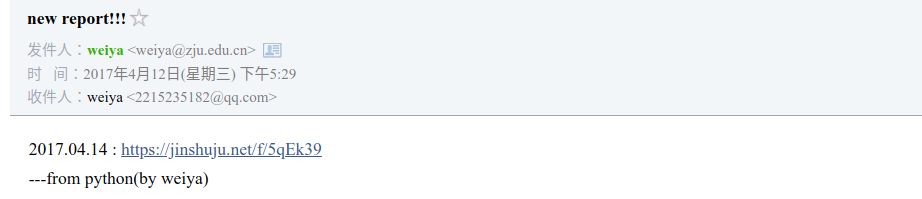
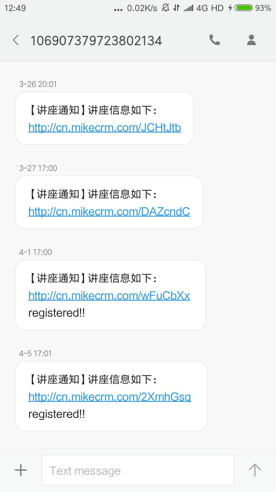

# 那些年抢过的讲座

刚刚报了最后一个讲座，感觉是时候写点东西了。

## 邮件提醒

如图

大致实现思路如下：

1. 实时抓取讲座列表
2. 若发现出现新链接，发送到邮箱

当然中间踩了好多坑，不得不吐糟一下数院的网站，里面的网页标签超级乱，`BeautifulSoup` 也不能按照正常思路来解析，经常是今天这个格式 ok，不曾想下次网页的标签又变了，诸如 `p`，`span`，`tr` 的混合使用。

## 手机提醒

毕竟邮件提醒也不是很方便，遂想直接发到手机上。如图

当然这部分没有新的程序，只是利用了 139 邮箱的自动转发到手机上的功能。

## 微信小程序

上学期回国后，想起讲座还没听完，于是打算继续玩玩以前的程序。然后当时小程序挺火的，如图（本来是应该截运行页面的，但我已经把后端服务器给撤了，只能进入首页了）

踩过很多坑，详见[微信小程序开发记录](wx)。必须地吐糟一下，微信对个人开发者挺不友好的，开放的权限超级有限。当时只完成了图中的刷新讲座信息的功能，自动报名还未实现。但从那时开始，数院小伙伴们疯狂在群里抢讲座了，所以刷新讲座信息其实挺鸡肋的，因为开始在群里同步讲座报名链接了。但我早已养成了不用 Windows 的~~好~~习惯，所以也不再受 QQ 的荼毒。

## 自动报名

但到了三月份，发现自己讲座没听完（主要是上学期不在学校），所以觉得还是得继续折腾。

!!! note "源码"
    这个阶段以前的部分源码放在了[Github: szcf-weiya/ReportInfo](https://github.com/szcf-weiya/ReportInfo)。自动报名部分的源码还在本地。

比较成功的版本如下：

那个有 `registered!!` 表示已经帮你自动报名了。

但随着讲座发布人不断更改表单类型，也经常出现无法读取数据，提交失败等 bug。比如其中的表单类型不断变化，从“23”变到“6”，从“8”变到“6”等等；另外还有前几天加入的定时发布表单功能，也不得不让我大改程序。

## QQ 群

现在很少用 Windows 了，手机也不会去查看 QQ 消息，所以错过了一些讲座扩容。今天用了一下 Windows，真是无心插柳，昨天的一个讲座扩容了（昨天因为表单形式又发生了变换，没有自动报名），而刚好那段时间群里没啥人，就报上了。

就这样报上了最后一场讲座。

## 后续 

### 大家太疯狂了

