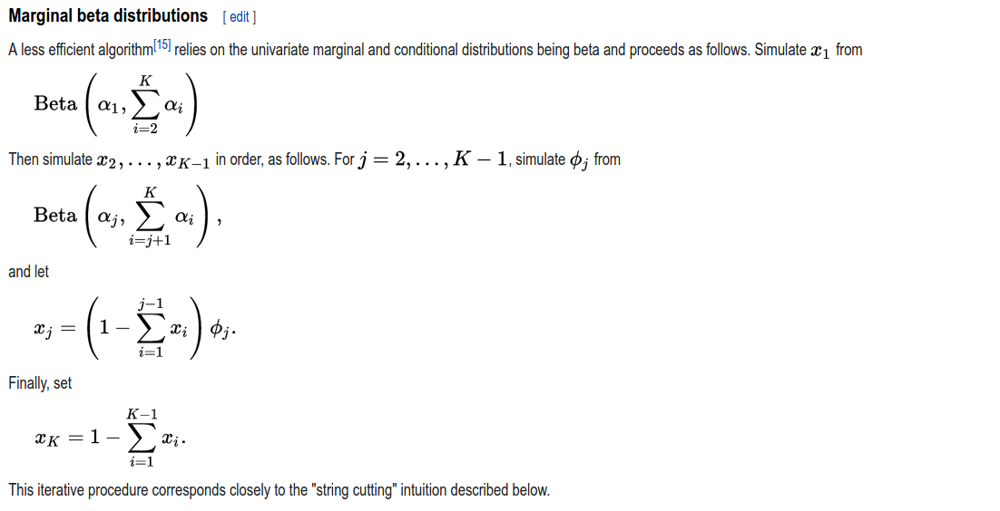

# gamma computing

[http://rosettacode.org/wiki/Gamma_function](http://rosettacode.org/wiki/Gamma_function)

[lanczos](https://mrob.com/pub/ries/lanczos-gamma.html)

# 产生K维Dirichlet分布的随机数

[wiki](https://en.wikipedia.org/wiki/Dirichlet_distribution)

# Inflection Point

[Inflection Point](http://mathworld.wolfram.com/InflectionPoint.html)

## Ellipse Facts

More details are available at [Information About Ellipses](https://www.geometrictools.com/Documentation/InformationAboutEllipses.pdf) or [here](/ref/InformationAboutEllipses.pdf).