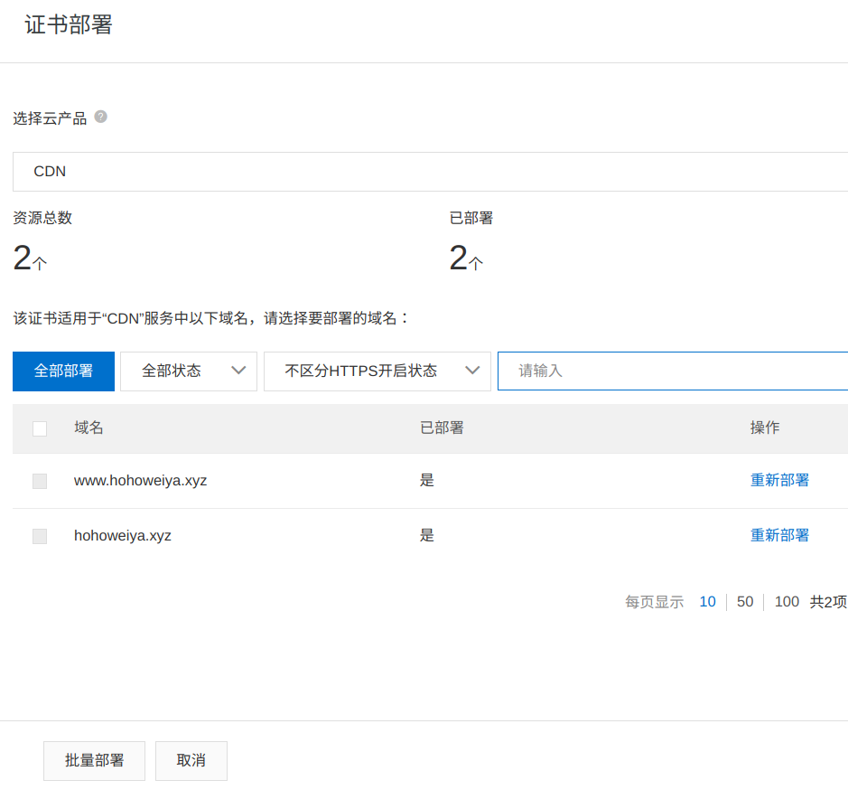

# CDN

## CDN 价格比较

比较了阿里云和又拍云，收费都包含两个部分，基础服务费用和增值服务请求费用。

基础服务可以按流量或带宽计费，但是带宽一般适用于大客户计费，又拍云对普通客户没有提供此选项，而稍微看了看阿里云的带宽收费，感觉会高于流量收费。

又拍云：

阿里云：

## 多个 CDN 混合使用

华为云可以免费申请 500 G 的境外 CDN，而又拍云之前买了大陆流量的 CDN，再加上阿里云域名解析有“智能解析”选项，猜测能否开通两个 CDN，境外走华为云，境内走又拍云。经试验，应该是可以的，

1. 又拍云加速区域改为境内
2. 华为云加速区域选择境外，同一加速域名
3. 阿里云域名解析添加华为云 CDN 设置时产生的 CNAME，注意解析线路选择境外。又拍云此前设置的 CDN 保持默认不变。

这样为什么就可以了呢？！注意到解析线路的“默认”是这样说的，

> 必填！未匹配到智能解析线路时，返回【默认】线路设置结果

所以是不是应该这样理解，对于境外访问，因为能够匹配到智能解析线路，所以指向华为云的 CDN，而对于境内访问，因为匹配不到智能线路，则采用默认的 CNAME，即又拍云的。

但还有几个小问题需要解决：

1. 又拍云之前有申请免费的 ssl 证书，所以支持 https，但境外走 CDN 后，华为云上面没有 SSL 证书，于是在阿里云那边申请了免费的证书，然后下载，然后将 `.pem` 和 `.key` 输入到华为云的 https 设置中。
2. 对于又拍云，其 https 连接是增值服务，而华为云竟然没看到这一点，这样挺好的，所以少交了 https 的增值费。

另外，在配置华为云的回源 host 突然意识到一点，其实没必要通过中间域名，或许直接在 github 那边的 CNAME 文件中添加同一加速域名即可，不需要单独解析这个加速域名！这个就有点像在服务器中任意指定一个域名，但是并没有在域名服务商那边提供解析，它只是为了在 github 这个大服务器中找到对应的结点。

## 更新证书

一年的免费证书就要到期了，是时候更新一波了……

从 2021 开始，阿里云上的免费证书需要通过 “证书资源包” 来申请，首先花 0 元购买好证书之后，然后申请证书，主要是填写绑定的域名信息，及联系人信息，然后会验证域名所有权，一般是通过 DNS 验证，这里一开始下拉框竟然只有手动 DNS 和文件验证两种方式，不过似乎输入了域名之后，可能是识别到了当前域名就在阿里云上面，所以出现了自动 DNS 验证，简言之自动在域名解析那里添加了解析，所以后面只要确认就好了。

证书立马就能签发，下一步是需要在 CDN 那里更改证书，只需要切换证书编号就好。

其实在 CDN 中证书选择一栏有“免费证书”，按理说不需要单独的证书申请流程，但是似乎不太成功，并且有提醒信息

> 受CA机构对免费证书的管理调整，免费证书的申请将会受到影响，建议使用云盾证书服务进行相关证书申请。

证书签发完成后，除了手动去 CDN 那边切换，也可以通过“部署”进行操作，不过需要确认一下权限。

部署时选择 `CDN` 即可。另外注意到对于 `www.hohoweiya.xyz`，会主动匹配到 `hohoweiya.xyz`，所以无需重复对 `hohoweiya.xyz` 进行设置，如下图

### 20210328

并非所有网站都需要 CDN，刚刚发现 Github 很早就支持了个性域名强制 HTTPS，所以停用 `tech`, `blog`, `stat` 以及 `@` 这几个子域名的 CDN，而改用 Github 自带的 `enforce https`，具体做法为

1. 停用 CDN
2. 修改域名解析，`CNAME` 至 `szcf-weiya.github.io`
3. 在仓库 `setting` 下勾上 `enforce https`
