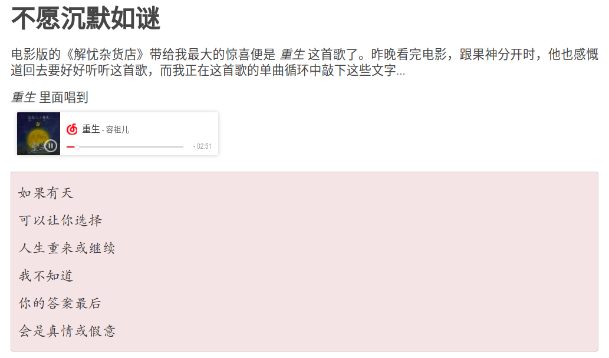

# 网站相关笔记
## 设置Disqus

[https://sgeos.github.io/jekyll/disqus/2016/02/14/adding-disqus-to-a-jekyll-blog.html](https://sgeos.github.io/jekyll/disqus/2016/02/14/adding-disqus-to-a-jekyll-blog.html)

[迁移disqus讨论
](https://help.disqus.com/customer/en/portal/articles/912627-domain-migration-tool
)


disqus迁移（待研究）

参考[Disqus 最近是不是被墙了啊？](https://www.v2ex.com/t/295213)

## mathjax中小于号与html的标签符号冲突

注意在mathjax中小于号左右空一格，不要连着写

## Github Pages 与百度爬虫

[解决 Github Pages 禁止百度爬虫的方法与可行性分析](http://jerryzou.com/posts/feasibility-of-allowing-baiduSpider-for-Github-Pages/)

[利用 CDN 解决百度爬虫被 Github Pages 拒绝的问题](https://www.dozer.cc/2015/06/github-pages-and-cdn.html)

## Jekyll Part 13: Creating an Article Series

[Jekyll Part 13: Creating an Article Series](https://digitaldrummerj.me/blogging-on-github-part-13-creating-an-article-series/)

## Add an "Updated" field to Jekyll posts

[Add an "Updated" field to Jekyll posts](https://zzz.buzz/2016/02/13/add-an-updated-field-to-your-jekyll-site/)

## iframe

[Embedding a document inside another using the "iframe" tag](http://www.javascriptkit.com/howto/externalhtml.shtml)

## Variable tags

[Variable tags](https://help.shopify.com/themes/liquid/tags/variable-tags#capture)


## Track Non-JavaScript Visits In Google Analytics

[Track Non-JavaScript Visits In Google Analytics](https://www.simoahava.com/analytics/track-non-javascript-visits-google-analytics/)

## Ubuntu 搭建Apache

参考[How To Install the Apache Web Server on Ubuntu 16.04](https://www.digitalocean.com/community/tutorials/how-to-install-the-apache-web-server-on-ubuntu-16-04)


[How To Install Linux, Apache, MySQL, PHP (LAMP) stack on Ubuntu 16.04](https://www.digitalocean.com/community/tutorials/how-to-install-linux-apache-mysql-php-lamp-stack-on-ubuntu-16-04)

自定义根目录注意设置权限。如

[Apache2: 'AH01630: client denied by server configuration'](https://stackoverflow.com/questions/18392741/apache2-ah01630-client-denied-by-server-configuration)

## Disqus国内访问

参考资料

1. [fooleap/disqus-php-api](https://github.com/fooleap/disqus-php-api)
1. [科学使用 Disqus](http://blog.fooleap.org/use-disqus-correctly.html)
1. [检测网络是否能够访问 Disqus](http://blog.fooleap.org/check-network-able-to-access-disqus.html)
1. [https://imququ.com/post/first-half-of-2016-blog-analytics.html#simple_thread](https://imququ.com/post/first-half-of-2016-blog-analytics.html#simple_thread)

2. [~~解决Hexo博客中 Disqus 在国内不能访问的方案~~](https://www.jianshu.com/p/9cc4cc8628c9)

### 服务器端配置过程

```bash
git clone git@github.com:fooleap/disqus-php-api.git
```

## 博客中插入网易云音乐

这个很容易实现，只需要在网易云中搜索要插入的音乐，然后点击“生成外链播放器”，将iframe代码插入博客的相应位置。

比如，我想在[不愿沉默如谜]()插入容祖儿的[重生](http://music.163.com/#/song?id=522631413)。点击页面中的“生成外链播放器”，将iframe代码放进原md文件中。但一开始有问题，iframe被当成普通的md文本。在[Jekyll raw HTML in post](https://stackoverflow.com/questions/30233461/jekyll-raw-html-in-post)中找到了答案。

网易云给的iframe代码为

```html
<iframe frameborder="no" border="0" marginwidth="0" marginheight="0" width=330 height=86 src="//music.163.com/outchain/player?type=2&id=522631413&auto=1&height=66"></iframe>
```

要将`width=330 height=86`改成`width="330" height="86"`，果然成功了。效果页面如下：

[](https://blog.hohoweiya.xyz/movie/2017/12/30/unwilling-to-be-silent.html)

## nginx虚拟主机配置

参考[How To Set Up Nginx Server Blocks (Virtual Hosts) on Ubuntu 14.04 LTS](https://www.digitalocean.com/community/tutorials/how-to-set-up-nginx-server-blocks-virtual-hosts-on-ubuntu-14-04-lts)

实现将本站用webhooks将其更新至阿里云服务器上，这与eslcn是同一个服务器，所以通过建立虚拟主机实现。


## jekyll中的相对路径

参考[Relative paths in Jekyll](https://ricostacruz.com/til/relative-paths-in-jekyll)

