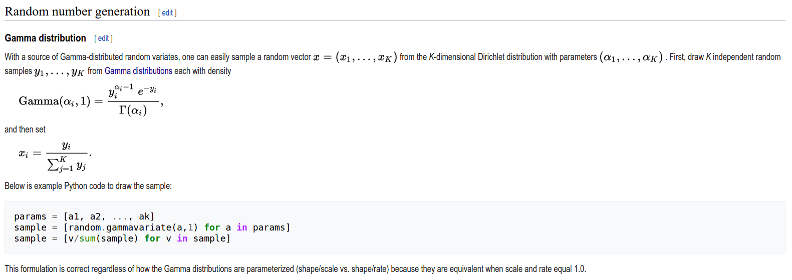

# gamma computing

[http://rosettacode.org/wiki/Gamma_function](http://rosettacode.org/wiki/Gamma_function)

[lanczos](https://mrob.com/pub/ries/lanczos-gamma.html)

# 产生K维Dirichlet分布的随机数

[wiki](https://en.wikipedia.org/wiki/Dirichlet_distribution)

